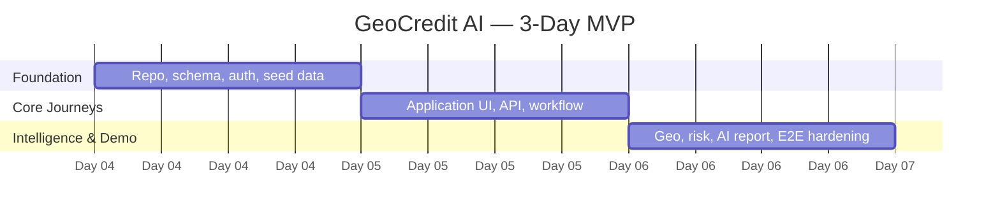
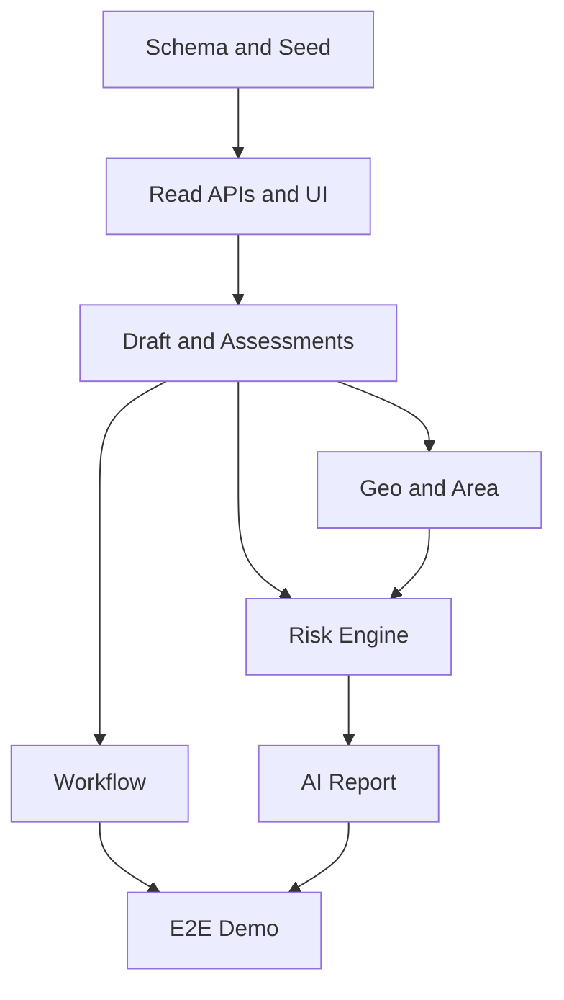

# GeoCredit AI — 3-Day Implementation Plan

**Version:** MVP v1.0  
**Target:** Hackathon / Vibe-Coded Demo MVP  
**Duration:** 3 working days  
**Last Updated:** 03 September 2026

## 1. Objective

Deliver a working GeoCredit AI demo that supports:

- Dabi flow: `CDO → BM → AM → RM`
- Progoti flow: `CO → AM → RM`
- Customer profile and historical loan/savings view
- Application, financial assessment, checklist and document status
- GPS/image capture and borrower intelligence within 500 meters
- Separate explainable customer-risk and area-risk results
- AI-assisted report with mandatory human review
- Role-based queues, workflow transitions and audit history
- Seeded data suitable for a complete demo

The goal is a coherent, testable vertical slice—not production readiness.

## 2. Delivery Assumptions

### Recommended Team

| Role | Count | Main Responsibility |
|---|---:|---|
| Product/Business Lead | 1 | Decisions, workflow validation, demo narrative |
| Full-stack Engineer | 2 | UI, API, integration |
| Backend/Data Engineer | 1 | PostgreSQL/PostGIS, rules, seed data |
| AI Engineer | 1 | Prompt, structured output, report generation |
| QA/UAT Owner | 1 | Acceptance tests, smoke/regression, evidence |

With fewer people, keep the same priority order but reduce secondary UI polish and offline functionality.

### Suggested Stack

| Layer | MVP Choice |
|---|---|
| Web application | Next.js + TypeScript |
| UI | Responsive component library + utility CSS |
| API | Next.js server routes or lightweight Node/Nest service |
| Database | PostgreSQL 16 + PostGIS |
| Authentication | Managed auth or development identity adapter |
| File storage | Private object storage or local demo adapter |
| Maps | Lightweight map SDK; list fallback if unavailable |
| AI | Structured JSON output behind an adapter |
| Validation | Shared schema validation on client/server |
| Tests | Unit + API integration + critical Playwright E2E |

## 3. Scope Priority

### P0 — Must Work

1. Role-based demo login and queues.
2. Dabi and Progoti application capture.
3. Valid workflow transitions through RM decision.
4. Customer profile, loan and savings history.
5. Financial calculation and checklist validation.
6. GPS location, image evidence stub and 500m query.
7. Deterministic customer/area risk scoring.
8. Explainable AI report with human-review disclaimer.
9. Seed data and two complete demo journeys.
10. Audit trail for major actions.

### P1 — Complete If P0 Is Stable

- Correction and additional-verification loops.
- Offline local draft and safe retry/idempotency.
- Risk snapshot regeneration after correction.
- Map visualization and richer risk charts.
- Wider negative/security test coverage.

### P2 — Defer First

- Full production SSO integration.
- Background job infrastructure beyond a simple queue/adapter.
- Complex admin configuration UI.
- Advanced model monitoring and calibration.
- Complete offline media upload recovery.
- Production-scale performance tuning.

## 4. Architecture Guardrails

- Keep business workflow and risk rules in backend services, not UI code.
- Use one shared domain model for both Dabi and Progoti; configure differences.
- Use PostgreSQL/PostGIS as the authoritative source for the 500m calculation.
- Store customer and area risk separately.
- Treat AI as narrative/explanation only; deterministic code calculates scores.
- Version application snapshots, risk rules and prompt/output schemas.
- Use synthetic seed data only.
- Backend rechecks role, scope, state and record version for each mutation.

## 5. Three-Day Milestone View

## 6. Workstreams

| Stream | Day 1 | Day 2 | Day 3 |
|---|---|---|---|
| Product/UX | Freeze demo scope | Validate journeys/content | UAT and demo rehearsal |
| Frontend | Shell, auth, profile | Forms, queues, review screens | Geo/risk/report polish |
| Backend | Schema, seed, API skeleton | Application/workflow APIs | Geo/risk/AI integration |
| Data/AI | Rules/fixtures | Risk engine | Prompt/report validation |
| QA | Test setup/smoke | Functional/API testing | E2E, regression, sign-off |

## 7. Day 1 — Foundation and Walking Skeleton

### Day 1 Outcome

By end of Day 1, every role can sign in, seeded customers/applications are visible, the database is migrated, and one thin Dabi journey can move through placeholder review states using real APIs.

### 09:00–10:00 — Kickoff and Scope Lock

**Product/Business**

- Confirm P0 scope and demo story.
- Confirm Dabi/Progoti field differences.
- Confirm demo risk thresholds are non-production defaults.
- Choose two primary demo applications and one failure scenario.
- Assign one decision owner for scope questions.

**Engineering/QA**

- Confirm repository, branches, environments and local setup.
- Create task board using the work breakdown in this document.
- Agree API error envelope, naming conventions and Definition of Done.

**Checkpoint:** No unresolved decision may block schema, routing or role implementation.

### 10:00–13:00 — Project, Database and Authentication

**Backend/Data**

- Initialize application and environment configuration.
- Start PostgreSQL with PostGIS.
- Implement first migrations for organization, users, customers, applications, versions and workflow history.
- Add essential enums, constraints and indexes.
- Create transaction and audit helpers.

**Frontend**

- Build application shell, navigation and responsive layout.
- Implement development login/role switcher behind a non-production guard.
- Create dashboard/queue empty states.
- Add shared form controls, status badge and error handling.

**QA**

- Prepare smoke checklist.
- Verify every role identity and organizational scope fixture.

### 14:00–16:30 — Seed Data and Read APIs

**Backend/Data**

- Load organizational units and users.
- Load 16 synthetic customers plus loan/savings histories.
- Load Dabi/Progoti applications in representative statuses.
- Implement customer search/detail and queue list APIs.
- Enforce role, department and scope filtering.

**Frontend**

- Build customer search/result screen.
- Build customer profile, loan history and savings history tabs.
- Build role dashboard and assigned application queue.

**QA**

- Test allowed and denied customer/application access.
- Verify masked identifiers and no real PII.

### 16:30–18:30 — Application Skeleton and First Transition

**Backend**

- Implement create/update draft API with optimistic version.
- Implement initial submit/start-review transitions.
- Add workflow action/audit records atomically.

**Frontend**

- Build application overview and basic Dabi/Progoti sections.
- Connect save-draft and validation-error states.
- Show allowed actions returned by API.

**End-of-Day Demo**

1. Sign in as CDO.
2. Find a customer and open history.
3. Create/save a Dabi draft.
4. Submit or move it to BM review through real API.
5. Sign in as BM and see it in the queue.

### Day 1 Definition of Done

- App and database start from documented commands.
- Migrations run cleanly.
- Seed load is deterministic and idempotent.
- All six roles can be represented in demo auth.
- Unauthorized scope tests pass.
- Customer/queue/application read path works.
- Draft save and at least two workflow transitions work.
- No P0 blocker is carried without an owner and workaround.

## 8. Day 2 — Complete Business Journeys

### Day 2 Outcome

By end of Day 2, complete Dabi and Progoti workflows work with application data, financial calculations, checklists, reviews, corrections and RM decision. Risk panels may still use deterministic placeholder output.

### 09:00–11:30 — Complete Application Capture

**Frontend**

- Implement product/application fields for Dabi and Progoti.
- Implement income, expense, liability and cash sections.
- Implement social assessment and role-specific checklists.
- Implement document states: Present, Missing, Not Applicable.
- Add section progress and submit readiness summary.

**Backend**

- Implement application version and financial-assessment persistence.
- Recalculate totals and affordability ratios server-side.
- Add validation guards for required sections.
- Freeze a version on submission.

**QA**

- Test incomplete draft, complete draft and invalid monetary values.
- Verify server/client totals match.

### 11:30–14:30 — Workflow State Machine

**Backend**

- Implement all Dabi and Progoti transitions.
- Enforce role, department, scope, assignment and current-state guards.
- Require remarks for return, additional verification and rejection.
- Add idempotency key and record-version validation.
- Record workflow history and audit event in one transaction.

**Frontend**

- Build BM, AM and RM review action panels.
- Display assessment differences and reviewer remarks.
- Build return/additional-verification dialogs.
- Add terminal approved/rejected read-only state.

### 14:30–16:30 — Evidence and Offline Basics

**Backend**

- Add media metadata endpoints and private storage adapter/stub.
- Add geo-verification record and status lifecycle.
- Add local draft/sync API contract and idempotent mutation handling.

**Frontend**

- Add image capture/upload component with preview/status.
- Add GPS capture fields with accuracy/time display.
- Cache permitted draft data locally.
- Show online/offline and sync status.

If time is constrained, keep actual offline submission out of scope; support local draft and reconnect-safe save only.

### 16:30–18:30 — Integration and E2E

**Team**

- Run full Dabi journey to approval.
- Run full Progoti journey to rejection.
- Run Dabi return/correction scenario.
- Fix workflow/data-integrity defects before UI polish.

**End-of-Day Demo**

- Complete Dabi: CDO → BM → AM → RM → Approved.
- Complete Progoti: CO → AM → RM → Rejected.
- Show one returned application and preserved history.

### Day 2 Definition of Done

- Required forms persist and validate.
- Server-calculated financial totals are correct.
- Dabi and Progoti routes both reach RM decision.
- No non-RM user can approve/reject.
- Invalid transitions and stale versions are rejected.
- Return and correction history is visible.
- Required GPS/image placeholders exist and gate submission.
- Critical E2E workflow tests pass.

## 9. Day 3 — Geo Intelligence, Risk, AI and Hardening

### Day 3 Outcome

By end of Day 3, the MVP calculates valid 500m-area intelligence, produces separate customer/area risk assessments and generates a structured explainable AI report. Critical tests pass and the demo is rehearsed.

### 09:00–11:00 — GPS and 500m Area Search

**Backend/Data**

- Store location as `geography(Point,4326)`.
- Validate coordinate range, accuracy and capture time.
- Implement authoritative `ST_DWithin(..., 500.0)` search.
- Exclude invalid/pending locations and ineligible borrowers.
- Store query origin, radius, rule version and result snapshot.
- Return `INSUFFICIENT_DATA` below minimum cohort.

**Frontend**

- Display verified/invalid GPS state and retake action.
- Display nearby aggregate counts/metrics and optional map.
- Avoid exposing nearby borrowers' PII.

**QA**

- Test points at 499m, exactly 500m and 501m.
- Test invalid accuracy and insufficient cohort.

### 11:00–13:30 — Deterministic Risk Engine

**Data/AI/Backend**

- Implement feature calculation for financial, loan, savings, social and checklist categories.
- Implement versioned weighted customer-risk rules.
- Implement versioned area-risk rules.
- Map scores to Low, Moderate, High and Very High.
- Store separate assessments, reason codes and evidence references.
- Validate seed fixtures against expected results.

**Frontend**

- Build separate customer-risk and area-risk cards.
- Display score, level, factors, data quality and generated time.
- Clearly label insufficient area data.

### 13:30–15:30 — AI Report

**AI/Backend**

- Assemble redacted structured prompt input.
- Require strict JSON-schema output.
- Validate output before persistence/display.
- Add retry, timeout and deterministic fallback summary.
- Prevent AI service from accessing transition/decision functions.

**Frontend**

- Display executive summary, positive factors, risk factors, findings and suggested review actions.
- Show `AI Recommendation — Human Review Required` prominently.
- Add generated timestamp and version information.

### 15:30–17:00 — Hardening and Regression

**QA/Engineering**

- Execute all P0 and selected P1 acceptance cases.
- Test RBAC, cross-scope IDs, invalid transitions and duplicate retries.
- Test unsupported upload, malformed AI output and service failure.
- Check logs for sensitive data.
- Validate application/risk/workflow version relationships.
- Fix only P0/P1 defects; defer cosmetic work unless demo blocking.

### 17:00–18:30 — Demo Freeze and Rehearsal

**Team**

- Freeze the demo build and seed dataset.
- Reset/reload data from a clean state.
- Run smoke test against the frozen build.
- Rehearse primary and fallback demo paths.
- Capture screenshots/video as backup.
- Record known limitations and post-hackathon backlog.

### Day 3 Definition of Done

- 500m search passes 499m/500m/501m tests.
- Customer and area risk are deterministic and separate.
- All four risk bands and insufficient data are demonstrable.
- AI report follows schema and carries the disclaimer.
- AI failure cannot change workflow state.
- Both end-to-end workflows pass on the frozen build.
- All P0 tests pass; no Critical/High security defect is open.
- Demo reset, smoke and rehearsal complete.

## 10. Task Ownership Matrix

| Deliverable | Product | Frontend | Backend | Data/AI | QA |
|---|---|---|---|---|---|
| Scope/field decisions | A/R | C | C | C | C |
| UI journeys | C | A/R | C | C | C |
| API/domain model | C | C | A/R | C | C |
| Database/PostGIS | C | I | A/R | R | C |
| Workflow engine | A | C | R | I | C |
| Risk rules | A | C | R | R | C |
| Prompt/report | C | C | R | A/R | C |
| Acceptance testing | A | C | C | C | R |
| Demo/rehearsal | A/R | R | R | R | R |

`R = Responsible`, `A = Accountable`, `C = Consulted`, `I = Informed`.

## 11. Dependency Order

Do not wait for the final UI to complete backend integration. Use stable API contracts and seed fixtures from Day 1.

## 12. API Delivery Order

| Order | Endpoint Group | Day |
|---:|---|---:|
| 1 | Session/me, role and assignments | 1 |
| 2 | Customer search/detail/history | 1 |
| 3 | Queue/application read | 1 |
| 4 | Draft create/update | 1 |
| 5 | Assessments/checklists/documents | 2 |
| 6 | Workflow actions/history | 2 |
| 7 | Media/geo verification | 2–3 |
| 8 | Area query/metrics | 3 |
| 9 | Risk assessment/report | 3 |

## 13. Required Automated Tests

### P0 Unit/Integration

- Financial totals and ratio boundaries.
- Risk-band boundaries.
- Dabi and Progoti valid/invalid transitions.
- Role and organizational-scope authorization.
- PostGIS 499m/500m/501m behavior.
- Minimum area cohort behavior.
- Idempotent submit/transition retry.
- Stale version conflict.
- AI output schema validation.

### P0 E2E

- Dabi low-risk approval.
- Progoti high-risk rejection.
- Return, correction and resubmission.
- Invalid GPS retake.
- Non-RM approval attempt.

## 14. Daily Ceremonies

| Time | Ceremony | Maximum Duration | Output |
|---|---|---:|---|
| 09:00 | Stand-up/scope check | 15 min | Owners and blockers |
| 13:00 | Integration checkpoint | 15 min | Contract issues resolved |
| 16:30 | Feature freeze check | 15 min | P0 focus list |
| 18:00 | Daily demo | 30 min | Verified build and next-day priorities |

All scope changes require removing or deferring another task of comparable effort.

## 15. Definition of Done per Task

A task is Done only when:

- Implementation is integrated, not only running in an isolated branch.
- Loading, success, empty and error states are handled where relevant.
- Backend authorization and validation are present.
- Seed data demonstrates the behavior.
- At least one positive and one relevant negative test pass.
- No sensitive value is logged.
- User-facing labels and errors are understandable.
- The task owner has demonstrated it to another team member.

## 16. Risk Register and Mitigation

| Risk | Impact | Early Mitigation | Fallback |
|---|---|---|---|
| Scope too large | Critical | Freeze P0 in first hour | Remove P2/map polish/offline media |
| AI output unstable | High | Strict schema and low variability | Deterministic templated report |
| Map SDK/config delay | Medium | Build metrics-first UI | Show coordinates and area summary without map |
| Real integration unavailable | High | Adapter interfaces and synthetic seed | Use documented mocks |
| PostGIS setup issue | High | Verify extension in first two hours | Prebuilt container; do not approximate final radius logic |
| Auth/SSO unavailable | High | Non-production identity adapter | Demo role switcher with visible demo banner |
| Image upload delay | Medium | Private storage stub + metadata | Bundled placeholder evidence |
| Offline sync complexity | High | Limit to local draft/idempotent save | Defer full offline media queue |
| Mobile device unavailable | Medium | Browser GPS/mock fixture | Pre-approved deterministic coordinates |
| Late workflow change | High | Business review on Day 1 | Configuration adjustment; avoid schema rewrite |

## 17. Demo Script

### Primary Journey — Dabi

1. Sign in as CDO and open a seeded customer.
2. Show loan/savings history and complete the application.
3. Capture valid GPS/image and show 500m area intelligence.
4. Show separate customer and area risk with reasons.
5. Submit and switch through BM and AM recommendations.
6. Sign in as RM, review AI report and approve manually.

### Secondary Journey — Progoti

1. Sign in as CO and open a high-risk enterprise customer.
2. Show financial stress, repayment issues and risky area factors.
3. Submit directly to AM, then RM.
4. RM rejects with human-entered remarks.

### Failure/Trust Moment

Demonstrate one of:

- exactly 501m borrower excluded;
- insufficient area data shown instead of low risk;
- non-RM approval denied;
- AI unavailable and safe fallback displayed;
- offline retry creates no duplicate.

## 18. Go/No-Go Checklist

### Go

- [ ] Clean setup and seed load work.
- [ ] All P0 tests pass.
- [ ] Dabi and Progoti E2E journeys pass twice.
- [ ] RM alone controls final decision.
- [ ] GPS boundary and insufficient-data tests pass.
- [ ] AI report schema/disclaimer pass.
- [ ] No real personal data exists.
- [ ] Frozen demo build and backup are available.
- [ ] Known limitations are documented.

### No-Go

- Any unauthorized data access or final decision.
- Incorrect 500m inclusion/exclusion.
- Workflow/data corruption.
- AI output presented as an automatic decision.
- Seed reset/setup fails without a reliable recovery.
- Open Critical/High security or privacy defect.

## 19. Post-Hackathon Backlog

1. Validate requirements and scoring with Credit Risk and Operations.
2. Complete threat model, privacy assessment and production security review.
3. Integrate approved identity, customer, loan and savings systems.
4. Add production-grade offline sync, background jobs and media recovery.
5. Run performance/load tests with realistic volumes.
6. Establish model/prompt monitoring, evaluation and governance.
7. Add accessibility and device compatibility coverage.
8. Complete disaster recovery, retention and support runbooks.
9. Pilot with trained users before broader rollout.

## 20. Final Delivery Package

- Source code and environment template
- Database migrations and deterministic seed scripts
- API specification and request collection
- Dabi/Progoti UI flows
- GPS/500m implementation and tests
- Versioned risk rules and prompt specification
- Acceptance test results and known limitations
- Demo script, screenshots/video and setup instructions

