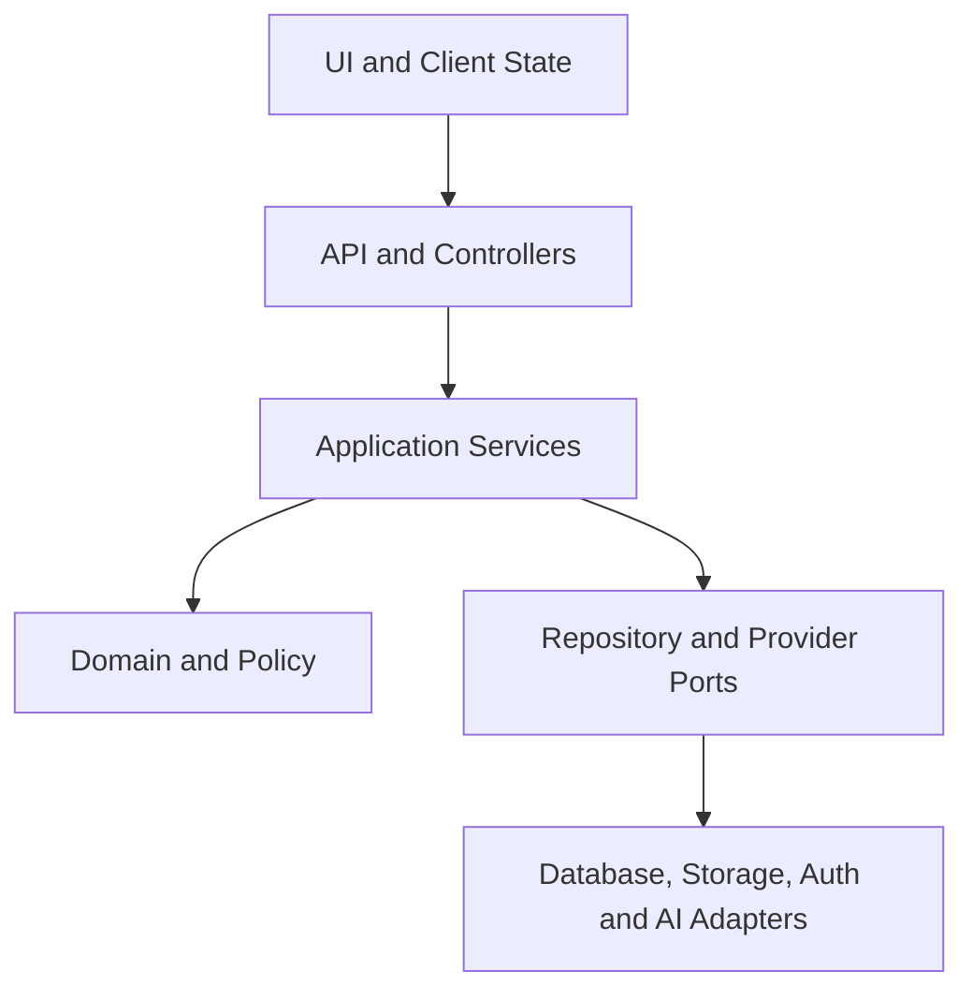

# GeoCredit AI — Coding Guidelines / AI Coding Instructions

**Version:** MVP v1.0  
**Audience:** Developers, Reviewers and AI Coding Assistants  
**Target:** Hackathon / 3-Day MVP  
**Last Updated:** 03 September 2026

## 1. Purpose

This document is the implementation contract for GeoCredit AI. It defines how humans and AI coding assistants must read requirements, structure code, preserve business rules, protect data, implement GPS/500m logic, produce risk/AI outputs, test changes and report completion.

Use this file as repository-level AI instructions (for example, adapt it into `AGENTS.md`, `CLAUDE.md`, `.github/copilot-instructions.md` or the selected tool’s instruction file).

## 2. Source-of-Truth Order

When requirements conflict, use this order and stop for clarification if the conflict changes business behavior:

1. Product Requirement Document (PRD)
2. Approved business/security decisions
3. Workflow & Status Transition Document
4. Role & Permission Matrix
5. AI Risk Scoring Rules and Prompt Specification
6. GPS & 500m Search Logic
7. API Specification and Database Schema/ERD
8. Screen/UI Specification and User Flow
9. Acceptance Criteria & Test Cases
10. 3-Day Implementation Plan

An AI assistant must not silently invent a business rule to resolve ambiguity.

## 3. Non-Negotiable Product Rules

1. Dabi route is `CDO → BM → AM → RM`.
2. Progoti route is `CO → AM → RM`; BM is not part of this route.
3. Only RM may record `APPROVED` or `REJECTED`.
4. AI and deterministic risk services have no workflow-decision permission.
5. Display `AI Recommendation — Human Review Required` on every AI report.
6. Customer risk and area risk remain separate.
7. Missing or insufficient data must not be interpreted as low risk.
8. The authoritative nearby search uses PostGIS geodesic distance with an inclusive 500m boundary.
9. Nearby borrower results expose privacy-safe aggregates, not neighbor PII.
10. Submitted application versions and their risk snapshots are immutable.
11. Corrections create a new application version and, when relevant input changes, a new risk snapshot.
12. Every server mutation revalidates authentication, role, scope, state and version.

## 4. Recommended Stack and Language Rules

| Area | Standard |
|---|---|
| Language | TypeScript with strict mode |
| Web | React/Next.js or approved equivalent |
| API | Typed server routes/service layer |
| Database | PostgreSQL 16 + PostGIS |
| Validation | Shared runtime schemas plus TypeScript types |
| Money | Decimal/numeric; never binary floating point |
| Time | UTC `timestamptz`; display timezone explicitly |
| IDs | UUID |
| Tests | Unit, API integration and critical E2E |
| Formatting | Automated formatter and linter |

If the repository already uses another approved stack, follow its conventions instead of performing an unsolicited rewrite.

## 5. Architecture Boundaries



### Dependency Rules

- UI may call typed API clients; it must not query the database directly.
- Controllers parse input and map responses; they do not contain core policy.
- Application services coordinate transactions and adapters.
- Domain modules contain workflow guards, calculations and rule evaluation.
- Infrastructure implements ports for database, storage, authentication and AI providers.
- Risk calculation must not depend on UI or AI provider code.
- AI narrative generation consumes validated risk results; it never becomes the source of scores.

## 6. Suggested Module Layout

```text
src/
  app/ or pages/
  features/
    customers/
    applications/
    assessments/
    workflow/
    geo/
    risk/
    reports/
  server/
    api/
    services/
    repositories/
    auth/
    storage/
    ai/
  domain/
    entities/
    policies/
    calculations/
    errors/
  shared/
    validation/
    types/
    logging/
    config/
database/
  migrations/
  seed/
tests/
```

Prefer feature cohesion over large generic `utils` or `services` folders.

## 7. General Coding Standards

- Enable TypeScript strict mode; do not suppress errors with broad `any`.
- Prefer small, named functions with explicit inputs and outputs.
- Use domain terms from the PRD consistently.
- Avoid boolean arguments whose meaning is unclear; use named options/enums.
- Reject impossible states using types and database constraints where practical.
- Keep pure calculations free from I/O and current-time dependence.
- Inject clock, random ID and provider dependencies for deterministic tests.
- Avoid hidden global mutable state.
- Do not duplicate business rules across client and server. Client validation is convenience; server validation is authoritative.
- Comments explain why or policy constraints—not obvious syntax.
- Remove dead code and debug statements before completion.

### Naming

| Item | Convention | Example |
|---|---|---|
| TypeScript files | `kebab-case.ts` | `risk-assessment.service.ts` |
| React components | `PascalCase` export | `RiskSummaryCard` |
| Functions/variables | `camelCase` | `calculateAreaRisk` |
| Constants | `UPPER_SNAKE_CASE` | `DEFAULT_RADIUS_METERS` |
| Database objects | `snake_case` plural tables | `loan_applications` |
| API JSON | `camelCase` | `applicationNo` |
| Enum values | `UPPER_SNAKE_CASE` | `BM_RECOMMENDED` |
| Error codes | `UPPER_SNAKE_CASE` | `GEO_NOT_VERIFIED` |

## 8. Type and Validation Rules

Define a runtime schema at every trust boundary:

- Browser input
- API request/query/path
- Environment configuration
- Database JSON columns
- External provider responses
- AI structured output
- Import/seed files

```ts
const MoneyInput = z
  .string()
  .regex(/^\d+(\.\d{1,2})?$/)
  .transform((value) => new Decimal(value));
```

Do not use `Number` for authoritative currency arithmetic.

Use exhaustive handling for domain enums:

```ts
function assertNever(value: never): never {
  throw new Error(`Unhandled domain value: ${String(value)}`);
}
```

## 9. API Guidelines

### Request Handling

For every mutation, perform checks in this order:

1. Authenticate session/token.
2. Validate request shape and size.
3. Load target using scope-aware repository query.
4. Authorize role, department, organizational scope and assignment.
5. Validate current workflow state.
6. Validate optimistic record/application version.
7. Execute domain operation in a transaction.
8. Write workflow/audit events.
9. Return a typed response with correlation ID.

### Response Envelope

```json
{
  "data": {},
  "meta": {
    "requestId": "uuid",
    "version": 3
  }
}
```

### Error Envelope

```json
{
  "error": {
    "code": "RESOURCE_VERSION_CONFLICT",
    "message": "The application was updated by another user.",
    "fieldErrors": [],
    "requestId": "uuid"
  }
}
```

- Use stable error codes.
- Do not return stack traces, SQL, secrets or unauthorized object details.
- Prefer `404` or policy-approved denial behavior where existence disclosure is unsafe.
- Enforce pagination limits and stable sorting.
- Require idempotency keys for retryable create/submit/transition operations.

## 10. Authentication and Authorization

- Managed identity owns credentials; never store plaintext passwords.
- Authorization is server-side and deny-by-default.
- Scope queries must filter by organizational assignment in the database/repository query where possible.
- Never trust role, user ID, department, branch or allowed action supplied by the client.
- UI `allowedActions` improves UX only; backend checks again.
- ADMIN does not inherit RM credit-decision rights automatically.
- Audit all denied high-risk actions without logging sensitive payloads.

```ts
await authorization.requireApplicationAction({
  actor,
  application,
  action: "APPROVE",
  requiredRole: "RM"
});
```

Do not scatter ad hoc role-string checks throughout UI and controllers. Centralize policies and test them as a matrix.

## 11. Workflow Implementation

Implement the workflow as an explicit state machine or transition table.

```ts
type TransitionRule = {
  from: ApplicationStatus;
  action: WorkflowAction;
  to: ApplicationStatus;
  roles: UserRole[];
  guards: GuardName[];
};
```

### Workflow Rules

- A client sends an action, not an arbitrary target status.
- The server derives the destination state.
- Transition, ownership change and history insert occur atomically.
- Return, additional verification and rejection require remarks.
- Terminal states reject normal business-data mutations.
- Never update workflow history; append a compensating/corrective event if policy permits.
- Duplicate idempotent transition requests return the original logical result.
- Concurrent actions use optimistic locking; only one valid action succeeds.

### Forbidden Pattern

```ts
// Forbidden: arbitrary client-controlled status
application.status = request.body.status;
```

## 12. Database Guidelines

- Use migrations; never modify deployed schemas manually.
- Use UUID primary keys and explicit foreign keys.
- Store money as `numeric(14,2)` or approved precision.
- Store time as `timestamptz` in UTC.
- Use `geography(Point,4326)` for validated locations.
- Add indexes based on actual access patterns.
- Use integer `version` for optimistic locking on mutable records.
- Use check constraints for stable invariants.
- Use transactions for application state plus workflow/audit changes.
- Parameterize every query.
- Separate migration scripts from synthetic seed scripts.

### Query Safety

```sql
UPDATE loan_applications
SET status = $1, version = version + 1, updated_at = now()
WHERE id = $2 AND version = $3
RETURNING *;
```

Zero updated rows must be handled as missing/unauthorized or version conflict without unsafe existence disclosure.

### Migration Rules

- Never rewrite an already-applied migration.
- Prefer backward-compatible expand/migrate/contract changes.
- Test migration from an empty database and from the previous release.
- Destructive changes require explicit review, backup and recovery plan.
- Seed data must fail closed in production.

## 13. Money and Financial Calculations

- Use decimal arithmetic and round only at specified boundaries.
- Server calculations are authoritative.
- Keep raw line items and derived totals.
- Distinguish debt balance from monthly debt payment.
- Guard division with documented denominators.
- Preserve calculation/rule version with snapshots.

```text
total_income = sum(valid monthly income items)
total_expense = sum(valid monthly expense items)
available_surplus = total_income - total_expense
installment_burden_ratio = proposed_installment / max(available_surplus, 1)
```

If surplus is non-positive, apply the explicit risk rule; do not disguise it by relying only on the denominator guard.

## 14. GPS and 500m Search

### Capture Validation

- Validate latitude `[-90, 90]` and longitude `[-180, 180]`.
- Record accuracy, capture timestamp, source/device metadata and server receipt time.
- Apply configured accuracy and age limits.
- Treat offline capture as pending until server verification.
- Never trust a client-provided distance or geo-verification status.

### Coordinate Construction

Longitude comes first in `ST_MakePoint`:

```sql
ST_SetSRID(ST_MakePoint(:longitude, :latitude), 4326)::geography
```

### Authoritative Radius Query

```sql
SELECT candidate.id,
       ST_Distance(candidate.location, origin.location) AS distance_meters
FROM eligible_borrower_locations candidate
CROSS JOIN selected_origin origin
WHERE candidate.geo_status = 'VALID'
  AND ST_DWithin(candidate.location, origin.location, 500.0)
ORDER BY distance_meters, candidate.id;
```

### Required Behavior

- Exact 500m is included.
- More than 500m is excluded.
- A bounding box may be used as a performance prefilter, never as final eligibility.
- Exclude invalid, pending, stale or policy-ineligible locations.
- Use a GiST spatial index.
- Store the query origin, radius, rule version and borrower/metric snapshot.
- Return aggregate area information without neighbor PII.
- Below the minimum cohort, return `INSUFFICIENT_DATA`.

## 15. Risk Engine Guidelines

- Risk score calculation is deterministic code/configuration, not an LLM prompt.
- Input is a frozen, validated feature set.
- Customer and area engines return independent outputs.
- Score range is `0–100`; higher means higher risk.
- Store engine, rule, threshold and feature-schema versions.
- Store triggered factors/reason codes with evidence references.
- Treat missing features explicitly according to documented policy.
- Identical inputs and versions must produce identical results.
- Changing rules requires a new version and regression tests.
- Never back-edit a submitted risk snapshot.

```ts
type RiskAssessment = {
  type: "CUSTOMER" | "AREA";
  score: Decimal | null;
  level: "LOW" | "MODERATE" | "HIGH" | "VERY_HIGH" | "INSUFFICIENT_DATA";
  factors: RiskFactor[];
  versions: RiskVersions;
  inputSnapshotId: string;
};
```

## 16. AI Report Guidelines

The AI layer summarizes validated structured evidence. It must not calculate authoritative risk or execute application actions.

### Input

- Minimize and redact sensitive data.
- Include only structured, versioned fields necessary for the report.
- Use IDs/references rather than full personal information where possible.
- Do not send neighbor identities or raw documents/images unless explicitly approved.

### Output

- Require a strict JSON schema.
- Validate type, enum, length and factor-code references.
- Reject unsupported facts and contradictions with structured inputs.
- Show deterministic fallback content on timeout or invalid output.
- Persist prompt/model/schema version and generated timestamp.
- Label the report `AI Recommendation — Human Review Required`.

### Prohibited

- Giving the AI database credentials or unrestricted tools.
- Allowing AI output to choose `APPROVED`/`REJECTED` as a workflow mutation.
- Rendering raw model HTML/Markdown without sanitization.
- Logging prompts/responses containing sensitive values.
- Retrying indefinitely.

## 17. Media and File Uploads

- Keep storage private.
- Validate declared and detected MIME type, extension, size and safe image decoding.
- Generate storage keys server-side; do not use the original filename as the primary key.
- Use short-lived authorized URLs.
- Store checksum, MIME type, size, capture/upload time and owner/application link.
- Prevent path traversal and public bucket/object permissions.
- Avoid base64 file payloads in ordinary JSON APIs.
- Scan files when required by the deployment security policy.
- Deleting/replacing evidence must preserve required audit/version history.

## 18. Offline and Idempotency

- Store only necessary local draft data.
- Encrypt/protect local sensitive data using platform capabilities.
- Partition local data by authenticated user.
- On logout/account change, prevent cross-user access.
- Use client-generated UUIDs and idempotency keys.
- Never silently overwrite a newer server version.
- Sync form metadata and media with explicit statuses.
- A lost response followed by retry must not create a duplicate.

Idempotency records should bind:

- actor
- route/action
- idempotency key
- normalized request hash
- result reference
- expiry

The same key with a different payload must be rejected.

## 19. UI Guidelines

- Design for mobile/field use first.
- Keep primary action visible and status-specific.
- Use progressive disclosure for long applications.
- Show section completion and submission blockers.
- Preserve entered values after recoverable errors.
- Provide loading, empty, error, retry, offline and conflict states.
- Do not convey risk only through color; include text/icon.
- Separate customer-risk and area-risk cards visually and semantically.
- Label insufficient data distinctly.
- Show evidence/source time and report generation time.
- Confirmation is required for approve/reject and other consequential actions.
- Terminal decisions are visibly read-only.
- Use semantic HTML, keyboard access and labeled controls.

## 20. Error Handling

Use domain errors mapped centrally to API responses.

| Error Code | Typical HTTP Status |
|---|---:|
| `AUTHENTICATION_REQUIRED` | 401 |
| `ROLE_PERMISSION_DENIED` | 403 |
| `ORGANIZATIONAL_SCOPE_DENIED` | 403/404 per policy |
| `RESOURCE_NOT_FOUND` | 404 |
| `REQUIRED_FIELD_MISSING` | 422 |
| `FINANCIAL_DATA_INVALID` | 422 |
| `GEO_NOT_VERIFIED` | 409/422 |
| `AREA_QUERY_PENDING` | 409 |
| `RISK_REPORT_PENDING` | 409 |
| `INVALID_WORKFLOW_TRANSITION` | 409 |
| `RESOURCE_VERSION_CONFLICT` | 409 |
| `IDEMPOTENCY_KEY_REUSE` | 409 |

- User messages are actionable and non-technical.
- Logs contain an internal error/correlation ID.
- Catch errors only when adding context, translating them or implementing a safe fallback.
- Never swallow a failed audit write for material actions.

## 21. Logging, Audit and Privacy

### Log

- request/correlation ID
- route, method, status and duration
- internal actor ID when allowed
- domain action and safe result code
- service/build/version

### Do Not Log

- passwords, tokens, cookies or API keys
- full national/identity numbers
- raw customer profiles or financial payloads
- precise GPS unless explicitly allowed and protected
- raw images/files
- full AI prompt/response with personal data
- database connection strings

Audit events are domain evidence, not ordinary debug logs. They must record actor/service, action, target, before/after references or safe change summary, result, time and correlation ID.

## 22. Security Guidelines

- Follow least privilege and deny by default.
- Parameterize SQL and encode/sanitize output.
- Validate all untrusted data on the server.
- Protect cookie sessions with secure attributes and CSRF control.
- Restrict CORS to explicit origins.
- Rate-limit authentication, search, upload and AI endpoints.
- Use secrets manager/environment injection; never hard-code credentials.
- Keep dependencies pinned and scanned.
- Do not expose debug routes, demo role switching or stack traces outside approved demo/local environments.
- Treat any permission bypass, PII exposure or unauthorized decision as release blocking.

## 23. Testing Requirements

### Unit Tests

- Financial calculations and rounding.
- Risk-rule and threshold boundaries.
- Dabi/Progoti transition tables.
- Role/scope policies.
- Validation and error mapping.
- AI schema validation and fallback.

### Integration Tests

- PostgreSQL constraints and transactions.
- PostGIS 499m, 500m and 501m behavior.
- Minimum area cohort.
- Idempotent retries and request-hash mismatch.
- Optimistic concurrency.
- Media authorization.

### E2E Tests

- Dabi approval journey.
- Progoti rejection journey.
- Return/correction/resubmission.
- Invalid GPS retake.
- Non-RM approval denial.
- Offline draft/reconnect-safe sync where implemented.

### Test Rules

- Use deterministic synthetic data.
- Never depend on current time without an injected clock.
- A test should have one clear reason to fail.
- Test names describe behavior and expected outcome.
- Fix flaky tests; do not add blind retries.
- New business behavior requires tests before it is called complete.

## 24. Vibe-Coding / AI Assistant Workflow

An AI coding assistant must follow this sequence for every task:

### 1. Understand

- Read repository instructions and relevant specifications.
- Inspect existing patterns before proposing new architecture.
- State assumptions when requirements are incomplete.
- Identify affected roles, statuses, data and tests.

### 2. Plan

- Produce a small, verifiable change plan.
- Identify schema/API compatibility impact.
- Separate P0 requirement from optional polish.
- Do not broaden scope without approval.

### 3. Implement

- Make the smallest coherent change.
- Reuse existing components/services/types.
- Preserve unrelated user changes.
- Add migrations rather than editing applied ones.
- Do not generate placeholder business logic when exact rules exist.

### 4. Verify

- Run formatter, lint and type checks.
- Run targeted unit/integration tests.
- Run relevant E2E/smoke tests when feasible.
- Inspect actual errors and fix root cause.
- Verify migration/seed effects if data changes.

### 5. Report

- Lead with the outcome.
- List changed files and behavior.
- State tests executed and results.
- Disclose assumptions, limitations and unverified items.
- Never claim a test passed if it was not run.

## 25. Instructions Specifically for AI Coding Agents

### Must Do

- Ask before making a material product/policy decision not covered by the docs.
- Preserve exact workflow status names and role routes.
- Use backend authorization even if UI hides the action.
- Use PostGIS for authoritative radius calculation.
- Keep deterministic scoring outside the language model.
- Add or update tests with every behavior change.
- Keep real/sensitive data out of prompts, tests and source code.
- Use safe, reversible operations and explicit migrations.
- Read current code before creating duplicate abstractions.

### Must Not Do

- Do not invent endpoints, tables or fields without checking the specifications and current repository.
- Do not silently modify scope or risk weights.
- Do not bypass validation to make a demo pass.
- Do not hard-code approval outcomes or risk results for real application paths.
- Do not accept arbitrary `status` updates from the client.
- Do not let AI output write workflow state.
- Do not expose neighbor/customer PII in area results.
- Do not use Euclidean degree distance for 500m search.
- Do not commit secrets, `.env` values or production data.
- Do not disable failing tests, lint or security controls without explicit approval.
- Do not rewrite unrelated code during a focused task.
- Do not claim production readiness for the 3-day prototype.

## 26. AI Task Prompt Template

Use this template when assigning implementation tasks to an AI coding assistant:

```text
Goal:
Implement [specific GeoCredit AI behavior].

Relevant specifications:
- [document + section]
- [document + section]

In scope:
- [behavior]
- [behavior]

Out of scope:
- [explicit exclusions]

Acceptance criteria:
1. [observable result]
2. [authorization/validation result]
3. [error/edge result]

Constraints:
- Preserve Dabi/Progoti workflow rules.
- Backend authorization is authoritative.
- Do not expose PII or secrets.
- Add/update tests.

Required verification:
- [test command]
- [test case IDs]

Before coding, inspect existing implementation and state any blocking conflict.
After coding, summarize changed files, tests run and remaining limitations.
```

## 27. Code Review Checklist

### Correctness

- [ ] Matches named acceptance criteria.
- [ ] Handles success, empty, invalid and failure cases.
- [ ] Dabi/Progoti workflow routes remain correct.
- [ ] Financial/risk/GPS calculations match versioned rules.
- [ ] No stale snapshot or mutable submitted version issue.

### Security and Privacy

- [ ] Authentication and server authorization present.
- [ ] Organizational scope enforced.
- [ ] Input validated; SQL parameterized.
- [ ] PII/secrets absent from logs and UI where not allowed.
- [ ] Media access remains private.
- [ ] AI input/output is minimized and validated.

### Data and Operations

- [ ] Migration is safe and tested.
- [ ] Transaction boundaries protect workflow/audit integrity.
- [ ] Idempotency/concurrency handled for mutations.
- [ ] Observability added without sensitive payloads.
- [ ] Demo seed remains deterministic.

### Quality

- [ ] Types are precise; no unjustified `any`.
- [ ] No duplicated business policy.
- [ ] Tests cover the change and boundaries.
- [ ] Lint, types and tests pass.
- [ ] Documentation/API specification updated if contract changed.

## 28. Definition of Done

A coding task is Done only when:

1. The implemented behavior meets its acceptance criteria.
2. Backend validation, authorization and scope checks are present.
3. Data changes include reviewed migrations and seed/test updates.
4. Tests include positive and relevant negative/boundary cases.
5. Formatting, lint, type checking and relevant tests pass.
6. Errors and loading/empty states are handled.
7. No sensitive data is introduced into code, logs, fixtures or prompts.
8. Relevant specifications are updated when the contract changes.
9. The change is integrated and demonstrable—not only locally mocked.
10. Limitations and unverified items are reported clearly.

## 29. MVP Completion Commands

Adapt to the repository, but keep an equivalent single quality gate:

```bash
npm run format:check
npm run lint
npm run typecheck
npm run test
npm run test:integration
npm run test:e2e -- --grep @smoke
npm run build
```

If any command cannot be run, the completion report must state which command, why and the associated risk.

## 30. Short Repository Instruction Block

The following concise block may be copied into an AI instruction file:

```text
Build GeoCredit AI according to the repository specifications. Preserve these invariants:

- Dabi: CDO → BM → AM → RM.
- Progoti: CO → AM → RM.
- Only RM can approve or reject.
- AI is advisory and cannot mutate workflow state.
- Customer and area risk remain separate.
- Missing/insufficient data is not low risk.
- Use PostGIS geography and ST_DWithin with an inclusive 500m radius.
- Do not expose neighboring borrower PII.
- Submitted versions and risk snapshots are immutable.
- Every mutation rechecks auth, scope, state, version and idempotency.

Before editing, inspect existing code and relevant docs. Make the smallest coherent change, preserve unrelated work, add tests, and run formatting, lint, type checks and targeted tests. Never invent a business rule, hard-code production outcomes, commit secrets, bypass validation or claim tests passed when not executed.
```

