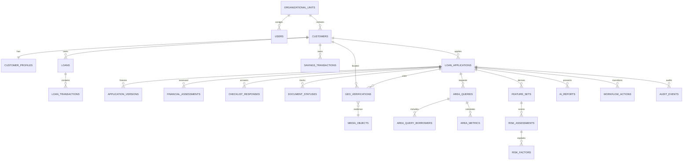

# GeoCredit AI — Database Schema / ERD

**Version:** MVP v1.0  
**Database:** PostgreSQL 16 + PostGIS  
**Target:** Hackathon / 3-Day Demo MVP  
**Last Updated:** 03 September 2026

## 1. Purpose

This schema supports customer profiles, historical loan/savings behavior, Dabi and Progoti applications, financial assessments, GPS/image verification, 500-meter area intelligence, explainable risk reports, workflow and audit history.

## 2. Conventions

| Item | Rule |
|---|---|
| IDs | UUID using `gen_random_uuid()` |
| Names | `snake_case`; plural table names |
| Time | `timestamptz` in UTC |
| Money | `numeric(14,2)` |
| Location | `geography(Point,4326)` |
| Mutable records | Integer `version` for optimistic locking |
| Snapshots | Append-only, application-version linked |
| External records | Preserve source system, ID and update time |
| Sensitive IDs | Encrypted/tokenized; optional masked suffix |

```sql
CREATE EXTENSION IF NOT EXISTS pgcrypto;
CREATE EXTENSION IF NOT EXISTS postgis;
```

## 3. High-Level ERD



## 4. Enums

```sql
CREATE TYPE user_role AS ENUM ('CDO','CO','BM','AM','RM','ADMIN');
CREATE TYPE department_type AS ENUM ('DABI','PROGOTI');
CREATE TYPE application_status AS ENUM (
  'DRAFT','SUBMITTED_BY_CDO','BM_REVIEW','BM_RECOMMENDED',
  'SUBMITTED_BY_CO','AM_REVIEW','AM_RECOMMENDED','RM_REVIEW',
  'ADDITIONAL_VERIFICATION_REQUIRED','RETURNED_FOR_CORRECTION',
  'APPROVED','REJECTED'
);
CREATE TYPE geo_status AS ENUM (
  'LOCAL_ONLY','UPLOAD_PENDING','PROCESSING','VALID','INVALID','FAILED'
);
CREATE TYPE risk_level AS ENUM ('LOW','MODERATE','HIGH','VERY_HIGH');
CREATE TYPE risk_type AS ENUM ('CUSTOMER','AREA');
CREATE TYPE factor_direction AS ENUM ('POSITIVE','RISK','INFORMATIONAL');
CREATE TYPE document_state AS ENUM ('PRESENT','MISSING','NOT_APPLICABLE');
```

## 5. Identity and Organization

```sql
CREATE TABLE organizational_units (
  id uuid PRIMARY KEY DEFAULT gen_random_uuid(),
  parent_id uuid REFERENCES organizational_units(id),
  unit_type varchar(30) NOT NULL CHECK
    (unit_type IN ('DIVISION','REGION','AREA','BRANCH','VO')),
  code varchar(50) NOT NULL,
  name varchar(200) NOT NULL,
  active boolean NOT NULL DEFAULT true,
  created_at timestamptz NOT NULL DEFAULT now(),
  updated_at timestamptz NOT NULL DEFAULT now(),
  UNIQUE (unit_type, code)
);

CREATE INDEX idx_org_units_parent ON organizational_units(parent_id);

CREATE TABLE users (
  id uuid PRIMARY KEY DEFAULT gen_random_uuid(),
  employee_id varchar(50) NOT NULL UNIQUE,
  display_name varchar(200) NOT NULL,
  role user_role NOT NULL,
  department department_type,
  organizational_unit_id uuid REFERENCES organizational_units(id),
  active boolean NOT NULL DEFAULT true,
  last_login_at timestamptz,
  created_at timestamptz NOT NULL DEFAULT now(),
  updated_at timestamptz NOT NULL DEFAULT now()
);

CREATE INDEX idx_users_scope
ON users(role, department, organizational_unit_id) WHERE active = true;
```

Managed authentication may own the user ID; do not store passwords in this application table.

## 6. Customer and Historical Behavior

```sql
CREATE TABLE customers (
  id uuid PRIMARY KEY DEFAULT gen_random_uuid(),
  member_no varchar(50) NOT NULL,
  project department_type NOT NULL,
  organizational_unit_id uuid NOT NULL REFERENCES organizational_units(id),
  vo_code varchar(50),
  customer_status varchar(30) NOT NULL DEFAULT 'ACTIVE',
  source_system varchar(50),
  source_id varchar(100),
  source_updated_at timestamptz,
  created_by uuid REFERENCES users(id),
  created_at timestamptz NOT NULL DEFAULT now(),
  updated_at timestamptz NOT NULL DEFAULT now(),
  deleted_at timestamptz,
  version integer NOT NULL DEFAULT 1,
  UNIQUE (project, organizational_unit_id, member_no)
);

CREATE INDEX idx_customers_member ON customers(member_no);
CREATE INDEX idx_customers_scope ON customers(project, organizational_unit_id);

CREATE TABLE customer_profiles (
  customer_id uuid PRIMARY KEY REFERENCES customers(id),
  member_name varchar(200) NOT NULL,
  date_of_birth date,
  mother_name varchar(200),
  father_name varchar(200),
  gender varchar(30),
  marital_status varchar(30),
  occupation varchar(200),
  present_address text,
  permanent_address text,
  primary_earner boolean,
  residence_type varchar(50),
  id_type varchar(50),
  encrypted_id_no text,
  id_no_last4 varchar(4),
  member_category varchar(50),
  spouse_info jsonb NOT NULL DEFAULT '{}'::jsonb,
  nominee_info jsonb NOT NULL DEFAULT '{}'::jsonb,
  updated_by uuid REFERENCES users(id),
  updated_at timestamptz NOT NULL DEFAULT now(),
  version integer NOT NULL DEFAULT 1
);

CREATE TABLE loans (
  id uuid PRIMARY KEY DEFAULT gen_random_uuid(),
  customer_id uuid NOT NULL REFERENCES customers(id),
  loan_serial_no varchar(50),
  disbursed_at date,
  disbursed_amount numeric(14,2) NOT NULL DEFAULT 0,
  installment_count integer,
  loan_status varchar(30) NOT NULL,
  responsible_officer_name varchar(200),
  responsible_officer_code varchar(50),
  source_system varchar(50),
  source_id varchar(100),
  source_updated_at timestamptz,
  UNIQUE (source_system, source_id)
);

CREATE INDEX idx_loans_customer ON loans(customer_id, disbursed_at DESC);

CREATE TABLE loan_transactions (
  id uuid PRIMARY KEY DEFAULT gen_random_uuid(),
  loan_id uuid NOT NULL REFERENCES loans(id),
  transaction_serial integer,
  collection_date date NOT NULL,
  target_amount numeric(14,2) NOT NULL DEFAULT 0,
  collection_amount numeric(14,2) NOT NULL DEFAULT 0,
  loan_due numeric(14,2) NOT NULL DEFAULT 0,
  overdue_amount numeric(14,2) NOT NULL DEFAULT 0,
  is_collection_date boolean,
  loan_status varchar(30),
  collection_method varchar(50),
  source_system varchar(50),
  source_id varchar(100),
  UNIQUE (source_system, source_id)
);

CREATE INDEX idx_loan_tx_loan_date
ON loan_transactions(loan_id, collection_date DESC);

CREATE TABLE savings_transactions (
  id uuid PRIMARY KEY DEFAULT gen_random_uuid(),
  customer_id uuid NOT NULL REFERENCES customers(id),
  transaction_date date NOT NULL,
  savings_own numeric(14,2) NOT NULL DEFAULT 0,
  collection_security numeric(14,2) NOT NULL DEFAULT 0,
  withdrawal_amount numeric(14,2) NOT NULL DEFAULT 0,
  balance numeric(14,2) NOT NULL DEFAULT 0,
  payment_method varchar(50),
  source_system varchar(50),
  source_id varchar(100),
  UNIQUE (source_system, source_id)
);

CREATE INDEX idx_savings_customer_date
ON savings_transactions(customer_id, transaction_date DESC);
```

## 7. Loan Applications and Versions

```sql
CREATE TABLE loan_applications (
  id uuid PRIMARY KEY DEFAULT gen_random_uuid(),
  application_no varchar(50) NOT NULL UNIQUE,
  customer_id uuid NOT NULL REFERENCES customers(id),
  department department_type NOT NULL,
  created_by uuid NOT NULL REFERENCES users(id),
  current_owner_id uuid REFERENCES users(id),
  status application_status NOT NULL DEFAULT 'DRAFT',
  proposed_amount numeric(14,2) CHECK (proposed_amount > 0),
  loan_user varchar(200),
  loan_type varchar(20) CHECK (loan_type IN ('NEW','REPEAT')),
  duration_months integer CHECK (duration_months > 0),
  loan_purpose text,
  investment_sector varchar(200),
  scheme varchar(100),
  loan_product varchar(100),
  residence_type varchar(50),
  submitted_at timestamptz,
  decided_at timestamptz,
  decided_by uuid REFERENCES users(id),
  decision_remarks text,
  created_at timestamptz NOT NULL DEFAULT now(),
  updated_at timestamptz NOT NULL DEFAULT now(),
  version integer NOT NULL DEFAULT 1,
  CHECK (
    status NOT IN ('APPROVED','REJECTED')
    OR (decided_at IS NOT NULL AND decided_by IS NOT NULL)
  )
);

CREATE INDEX idx_app_customer
ON loan_applications(customer_id, created_at DESC);
CREATE INDEX idx_app_queue
ON loan_applications(status, department, current_owner_id, updated_at DESC);

CREATE TABLE application_versions (
  id uuid PRIMARY KEY DEFAULT gen_random_uuid(),
  application_id uuid NOT NULL REFERENCES loan_applications(id),
  version_no integer NOT NULL,
  snapshot jsonb NOT NULL,
  snapshot_hash varchar(128) NOT NULL,
  created_by uuid NOT NULL REFERENCES users(id),
  created_at timestamptz NOT NULL DEFAULT now(),
  UNIQUE (application_id, version_no)
);
```

## 8. Financial Assessments

```sql
CREATE TABLE financial_assessments (
  id uuid PRIMARY KEY DEFAULT gen_random_uuid(),
  application_id uuid NOT NULL REFERENCES loan_applications(id),
  application_version_no integer,
  assessor_id uuid NOT NULL REFERENCES users(id),
  assessor_role user_role NOT NULL,
  total_income numeric(14,2) NOT NULL DEFAULT 0,
  total_expense numeric(14,2) NOT NULL DEFAULT 0,
  other_debt numeric(14,2) NOT NULL DEFAULT 0,
  monthly_cash_in_hand numeric(14,2) NOT NULL DEFAULT 0,
  proposed_installment numeric(14,2) NOT NULL DEFAULT 0,
  available_surplus numeric(14,2) GENERATED ALWAYS AS
    (total_income - total_expense) STORED,
  tolerance_percent numeric(7,2),
  remarks text,
  details jsonb NOT NULL DEFAULT '{}'::jsonb,
  created_at timestamptz NOT NULL DEFAULT now(),
  updated_at timestamptz NOT NULL DEFAULT now(),
  version integer NOT NULL DEFAULT 1,
  UNIQUE (application_id, application_version_no, assessor_role)
);

CREATE INDEX idx_financial_app
ON financial_assessments(application_id, assessor_role);
```

For the hackathon, `details` may store named income/expense/liability fields. A production version can normalize them into `financial_assessment_items`.

## 9. Checklists and Documents

```sql
CREATE TABLE checklist_templates (
  id uuid PRIMARY KEY DEFAULT gen_random_uuid(),
  code varchar(100) NOT NULL,
  department department_type NOT NULL,
  owner_role user_role NOT NULL,
  version_no integer NOT NULL,
  title varchar(200) NOT NULL,
  active boolean NOT NULL DEFAULT true,
  UNIQUE (code, version_no)
);

CREATE TABLE checklist_questions (
  id uuid PRIMARY KEY DEFAULT gen_random_uuid(),
  template_id uuid NOT NULL REFERENCES checklist_templates(id),
  question_code varchar(100) NOT NULL,
  question_text text NOT NULL,
  response_type varchar(30) NOT NULL,
  required boolean NOT NULL DEFAULT false,
  display_order integer NOT NULL,
  validation_config jsonb NOT NULL DEFAULT '{}'::jsonb,
  UNIQUE (template_id, question_code)
);

CREATE TABLE checklist_responses (
  id uuid PRIMARY KEY DEFAULT gen_random_uuid(),
  application_id uuid NOT NULL REFERENCES loan_applications(id),
  application_version_no integer,
  template_id uuid NOT NULL REFERENCES checklist_templates(id),
  question_id uuid NOT NULL REFERENCES checklist_questions(id),
  respondent_id uuid NOT NULL REFERENCES users(id),
  respondent_role user_role NOT NULL,
  response_value jsonb NOT NULL,
  remarks text,
  created_at timestamptz NOT NULL DEFAULT now(),
  updated_at timestamptz NOT NULL DEFAULT now(),
  UNIQUE (application_id, application_version_no, question_id, respondent_role)
);

CREATE TABLE document_statuses (
  id uuid PRIMARY KEY DEFAULT gen_random_uuid(),
  application_id uuid NOT NULL REFERENCES loan_applications(id),
  application_version_no integer,
  document_code varchar(100) NOT NULL,
  document_name varchar(200) NOT NULL,
  status document_state NOT NULL,
  required boolean NOT NULL DEFAULT false,
  media_object_id uuid,
  remarks text,
  updated_by uuid NOT NULL REFERENCES users(id),
  updated_at timestamptz NOT NULL DEFAULT now(),
  UNIQUE (application_id, application_version_no, document_code)
);
```

## 10. Media and Geo Verification

```sql
CREATE TABLE media_objects (
  id uuid PRIMARY KEY DEFAULT gen_random_uuid(),
  storage_provider varchar(50) NOT NULL,
  storage_key text NOT NULL UNIQUE,
  original_filename varchar(255),
  mime_type varchar(100) NOT NULL,
  size_bytes bigint NOT NULL CHECK (size_bytes >= 0),
  checksum_sha256 varchar(64) NOT NULL,
  upload_status varchar(30) NOT NULL,
  malware_scan_status varchar(30),
  uploaded_by uuid NOT NULL REFERENCES users(id),
  created_at timestamptz NOT NULL DEFAULT now(),
  verified_at timestamptz
);

ALTER TABLE document_statuses
ADD CONSTRAINT fk_document_media
FOREIGN KEY (media_object_id) REFERENCES media_objects(id);

CREATE TABLE geo_verifications (
  id uuid PRIMARY KEY DEFAULT gen_random_uuid(),
  customer_id uuid NOT NULL REFERENCES customers(id),
  application_id uuid REFERENCES loan_applications(id),
  media_object_id uuid REFERENCES media_objects(id),
  location geography(Point,4326),
  latitude numeric(9,6),
  longitude numeric(9,6),
  accuracy_m numeric(9,2),
  captured_at timestamptz NOT NULL,
  officer_id uuid NOT NULL REFERENCES users(id),
  device_id_hash varchar(128),
  client_capture_id uuid NOT NULL,
  status geo_status NOT NULL DEFAULT 'LOCAL_ONLY',
  validation_reasons jsonb NOT NULL DEFAULT '[]'::jsonb,
  verified_at timestamptz,
  created_at timestamptz NOT NULL DEFAULT now(),
  UNIQUE (officer_id, client_capture_id),
  CHECK (latitude IS NULL OR latitude BETWEEN -90 AND 90),
  CHECK (longitude IS NULL OR longitude BETWEEN -180 AND 180),
  CHECK (
    status <> 'VALID'
    OR (location IS NOT NULL AND media_object_id IS NOT NULL)
  )
);

CREATE INDEX idx_geo_location
ON geo_verifications USING GIST(location);
CREATE INDEX idx_geo_customer
ON geo_verifications(customer_id, captured_at DESC);
CREATE INDEX idx_geo_application
ON geo_verifications(application_id, captured_at DESC);
```

Create the point with longitude first:

```sql
ST_SetSRID(ST_MakePoint(:longitude, :latitude),4326)::geography
```

Latest valid location view:

```sql
CREATE VIEW current_customer_locations AS
SELECT DISTINCT ON (customer_id)
  id AS geo_verification_id,
  customer_id,
  application_id,
  location,
  accuracy_m,
  captured_at
FROM geo_verifications
WHERE status = 'VALID' AND location IS NOT NULL
ORDER BY customer_id, captured_at DESC;
```

## 11. Area Intelligence

```sql
CREATE TABLE area_queries (
  id uuid PRIMARY KEY DEFAULT gen_random_uuid(),
  application_id uuid NOT NULL REFERENCES loan_applications(id),
  application_version_no integer NOT NULL,
  geo_verification_id uuid NOT NULL REFERENCES geo_verifications(id),
  center_point geography(Point,4326) NOT NULL,
  radius_m integer NOT NULL DEFAULT 500 CHECK (radius_m > 0),
  eligibility_rules_version varchar(50) NOT NULL,
  data_cutoff_at timestamptz NOT NULL,
  query_status varchar(30) NOT NULL,
  borrower_count integer NOT NULL DEFAULT 0,
  started_at timestamptz NOT NULL DEFAULT now(),
  completed_at timestamptz,
  error_code varchar(100),
  UNIQUE (application_id, application_version_no, eligibility_rules_version)
);

CREATE TABLE area_query_borrowers (
  area_query_id uuid NOT NULL REFERENCES area_queries(id),
  customer_id uuid NOT NULL REFERENCES customers(id),
  distance_m numeric(10,2) NOT NULL CHECK (distance_m >= 0),
  loan_status varchar(30),
  risk_level risk_level,
  repayment_summary jsonb NOT NULL DEFAULT '{}'::jsonb,
  savings_summary jsonb NOT NULL DEFAULT '{}'::jsonb,
  included_at timestamptz NOT NULL DEFAULT now(),
  PRIMARY KEY (area_query_id, customer_id)
);

CREATE TABLE area_metrics (
  id uuid PRIMARY KEY DEFAULT gen_random_uuid(),
  area_query_id uuid NOT NULL REFERENCES area_queries(id),
  metric_code varchar(100) NOT NULL,
  numeric_value numeric(18,6),
  text_value text,
  unit varchar(50),
  source_record_count integer,
  created_at timestamptz NOT NULL DEFAULT now(),
  UNIQUE (area_query_id, metric_code),
  CHECK (numeric_value IS NOT NULL OR text_value IS NOT NULL)
);
```

Reference 500-meter query:

```sql
WITH applicant AS (
  SELECT customer_id, location
  FROM geo_verifications
  WHERE id = :geo_verification_id AND status = 'VALID'
)
SELECT
  ccl.customer_id,
  ST_Distance(ccl.location, a.location) AS distance_m
FROM current_customer_locations ccl
CROSS JOIN applicant a
JOIN customers c ON c.id = ccl.customer_id
WHERE ccl.customer_id <> a.customer_id
  AND c.customer_status = 'ACTIVE'
  AND c.project = :department
  AND ST_DWithin(ccl.location, a.location, 500)
ORDER BY distance_m;
```

Persist the resulting borrower cohort in `area_query_borrowers` so the area-risk snapshot remains explainable.

## 12. Risk and AI Report

```sql
CREATE TABLE feature_sets (
  id uuid PRIMARY KEY DEFAULT gen_random_uuid(),
  application_id uuid NOT NULL REFERENCES loan_applications(id),
  application_version_no integer NOT NULL,
  area_query_id uuid REFERENCES area_queries(id),
  schema_version varchar(50) NOT NULL,
  features jsonb NOT NULL,
  missing_features jsonb NOT NULL DEFAULT '[]'::jsonb,
  source_timestamps jsonb NOT NULL DEFAULT '{}'::jsonb,
  feature_hash varchar(128) NOT NULL,
  created_at timestamptz NOT NULL DEFAULT now(),
  UNIQUE (application_id, application_version_no, schema_version, feature_hash)
);

CREATE TABLE risk_assessments (
  id uuid PRIMARY KEY DEFAULT gen_random_uuid(),
  application_id uuid NOT NULL REFERENCES loan_applications(id),
  application_version_no integer NOT NULL,
  feature_set_id uuid NOT NULL REFERENCES feature_sets(id),
  assessment_type risk_type NOT NULL,
  score numeric(5,2) NOT NULL CHECK (score BETWEEN 0 AND 100),
  risk_level risk_level NOT NULL,
  engine_version varchar(50) NOT NULL,
  rules_version varchar(50) NOT NULL,
  threshold_version varchar(50) NOT NULL,
  generated_at timestamptz NOT NULL DEFAULT now(),
  UNIQUE (application_id, application_version_no, assessment_type, engine_version)
);

CREATE TABLE risk_factors (
  id uuid PRIMARY KEY DEFAULT gen_random_uuid(),
  assessment_id uuid NOT NULL REFERENCES risk_assessments(id),
  factor_code varchar(100) NOT NULL,
  label varchar(300) NOT NULL,
  direction factor_direction NOT NULL,
  severity varchar(30),
  observed_value jsonb,
  comparison_value jsonb,
  source_entity varchar(100),
  source_reference varchar(200),
  source_timestamp timestamptz,
  evidence_text text NOT NULL,
  display_order integer NOT NULL DEFAULT 0
);

CREATE INDEX idx_risk_factor_assessment
ON risk_factors(assessment_id, direction, display_order);

CREATE TABLE ai_reports (
  id uuid PRIMARY KEY DEFAULT gen_random_uuid(),
  application_id uuid NOT NULL REFERENCES loan_applications(id),
  application_version_no integer NOT NULL,
  customer_assessment_id uuid NOT NULL REFERENCES risk_assessments(id),
  area_assessment_id uuid NOT NULL REFERENCES risk_assessments(id),
  suggested_action_code varchar(100) NOT NULL,
  suggested_action_text text NOT NULL,
  key_findings jsonb NOT NULL DEFAULT '[]'::jsonb,
  template_version varchar(50) NOT NULL,
  model_provider varchar(100),
  model_name varchar(100),
  human_review_required boolean NOT NULL DEFAULT true,
  report_hash varchar(128) NOT NULL,
  generated_at timestamptz NOT NULL DEFAULT now(),
  UNIQUE (application_id, application_version_no, report_hash),
  CHECK (human_review_required = true)
);
```

## 13. Workflow and Audit

```sql
CREATE TABLE workflow_actions (
  id uuid PRIMARY KEY DEFAULT gen_random_uuid(),
  application_id uuid NOT NULL REFERENCES loan_applications(id),
  application_version_no integer,
  action_type varchar(50) NOT NULL,
  actor_id uuid NOT NULL REFERENCES users(id),
  actor_role user_role NOT NULL,
  from_status application_status,
  to_status application_status NOT NULL,
  reason_code varchar(100),
  remarks text,
  idempotency_key varchar(200),
  correlation_id varchar(100),
  created_at timestamptz NOT NULL DEFAULT now(),
  UNIQUE (actor_id, idempotency_key),
  CHECK (
    action_type NOT IN ('RETURN','REQUEST_ADDITIONAL_VERIFICATION','REJECT')
    OR length(trim(coalesce(remarks,''))) > 0
  )
);

CREATE INDEX idx_workflow_application
ON workflow_actions(application_id, created_at DESC);

CREATE TABLE audit_events (
  id uuid PRIMARY KEY DEFAULT gen_random_uuid(),
  actor_id uuid REFERENCES users(id),
  actor_role user_role,
  action varchar(100) NOT NULL,
  entity_type varchar(100) NOT NULL,
  entity_id uuid,
  application_id uuid REFERENCES loan_applications(id),
  customer_id uuid REFERENCES customers(id),
  organizational_unit_id uuid REFERENCES organizational_units(id),
  previous_state_ref jsonb,
  new_state_ref jsonb,
  metadata jsonb NOT NULL DEFAULT '{}'::jsonb,
  correlation_id varchar(100),
  ip_address inet,
  device_id_hash varchar(128),
  created_at timestamptz NOT NULL DEFAULT now()
);

CREATE INDEX idx_audit_application
ON audit_events(application_id, created_at DESC);
CREATE INDEX idx_audit_customer
ON audit_events(customer_id, created_at DESC);
CREATE INDEX idx_audit_actor
ON audit_events(actor_id, created_at DESC);
```

Normal application roles must not have `UPDATE` or `DELETE` permission on snapshot, workflow or audit records.

## 14. Idempotency

```sql
CREATE TABLE idempotency_records (
  id uuid PRIMARY KEY DEFAULT gen_random_uuid(),
  actor_id uuid NOT NULL REFERENCES users(id),
  idempotency_key varchar(200) NOT NULL,
  operation varchar(100) NOT NULL,
  request_hash varchar(128) NOT NULL,
  response_status integer,
  response_body jsonb,
  resource_type varchar(100),
  resource_id uuid,
  created_at timestamptz NOT NULL DEFAULT now(),
  expires_at timestamptz NOT NULL,
  UNIQUE (actor_id, idempotency_key)
);

CREATE INDEX idx_idempotency_expiry ON idempotency_records(expires_at);
```

## 15. Privacy-Safe Nearby View

```sql
CREATE VIEW nearby_borrower_public_summary AS
SELECT
  aqb.area_query_id,
  encode(digest(aqb.customer_id::text,'sha256'),'hex') AS masked_reference,
  round(aqb.distance_m / 25) * 25 AS distance_band_m,
  aqb.loan_status,
  aqb.risk_level,
  aqb.repayment_summary,
  aqb.savings_summary
FROM area_query_borrowers aqb;
```

This view must not contain customer name, NID, phone, address, exact coordinate or detailed transactions.

## 16. Recommended Read Models

| View/Projection | Purpose |
|---|---|
| `current_customer_locations` | Latest valid location for radius search |
| `customer_loan_summary` | Previous/closed/active loans, overdue and delays |
| `customer_savings_summary` | Current balance, deposit/withdrawal trend |
| `application_queue_view` | Role-scoped reviewer queue with risk badges |
| `application_complete_view` | Aggregated application detail for review |
| `nearby_borrower_public_summary` | Privacy-minimized area display |

Latest savings balance example:

```sql
CREATE VIEW latest_savings_balances AS
SELECT DISTINCT ON (customer_id)
  customer_id, balance, transaction_date
FROM savings_transactions
ORDER BY customer_id, transaction_date DESC;
```

## 17. Data Integrity Rules

| Rule | Enforcement |
|---|---|
| Risk score range | `CHECK score BETWEEN 0 AND 100` |
| Final decision completeness | Approved/rejected requires decision actor/time |
| Valid geo evidence | Valid status requires point and media |
| Coordinate limits | Latitude −90..90, longitude −180..180 |
| Duplicate capture | Unique officer + client capture ID |
| Duplicate workflow action | Unique actor + idempotency key |
| Required remarks | Return/additional verification/reject constraint |
| Historical consistency | Report links to application version and feature set |
| Separate risks | Assessment type is customer or area |
| Human authority | `human_review_required = true` |

Allowed workflow transitions, checklist completeness and role authorization must also be enforced in the service layer.

## 18. Row-Level Access Requirements

If Supabase/PostgreSQL RLS is used:

- Enable RLS on customers, applications, evidence, area, risk and workflow tables.
- CDO/CO access only their organizational scope.
- BM accesses assigned Dabi branch/scope applications.
- AM accesses assigned Dabi/Progoti area applications.
- RM accesses assigned regional applications.
- Raw nearby locations and direct `storage_key` values are not client-readable.
- Final decisions execute through a server function/action that verifies RM role and state.
- Nearby results are returned through the privacy-safe projection or backend API.

Frontend filtering is not access control.

## 19. Seed Data Minimums

| Entity | Minimum |
|---|---:|
| Users | 5: CDO, CO, BM, AM, RM |
| Customers | 20 |
| Valid locations | 20 |
| Demo borrowers within 500m | 12 |
| Loans | 25 |
| Loan transactions | 150 |
| Savings transactions | 100 |
| Dabi applications | 3 |
| Progoti applications | 1 |

All seed data must be synthetic.

## 20. Migration Order

1. Extensions and enums
2. Organizational units and users
3. Customers and profiles
4. Loans and loan transactions
5. Savings transactions
6. Applications and versions
7. Financial assessments
8. Checklists and documents
9. Media objects and geo verifications
10. Current-location view
11. Area queries, cohort and metrics
12. Feature sets, risk assessments and factors
13. AI reports
14. Workflow actions, audit and idempotency
15. Read models and RLS policies
16. Seed data

## 21. Three-Day MVP Simplifications

- Use Supabase Auth and keep `users` as an application profile.
- Keep financial named fields inside `details jsonb` during rapid iteration.
- Seed customer, loan and savings records directly.
- Use one audit table instead of a separate event platform.
- Store checklist definitions as seeded templates.
- Use one backend function for controlled workflow transitions.
- Use deterministic TypeScript risk rules and persist their versioned output.

Do not simplify away:

- GPS + image submission guard
- PostGIS 500-meter query
- Separate customer and area risks
- Reason codes and evidence
- Application/risk snapshots
- Role/state enforcement
- Append-only workflow/audit records
- Privacy-safe nearby borrower response

## 22. Acceptance Criteria

- Migrations succeed on a clean PostgreSQL/PostGIS database.
- Required foreign keys, checks and indexes exist.
- Synthetic customer/history data loads without constraint errors.
- Valid geo status requires image evidence and a spatial point.
- The indexed 500-meter query returns the expected seeded cohort.
- Applicant is excluded from their own nearby result.
- Nearby projection contains no prohibited personal information.
- Customer and area risk records are separate.
- Risk records reference a feature set and application version.
- A historical submitted report remains unchanged after source updates.
- Duplicate capture/submission/action retries do not create duplicates.
- Only valid state transitions can be recorded.
- Final decision identifies the RM, time and remarks.
- Return, additional-verification and reject actions require remarks.
- Application roles cannot update or delete audit/snapshot history.

