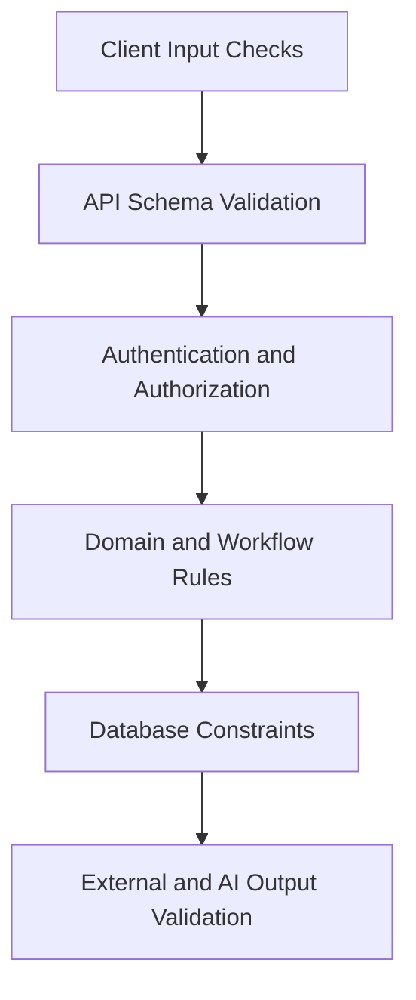
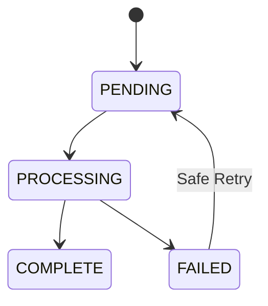

# GeoCredit AI — Error Handling & Validation Rules

**Version:** MVP v1.0  
**Status:** Development and QA Specification  
**Target:** Hackathon / 3-Day MVP  
**Last Updated:** 03 September 2026

## 1. Purpose

This document defines consistent validation, error handling, user feedback, retry, logging and audit behavior for GeoCredit AI. These rules apply to the web/mobile UI, API, database operations, workflow engine, GPS/500m search, media uploads, risk calculation, AI report generation and offline synchronization.

## 2. Objectives

- Prevent invalid, unauthorized or inconsistent data from entering the system.
- Give users clear, actionable and non-technical feedback.
- Preserve user-entered data after recoverable failures.
- Keep workflow, application versions and audit history consistent.
- Avoid exposing personal data, secrets or internal implementation details.
- Make errors observable and traceable using safe correlation IDs.
- Distinguish retryable failures from validation or policy failures.

## 3. Core Principles

1. **Server is authoritative.** Client validation improves UX but never replaces server validation.
2. **Deny by default.** Authentication, role, department, organizational scope and assignment are checked for every protected request.
3. **Validate at boundaries.** Browser, API, database, storage and AI provider inputs are untrusted.
4. **Fail atomically.** A failed business mutation must not leave partial workflow/audit state.
5. **Preserve drafts.** Recoverable network/server errors must not erase valid user input.
6. **Use stable codes.** Machines act on error codes; human-facing messages may be localized.
7. **Do not leak.** Errors must not reveal stack traces, SQL, secrets, nearby customer identities or unauthorized record existence.
8. **Retry selectively.** Retry transient technical failures, not invalid data or permission denials.
9. **Make uncertainty explicit.** Missing/insufficient data is not Low Risk.
10. **AI cannot decide.** AI failure or output must never approve/reject an application.

## 4. Validation Layers



| Layer | Responsibility | Example |
|---|---|---|
| Client | Immediate guidance and formatting | Required field, valid date display |
| API schema | Shape, type, size and enum validation | UUID, decimal string, allowed status/action |
| Authorization | Actor eligibility | CDO cannot submit Progoti |
| Domain | Business invariants | Expense totals, submission guards |
| Workflow | State/action/role guards | Only RM approves from `RM_REVIEW` |
| Database | Last-line integrity | FK, check, unique and optimistic version |
| Provider output | Untrusted response validation | AI JSON schema and factor codes |

Do not rely on database exceptions as the normal user-validation path. Validate predictable business errors before persistence and keep database constraints as defense in depth.

## 5. Standard API Error Contract

```json
{
  "error": {
    "code": "REQUIRED_FIELD_MISSING",
    "message": "Complete the required fields before submitting.",
    "fieldErrors": [
      {
        "field": "financialAssessment.monthlyIncome",
        "code": "FIELD_REQUIRED",
        "message": "Monthly income is required."
      }
    ],
    "details": {
      "section": "financialAssessment"
    },
    "requestId": "6a0f4040-59c7-4a62-a0ea-79055e7c2f6a",
    "retryable": false
  }
}
```

### Contract Rules

- `code` is stable, uppercase and machine-readable.
- `message` is safe, concise and actionable.
- `fieldErrors` is present when individual inputs are invalid.
- `details` contains only approved, non-sensitive structured context.
- `requestId` matches server logs/traces.
- `retryable` reflects whether repeating the same valid request may succeed.
- Never return stack traces, SQL, internal hostnames or provider raw errors.
- Localized clients may map `code` to translated messages while preserving the server message as fallback.

## 6. HTTP Status Mapping

| Status | Use | Examples |
|---:|---|---|
| `400` | Malformed request syntax/format | Invalid JSON, invalid UUID syntax |
| `401` | Missing, invalid or expired authentication | `AUTHENTICATION_REQUIRED` |
| `403` | Authenticated but not permitted | Role/scope denial |
| `404` | Resource absent or existence hidden | `RESOURCE_NOT_FOUND` |
| `409` | State, version or idempotency conflict | Invalid transition, stale version |
| `413` | Payload/file too large | `MEDIA_FILE_TOO_LARGE` |
| `415` | Unsupported media/content type | `MEDIA_TYPE_UNSUPPORTED` |
| `422` | Semantically invalid input/business data | Required/financial/geo validation |
| `429` | Rate limit reached | `RATE_LIMIT_EXCEEDED` |
| `500` | Unexpected internal failure | `INTERNAL_ERROR` |
| `502` | Required provider returned invalid/failure response | `UPSTREAM_SERVICE_ERROR` |
| `503` | Dependency temporarily unavailable | `SERVICE_UNAVAILABLE` |
| `504` | Dependency timeout | `UPSTREAM_TIMEOUT` |

Use one consistent status for each documented error code throughout the API.

## 7. Error Code Catalog — Authentication and Authorization

| Code | HTTP | Retryable | User Message | Notes |
|---|---:|---:|---|---|
| `AUTHENTICATION_REQUIRED` | 401 | No | Sign in to continue. | Preserve local draft |
| `SESSION_EXPIRED` | 401 | No | Your session expired. Sign in again. | Safe return URL allowed |
| `ACCOUNT_INACTIVE` | 403 | No | This account is not active. Contact support. | Do not reveal extra details |
| `ROLE_PERMISSION_DENIED` | 403 | No | You do not have permission for this action. | Audit sensitive attempts |
| `DEPARTMENT_PERMISSION_DENIED` | 403 | No | This application is outside your assigned project. | Dabi/Progoti |
| `ORGANIZATIONAL_SCOPE_DENIED` | 403/404 | No | You cannot access this record. | Apply existence-hiding policy |
| `APPLICATION_ASSIGNMENT_DENIED` | 403 | No | This application is not assigned to you. | Reviewer queue scope |
| `FINAL_DECISION_PERMISSION_DENIED` | 403 | No | Only an authorized RM can make the final decision. | P0 control |

Authorization errors must not return the protected record payload.

## 8. Error Code Catalog — Request and Resource

| Code | HTTP | Retryable | User Message |
|---|---:|---:|---|
| `INVALID_REQUEST` | 400 | No | The request could not be processed. Check the entered information. |
| `INVALID_IDENTIFIER` | 400 | No | The record reference is invalid. |
| `RESOURCE_NOT_FOUND` | 404 | No | The requested record was not found. |
| `RESOURCE_VERSION_CONFLICT` | 409 | No | This record was updated by someone else. Refresh and review the changes. |
| `DUPLICATE_RESOURCE` | 409 | No | A matching record already exists. |
| `IDEMPOTENCY_KEY_REQUIRED` | 400 | No | A request reference is required. Try again from the application. |
| `IDEMPOTENCY_KEY_REUSE` | 409 | No | This request reference was already used for different data. |
| `REQUEST_TOO_LARGE` | 413 | No | The submitted data is too large. |
| `RATE_LIMIT_EXCEEDED` | 429 | Yes | Too many requests. Wait briefly and try again. |

## 9. Field Validation Rules

### General

| Rule | Behavior |
|---|---|
| Required | Reject missing, null or blank-after-trim values unless blank is meaningful |
| String length | Enforce documented min/max on client and server |
| Enum | Accept only exact documented values |
| UUID | Parse strictly; do not coerce arbitrary strings |
| Boolean | Accept real boolean values, not ambiguous text |
| Date | Use ISO date and validate real calendar date |
| Timestamp | Require ISO 8601 with timezone/offset |
| Decimal | Use decimal string/decimal type; max two money decimals |
| Array | Enforce min/max items and reject unexpected duplicates |
| Unknown fields | Reject or ignore consistently per API version policy |

### Text

- Trim surrounding whitespace.
- Preserve meaningful internal whitespace.
- Normalize line endings.
- Enforce maximum length before persistence.
- Encode output and sanitize any supported rich text.
- Do not remove characters merely to hide an injection bug; use parameterized queries and safe rendering.

### Field Error Codes

| Code | Meaning |
|---|---|
| `FIELD_REQUIRED` | Required value missing |
| `FIELD_INVALID_FORMAT` | Invalid date/ID/decimal/other format |
| `FIELD_TOO_SHORT` | Below minimum length |
| `FIELD_TOO_LONG` | Exceeds maximum length |
| `FIELD_OUT_OF_RANGE` | Numeric/date value outside allowed bounds |
| `FIELD_INVALID_OPTION` | Value not in allowed enum/options |
| `FIELD_DUPLICATE` | Duplicate where uniqueness is required |
| `FIELD_INCONSISTENT` | Conflicts with another value |

## 10. Customer Validation

- `memberNo`, project and organizational unit are required.
- The same member number may not be duplicated within the defined project/scope uniqueness rule.
- Date of birth cannot be in the future.
- Sensitive identity numbers are encrypted/tokenized and masked for display.
- Full identity numbers must not appear in ordinary API list responses.
- Customer project must match the application department.
- Soft-deleted/inactive customers cannot receive a new application unless an approved rule allows it.
- Missing history is recorded as unavailable—not zero delay, zero overdue or positive history.

| Code | HTTP | Message |
|---|---:|---|
| `CUSTOMER_PROJECT_MISMATCH` | 422 | The customer project does not match this application. |
| `CUSTOMER_NOT_ACTIVE` | 422 | A new application cannot be created for this customer. |
| `CUSTOMER_DUPLICATE` | 409 | A customer with this member reference already exists. |

## 11. Application Validation

### Draft Save

- An incomplete draft may be saved.
- Fields that are present must still be well-formed.
- Draft owner must be CDO for Dabi or CO for Progoti and within scope.
- Invalid amounts, dates or enum values are rejected even in a draft.
- The response returns section completion and known blockers.

### Submission

Submission requires:

- Correct role and department.
- Current status is eligible for submit/resubmit.
- Current record version matches.
- Required product/application fields complete.
- Financial data valid and recalculated.
- Required checklist/document states complete.
- Required image evidence ready.
- Server geo status `VALID`.
- Area query completed or explicit allowed insufficient-data result.
- Current-version risk report ready.
- Required AI/report acknowledgment completed.

| Code | HTTP | Message |
|---|---:|---|
| `REQUIRED_FIELD_MISSING` | 422 | Complete the required fields before submitting. |
| `APPLICATION_SECTION_INCOMPLETE` | 422 | Complete all required application sections. |
| `APPLICATION_SUBMISSION_NOT_READY` | 409 | This application is not ready to submit. Review the listed items. |
| `APPLICATION_TERMINAL` | 409 | This application is already finalized and cannot be edited. |
| `APPLICATION_VERSION_NOT_FROZEN` | 409 | The application version could not be prepared for submission. |

## 12. Financial Validation

### Input Rules

- Money values must be valid decimals with at most two decimal places.
- Income, expense, cash and payment amounts cannot be negative unless a field explicitly supports signed adjustments.
- Proposed loan amount and duration must be greater than zero and inside product limits.
- Debt balance and recurring monthly debt payment are different fields.
- Totals from the client are advisory; the server recalculates them.
- Server-calculated values overwrite or reject inconsistent derived client values according to the API contract.

### Calculations

```text
total_income = sum(valid monthly income items)
total_expense = sum(valid monthly expense items)
available_surplus = total_income - total_expense
debt_adjusted_surplus = available_surplus - recurring_external_debt_payment
installment_burden_ratio = proposed_installment / max(available_surplus, 1)
expense_to_income_ratio = total_expense / max(total_income, 1)
```

If income or surplus is non-positive, use the explicit risk/validation rule and do not present the denominator guard as evidence of affordability.

| Code | HTTP | Message |
|---|---:|---|
| `FINANCIAL_DATA_INVALID` | 422 | Review the financial information and correct invalid values. |
| `FINANCIAL_TOTAL_MISMATCH` | 422 | The financial totals changed after recalculation. Review them before continuing. |
| `PROPOSED_AMOUNT_OUT_OF_RANGE` | 422 | The proposed amount is outside the allowed range. |
| `LOAN_DURATION_OUT_OF_RANGE` | 422 | Select an allowed loan duration. |
| `MONTHLY_DEBT_DATA_MISSING` | 422/Warning | Add the recurring debt payment or mark it unavailable. |

Negative surplus may be a risk condition rather than a hard submission blocker; the behavior must follow approved product configuration.

## 13. Checklist and Document Validation

- Validate against the active checklist version for department and reviewer role.
- Required answers cannot be null.
- Adverse answers require remarks when configured.
- Document states are `PRESENT`, `MISSING` or `NOT_APPLICABLE`.
- `NOT_APPLICABLE` requires eligibility under the configured rule and may require remarks.
- Required missing documents block or warn according to versioned configuration.
- Preserve CDO/BM or CO/AM differences; never overwrite earlier assessments.

| Code | HTTP | Message |
|---|---:|---|
| `CHECKLIST_INCOMPLETE` | 422 | Complete all required checklist items. |
| `CHECKLIST_REMARKS_REQUIRED` | 422 | Add remarks for the selected response. |
| `DOCUMENT_STATUS_REQUIRED` | 422 | Select a status for each required document. |
| `MANDATORY_DOCUMENT_MISSING` | 422 | Upload or confirm the required document before continuing. |
| `CHECKLIST_VERSION_MISMATCH` | 409 | The checklist was updated. Refresh and review the current questions. |

## 14. Media Validation

### Rules

- Require an authorized application and permitted evidence type.
- Enforce configured maximum bytes before and during upload.
- Allow only configured image MIME types.
- Check file signature/content, not only filename or header.
- Decode images safely; reject corrupt/polyglot/unsupported files.
- Generate storage keys on the server.
- Store checksum, size, MIME, capture/upload times and owner/application link.
- Keep objects private and use short-lived authorized URLs.
- An incomplete or failed upload cannot satisfy evidence requirements.

| Code | HTTP | Retryable | Message |
|---|---:|---:|---|
| `MEDIA_REQUIRED` | 422 | Add the required image evidence. |
| `MEDIA_FILE_TOO_LARGE` | 413 | The image is larger than the allowed size. |
| `MEDIA_TYPE_UNSUPPORTED` | 415 | Use a supported image format. |
| `MEDIA_CONTENT_INVALID` | 422 | This image could not be verified. Capture or select another image. |
| `MEDIA_UPLOAD_PENDING` | 409 | Wait for the image upload to finish. | Yes |
| `MEDIA_UPLOAD_FAILED` | 503 | The image could not be uploaded. Try again. | Yes |
| `MEDIA_ACCESS_DENIED` | 403/404 | You cannot access this evidence. | No |

## 15. GPS Validation

### Coordinate Rules

- Latitude is required and must be between `-90` and `90`.
- Longitude is required and must be between `-180` and `180`.
- PostGIS point order is longitude, then latitude.
- Accuracy must be positive and within configured maximum for a valid capture.
- Capture time must not be in the future beyond allowed clock tolerance.
- Capture age must be within configured maximum where live capture is required.
- Client-provided status or distance is never trusted.
- Offline location begins as `LOCAL_ONLY`/`UPLOAD_PENDING`, then server validation decides validity.

| Code | HTTP | Retryable | Message |
|---|---:|---:|---|
| `GEO_LOCATION_REQUIRED` | 422 | Capture the customer location before continuing. | No |
| `GEO_COORDINATE_INVALID` | 422 | The captured coordinates are invalid. Capture the location again. | No |
| `GEO_ACCURACY_INSUFFICIENT` | 422 | GPS accuracy is too low. Move to an open area and try again. | Yes |
| `GEO_CAPTURE_STALE` | 422 | The location capture is too old. Capture it again. | Yes |
| `GEO_CAPTURE_TIME_INVALID` | 422 | The location time is invalid. Check the device time and retry. | Yes |
| `GEO_UPLOAD_PENDING` | 409 | Location verification is still pending. | Yes |
| `GEO_NOT_VERIFIED` | 409/422 | Verify the location before submitting. | Yes |
| `GEO_VERIFICATION_FAILED` | 503 | Location verification could not be completed. Try again. | Yes |

## 16. 500m Search and Area Validation

### Authoritative Rule

```sql
ST_DWithin(candidate.location, origin.location, 500.0)
```

- Use `geography(Point,4326)` or explicit geography cast.
- Exact 500m is included; any value over 500m is excluded.
- Bounding boxes may prefilter but cannot decide final inclusion.
- Only valid, eligible borrower locations enter the cohort.
- Store origin, radius, rule version, execution time and snapshot.
- Do not expose nearby borrower PII.

### Outcomes

| Outcome | Behavior |
|---|---|
| Valid cohort | Calculate and return area metrics/risk |
| Cohort below minimum | Return `INSUFFICIENT_DATA`; no misleading risk score |
| Zero eligible borrowers | Return `INSUFFICIENT_DATA` with count zero |
| Origin invalid/pending | Do not execute authoritative area assessment |
| Query failure | Preserve application; allow bounded retry |

| Code | HTTP | Retryable | Message |
|---|---:|---:|---|
| `AREA_ORIGIN_INVALID` | 422 | A verified location is required for area analysis. | No |
| `AREA_QUERY_PENDING` | 409 | Area analysis is still in progress. | Yes |
| `AREA_QUERY_FAILED` | 503 | Area analysis could not be completed. Try again. | Yes |
| `AREA_DATA_INSUFFICIENT` | 200/Domain result | No | There is not enough nearby data for a reliable area assessment. |
| `AREA_RULE_VERSION_UNAVAILABLE` | 500/503 | No | Area analysis is temporarily unavailable. | 

`AREA_DATA_INSUFFICIENT` is normally a successful domain outcome, not a technical exception.

## 17. Risk Engine Validation

- Validate the complete frozen feature set before scoring.
- Scores must be decimal values within `0–100`.
- Risk level must match the active threshold version.
- Customer and area assessments use their own types and formulas.
- Triggered factor codes must exist in the active rule version.
- Missing data must create explicit data-quality/factor codes.
- Identical inputs and versions must produce identical results.
- Store application/input snapshot, engine, rules, thresholds and feature schema versions.
- Never overwrite a submitted risk assessment.

| Code | HTTP | Retryable | Message |
|---|---:|---:|---|
| `RISK_INPUT_INCOMPLETE` | 422/409 | No | Required information is missing for risk assessment. |
| `RISK_RULE_VERSION_UNAVAILABLE` | 503 | Yes | Risk rules are temporarily unavailable. |
| `RISK_SCORE_OUT_OF_RANGE` | 500 | No | Risk assessment could not be validated. |
| `RISK_FACTOR_INVALID` | 500 | No | Risk assessment could not be validated. |
| `RISK_REPORT_PENDING` | 409 | Yes | Risk assessment is still in progress. |
| `RISK_CALCULATION_FAILED` | 500/503 | Yes | Risk assessment could not be completed. Try again. |
| `RISK_SNAPSHOT_STALE` | 409 | No | Application data changed. Generate a new risk assessment. |

Do not return a partial score as final if required category calculations fail.

## 18. AI Report Validation and Failure Handling

### Input Validation

- Use minimized, redacted structured input.
- Include current application/risk snapshot versions.
- Exclude neighbor identities and unnecessary sensitive fields.
- Enforce size/token limits before provider call.

### Output Validation

- Parse strict JSON; reject unstructured fallback text unless it is locally generated.
- Validate schema, enum values, list lengths and text lengths.
- Verify referenced factor codes exist in the supplied risk results.
- Reject unsupported facts and score contradictions.
- Sanitize any rendered text/Markdown.
- Ensure the report includes `AI Recommendation — Human Review Required`.

### Failure Behavior

1. Mark generation attempt failed with safe reason.
2. Retry only transient failures and only within configured bounded attempts.
3. Use a deterministic template-based fallback when enabled.
4. Keep prior valid immutable report accessible where version-correct.
5. Never transition, approve or reject an application.

| Code | HTTP | Retryable | Message |
|---|---:|---:|---|
| `AI_INPUT_INVALID` | 422 | No | The report cannot be generated from the current information. |
| `AI_OUTPUT_INVALID` | 502 | Yes | The generated report could not be validated. Try again. |
| `AI_OUTPUT_UNSUPPORTED_FACT` | 502 | Yes | The generated report contained unsupported information. |
| `AI_PROVIDER_UNAVAILABLE` | 503 | Yes | AI report generation is temporarily unavailable. |
| `AI_PROVIDER_TIMEOUT` | 504 | Yes | AI report generation timed out. Try again. |
| `AI_RATE_LIMITED` | 429/503 | Yes | AI report generation is busy. Try again shortly. |
| `AI_FALLBACK_USED` | 200/Warning | No | A rule-based summary is shown because AI generation was unavailable. |

`AI_FALLBACK_USED` is a response warning/status, not a failed user operation.

## 19. Workflow Validation

### Common Checks

For a workflow action, validate:

1. Actor is authenticated and active.
2. Role/department/scope/assignment permit the action.
3. Application current status matches the transition rule.
4. Client record version matches the server.
5. Required guards for the action pass.
6. Remarks/reason/assignee are present when required.
7. Transition and audit history commit atomically.

### Dabi Route

`DRAFT → SUBMITTED_BY_CDO → BM_REVIEW → BM_RECOMMENDED → AM_REVIEW → AM_RECOMMENDED → RM_REVIEW → APPROVED/REJECTED`

### Progoti Route

`DRAFT → SUBMITTED_BY_CO → AM_REVIEW → AM_RECOMMENDED → RM_REVIEW → APPROVED/REJECTED`

| Code | HTTP | Retryable | Message |
|---|---:|---:|---|
| `INVALID_WORKFLOW_TRANSITION` | 409 | No | This action is not available for the current status. |
| `WORKFLOW_GUARD_FAILED` | 422/409 | No | Complete the required checks before continuing. |
| `WORKFLOW_REMARKS_REQUIRED` | 422 | No | Add remarks before continuing. |
| `WORKFLOW_REASON_REQUIRED` | 422 | No | Select a reason before continuing. |
| `WORKFLOW_ASSIGNEE_REQUIRED` | 422 | No | Select the responsible officer. |
| `WORKFLOW_ALREADY_COMPLETED` | 409/200 idempotent | No | This action has already been completed. |
| `FINAL_DECISION_ALREADY_RECORDED` | 409 | No | A final decision has already been recorded. |

The client sends an action; it must not set an arbitrary target status.

## 20. Offline and Sync Errors

### Rules

- Retain unsynced local data on network, authentication or transient server failure.
- Show last sync state and actionable retry.
- Bind local data to the originating authenticated user.
- Do not automatically resolve a version conflict by overwriting.
- Idempotent retries return the original logical result.
- Form and media sync statuses may progress separately.

| Code | Retryable | UI Behavior |
|---|---:|---|
| `OFFLINE_NETWORK_UNAVAILABLE` | Yes | Save locally; show Unsynced |
| `SYNC_PENDING` | Yes | Keep queued; retry after connectivity |
| `SYNC_FAILED` | Yes | Preserve data; show retry |
| `SYNC_AUTHENTICATION_REQUIRED` | After login | Preserve data; require sign-in |
| `SYNC_VERSION_CONFLICT` | No automatic retry | Show server/local comparison or recovery action |
| `SYNC_PAYLOAD_INVALID` | No | Highlight invalid fields; preserve draft |
| `SYNC_MEDIA_PENDING` | Yes | Form may sync; submission remains blocked |
| `SYNC_USER_MISMATCH` | No | Hide data from new user; require original user |

## 21. Retry Policy

### Retryable

- Network interruption
- `429` with `Retry-After`
- Selected `502`, `503` and `504`
- Provider timeout/unavailability
- Pending media, geo, area or risk job polling

### Not Retryable Without Change

- `400`, `401`, `403`, `404`, `409` state/version conflicts
- `413`, `415`, most `422`
- Invalid AI input/output after bounded attempts
- Invalid workflow or permission denial

### Backoff

```text
delay = min(base_delay × 2^attempt + jitter, maximum_delay)
```

- Use bounded attempts.
- Respect provider/API `Retry-After`.
- Retry mutations only with the same valid idempotency key.
- Never retry approval/rejection blindly after an uncertain response; first retrieve the authoritative application state or repeat idempotently.
- Users can manually retry when it is safe and clear.

## 22. UI Error Presentation

| Error Type | Placement | Behavior |
|---|---|---|
| Field validation | Under/near field | Focus first error; retain values |
| Section incomplete | Section header + summary | Link to invalid section |
| Form submit failed | Form-level banner | Explain no change occurred |
| Permission denied | Page/action notice | Remove/disable invalid actions after refresh |
| Version conflict | Blocking dialog/page | Refresh/review; preserve recoverable local input |
| Offline | Persistent status indicator | Show unsynced count and retry |
| Temporary service issue | Banner/toast + inline state | Offer safe retry |
| Terminal/fatal page error | Error page | Request ID and safe navigation |

### Message Style

- State what happened in plain language.
- Tell the user what to do next.
- Avoid blame, raw codes and technical provider names.
- Do not say “Something went wrong” when a more specific safe message exists.
- Include Request ID for support on unexpected failures.
- Do not reveal another user/customer/application exists.

### Example

Bad: `Postgres unique violation 23505 on idx_app_customer`  
Good: `An application with this reference already exists. Open the existing application or use a different reference.`

## 23. Transaction and Partial Failure Rules

The following operations must be atomic:

- Application status update + workflow action + audit event
- Final decision + decision metadata + audit event
- Frozen application version + submission transition
- Risk assessment header + factors + version references
- Area query + included-borrower snapshot + metrics, when marked complete

For external media/AI calls, use explicit statuses and compensating/retry behavior rather than holding long database transactions.



Never mark a job `COMPLETE` before every required child record/object is durable and validated.

## 24. Database Error Translation

Map expected database exceptions centrally:

| Database Condition | Domain/API Error |
|---|---|
| Unique violation | `DUPLICATE_RESOURCE` or specific duplicate code |
| Foreign-key violation | `RESOURCE_NOT_FOUND`/domain reference invalid |
| Check violation | Specific validation code or `INVALID_REQUEST` |
| Optimistic update affects zero rows | `RESOURCE_VERSION_CONFLICT` after safe resolution |
| Statement timeout | `DATABASE_TIMEOUT` / `SERVICE_UNAVAILABLE` |
| Connection unavailable | `DATABASE_UNAVAILABLE` / `SERVICE_UNAVAILABLE` |
| Serialization/deadlock | Bounded server retry, then conflict/unavailable |

Do not expose table, index, SQL statement or database host in API responses.

## 25. Unexpected Error Handling

For an unhandled exception:

1. Stop/rollback the current transaction.
2. Generate/use the request correlation ID.
3. Log the sanitized exception internally with stack trace in protected logs.
4. Return `INTERNAL_ERROR` with safe message and `retryable` based on known context.
5. Emit metric/alert according to severity.
6. Never return a partially successful mutation as success.

```json
{
  "error": {
    "code": "INTERNAL_ERROR",
    "message": "The request could not be completed. Try again or contact support with the Request ID.",
    "requestId": "<request-id>",
    "retryable": true
  }
}
```

## 26. Logging and Redaction

### Log

- Request/correlation ID
- Environment/build/service
- Route/method/status/duration
- Internal actor ID when allowed
- Safe entity ID/reference
- Error code/category
- Retry attempt and provider category
- Workflow action/result

### Never Log

- Passwords, session tokens, cookies, API keys
- Full national or identity numbers
- Raw financial/application payloads
- Raw media/image content
- Signed storage URLs
- Exact GPS where not specifically approved
- Nearby borrower identities
- Unredacted AI prompts/responses
- Database connection strings

Redaction occurs before data reaches the logging sink. A logging failure must not cause sensitive fallback output to console.

## 27. Audit Rules

Audit these events:

- Authentication/security-relevant denial
- Customer/application creation and material edits
- Submission, return, verification request, recommendation and final decision
- Geo verification and evidence replacement
- Area query generation
- Risk generation/regeneration
- AI report generation/fallback/failure
- Administrative configuration/version changes

Audit records include actor/service, action, target reference, result, safe change summary, timestamp, request ID and relevant application version. Audit records are append-only for normal application users.

## 28. Monitoring and Alerts

Track:

- Error rate by code/route/environment
- Validation failure rate by field/section without raw values
- `401/403` and suspicious enumeration patterns
- Workflow transition failure/conflict rate
- Database timeout/unavailability
- Media failure/pending duration
- Geo verification and area-query failure/latency
- Risk calculation failure/stale snapshot rate
- AI invalid-output, timeout, retry and fallback rate
- Offline sync conflicts and idempotent replay count

Alert immediately on:

- Unauthorized final decision or permission-control failure
- PII/secret leakage signal
- Audit write failure for material mutations
- Data corruption/inconsistent workflow history
- Sustained application/database unavailability

## 29. Test Matrix

| Test ID | Scenario | Expected |
|---|---|---|
| ERR-001 | Missing required application field | `422`, field error, values retained |
| ERR-002 | Invalid decimal/negative expense | `FINANCIAL_DATA_INVALID` |
| ERR-003 | CDO creates Progoti | `ROLE_PERMISSION_DENIED` |
| ERR-004 | Out-of-scope customer ID | Denied without data disclosure |
| ERR-005 | Non-RM attempts approval | `FINAL_DECISION_PERMISSION_DENIED`; state unchanged |
| ERR-006 | Invalid workflow transition | `409`; history unchanged except safe denial audit |
| ERR-007 | Stale application version | `RESOURCE_VERSION_CONFLICT` |
| ERR-008 | Same idempotency key/same request | Same logical result; no duplicate |
| ERR-009 | Same idempotency key/different request | `IDEMPOTENCY_KEY_REUSE` |
| ERR-010 | Unsupported/oversized media | `415`/`413`; no usable object |
| ERR-011 | Invalid coordinate | `GEO_COORDINATE_INVALID` |
| ERR-012 | Poor accuracy/stale GPS | Retake message; cannot submit |
| ERR-013 | 500m/501m points | 500m included; 501m excluded |
| ERR-014 | Cohort below minimum | `AREA_DATA_INSUFFICIENT`, not Low Risk |
| ERR-015 | Risk input missing | No final score; missing input indicated |
| ERR-016 | Stale risk snapshot | New report required |
| ERR-017 | AI malformed/unsupported output | Reject, retry/fallback; no state change |
| ERR-018 | AI timeout | Bounded retry/fallback |
| ERR-019 | Network lost during save | Draft retained; safe retry |
| ERR-020 | Lost response after successful submit | Idempotent retry; one transition |
| ERR-021 | Database failure mid-transition | Full rollback; no partial state/history |
| ERR-022 | XSS in remarks | Safely rendered, never executes |
| ERR-023 | SQL injection attempt | Parameterized handling; no exposure/change |
| ERR-024 | Unexpected exception | Safe `INTERNAL_ERROR` + request ID |

## 30. Acceptance Criteria

- All APIs use the standard error contract and stable documented codes.
- Client and server validate field formats; server enforces business truth.
- Permission, scope, workflow and version failures never mutate protected data.
- Dabi and Progoti transition errors follow their distinct routes.
- Only RM may record a final decision.
- Financial calculations use decimal arithmetic and server recalculation.
- GPS validation blocks invalid, stale or inaccurate captures as configured.
- 500m search includes exact boundary and protects nearby borrower privacy.
- Insufficient area data is a domain outcome, not Low Risk.
- AI output is schema/fact validated and has safe retry/fallback behavior.
- Offline and transient failures preserve recoverable user input.
- Idempotent retries do not create duplicates.
- Material operations are atomic and audited.
- Logs/API responses contain no secrets, stack traces or prohibited PII.
- All P0 error/validation tests pass before the demo build is frozen.

