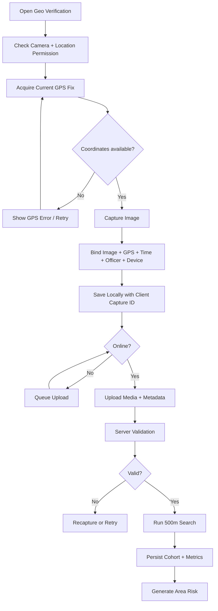

# GeoCredit AI — GPS & 500m Search Logic

**Version:** MVP v1.0  
**Status:** Draft for Development and UAT  
**Database:** PostgreSQL + PostGIS  
**Target:** Hackathon / 3-Day Demo MVP  
**Last Updated:** 03 September 2026

## 1. Purpose

This document defines the technical and business logic for:

- Capturing a customer's house/business image with GPS evidence
- Validating latitude, longitude, accuracy and capture metadata
- Supporting offline capture and later synchronization
- Finding eligible borrowers within approximately 500 meters
- Calculating privacy-safe area metrics
- Providing data to the Area Risk Assessment

The server-confirmed coordinate is authoritative for the 500-meter search.

## 2. Mandatory Business Rules

| Workflow | Role | Condition | Result |
|---|---|---|---|
| Dabi | CDO | Valid image and coordinates | May proceed to area analysis |
| Dabi | CDO | Coordinates missing/invalid | Submission blocked |
| Dabi | BM | CDO evidence valid | BM location input optional |
| Dabi | BM | Configured exception requires verification | BM must provide/verify location |
| Progoti | CO | Valid image and coordinates | May proceed to area analysis |
| Progoti | CO | Coordinates missing/invalid | Submission blocked |

Only `VALID` server verification satisfies the submission guard.

## 3. End-to-End Flow



## 4. Capture Requirements

### 4.1 Required Fields

```json
{
  "clientCaptureId": "uuid-generated-on-device",
  "customerId": "uuid",
  "applicationId": "uuid",
  "mediaId": "uuid-after-upload",
  "latitude": 23.780573,
  "longitude": 90.279239,
  "accuracyMeters": 12.4,
  "capturedAt": "2026-09-03T10:30:12Z",
  "officerId": "trusted-from-session",
  "device": {
    "deviceId": "client-device-id",
    "platform": "ANDROID_PWA",
    "appVersion": "1.0.0"
  }
}
```

### 4.2 Capture-Time Binding

The application must bind the following into one local record at or immediately around shutter time:

- Image checksum
- Latitude and longitude
- GPS accuracy
- GPS observation timestamp
- Image capture timestamp
- Customer/application reference
- Authenticated officer reference
- Device identifier hash where appropriate
- Client-generated capture UUID

The user must not select an old gallery image for mandatory evidence unless a business-approved fallback explicitly permits it.

### 4.3 GPS Source

- Use the device location service at capture time.
- EXIF GPS is supporting evidence only, not the sole trusted source.
- Prefer a recent high-accuracy fix.
- Never trust client-submitted officer ID, role or organizational scope.
- The server creates its PostGIS point from validated numeric coordinates.

## 5. Client GPS Acquisition

### 5.1 Suggested Mobile/PWA Options

```javascript
const options = {
  enableHighAccuracy: true,
  timeout: 15000,
  maximumAge: 10000
};

navigator.geolocation.getCurrentPosition(onSuccess, onError, options);
```

Native Android should use the fused location provider and CameraX where available.

### 5.2 Acquisition Rules

1. Confirm location permission.
2. Confirm location service/GPS is enabled.
3. Request high-accuracy location.
4. Reject missing/non-finite values.
5. Reject out-of-range values.
6. Compare GPS observation time to image capture time.
7. Display coordinates and accuracy on the preview screen.
8. Allow retake before local confirmation.

### 5.3 Suggested Demo Thresholds

These values are configurable and require business validation.

| Parameter | Suggested Value | Behavior |
|---|---:|---|
| Preferred accuracy | ≤ 25m | Normal verified capture |
| Warning accuracy | >25m to 75m | Allow with warning if policy permits |
| Poor accuracy | >75m | Recapture recommended; block if configured |
| Maximum GPS age at capture | 30 seconds | Older fix requires refresh |
| Maximum time difference: GPS vs photo | 30 seconds | Larger difference is suspicious/warning |
| Submission evidence age | 24 hours | Older capture warns or requires recapture |
| Search radius | 500m | Server-controlled |

The PRD requires location presence. Accuracy blocking behavior is a configurable additional control.

## 6. Coordinate Validation

### 6.1 Client Validation

```typescript
function validateCoordinates(latitude: number, longitude: number): boolean {
  return Number.isFinite(latitude)
    && Number.isFinite(longitude)
    && latitude >= -90
    && latitude <= 90
    && longitude >= -180
    && longitude <= 180;
}
```

### 6.2 Server Validation

The server repeats all checks:

- Latitude present and between `-90` and `90`
- Longitude present and between `-180` and `180`
- Reject `(0,0)` unless it is explicitly valid for the operating country/context
- Accuracy is non-negative when supplied
- Capture timestamp is valid and not unreasonably future-dated
- Authenticated user has access to the customer/application
- Role is permitted to capture/verify location
- Application is in an editable/verification state
- Media upload exists and checksum/type validation passed
- Client capture ID has not already created another record

### 6.3 PostGIS Point Creation

Longitude must be passed first to `ST_MakePoint`:

```sql
ST_SetSRID(
  ST_MakePoint(:longitude, :latitude),
  4326
)::geography
```

## 7. Verification Statuses

| Status | Meaning | Next Action |
|---|---|---|
| `LOCAL_ONLY` | Evidence exists only on device | Wait for connection/sync |
| `UPLOAD_PENDING` | Media/metadata queued | Retry automatically |
| `PROCESSING` | Server is validating evidence | Poll status |
| `VALID` | Required evidence accepted | Enable area analysis |
| `INVALID` | Business/validation check failed | Recapture/correct |
| `FAILED` | Technical processing failed | Retry; then support |

## 8. Server Verification Algorithm

```text
function verifyGeoEvidence(request, authenticatedUser):
    authorize(authenticatedUser, request.applicationId, GEO_CAPTURE)

    assert application state permits evidence
    assert request.clientCaptureId is idempotent
    assert latitude and longitude are present and in range
    assert media object exists and belongs to this upload flow
    assert media checksum and type checks passed
    assert capturedAt is plausible
    assert GPS age/time difference satisfies configured rule

    point = geographyPoint(longitude, latitude)

    signals = compare(
        device coordinates,
        EXIF coordinates if present,
        device/server timestamps,
        prior customer location if present,
        accuracy value
    )

    if mandatory validation fails:
        status = INVALID
    else:
        status = VALID

    persist record, signals, configuration version and audit event
    return privacy-appropriate verification result
```

EXIF mismatch may generate a warning or failure based on approved policy. EXIF absence must not automatically invalidate a valid device-location capture if the implementation does not guarantee GPS EXIF writing.

## 9. Database Model

```sql
CREATE TABLE geo_verifications (
  id uuid PRIMARY KEY DEFAULT gen_random_uuid(),
  customer_id uuid NOT NULL REFERENCES customers(id),
  application_id uuid REFERENCES loan_applications(id),
  media_object_id uuid REFERENCES media_objects(id),
  location geography(Point,4326),
  latitude numeric(9,6),
  longitude numeric(9,6),
  accuracy_m numeric(9,2),
  captured_at timestamptz NOT NULL,
  officer_id uuid NOT NULL REFERENCES users(id),
  device_id_hash varchar(128),
  client_capture_id uuid NOT NULL,
  status geo_status NOT NULL DEFAULT 'LOCAL_ONLY',
  validation_reasons jsonb NOT NULL DEFAULT '[]'::jsonb,
  config_version varchar(50) NOT NULL,
  verified_at timestamptz,
  created_at timestamptz NOT NULL DEFAULT now(),
  UNIQUE (officer_id, client_capture_id),
  CHECK (latitude IS NULL OR latitude BETWEEN -90 AND 90),
  CHECK (longitude IS NULL OR longitude BETWEEN -180 AND 180),
  CHECK (
    status <> 'VALID'
    OR (location IS NOT NULL AND media_object_id IS NOT NULL)
  )
);

CREATE INDEX idx_geo_verifications_location
ON geo_verifications USING GIST(location);
```

## 10. Current Customer Location

The nearby search uses an approved current location per eligible borrower.

```sql
CREATE VIEW current_customer_locations AS
SELECT DISTINCT ON (customer_id)
  id AS geo_verification_id,
  customer_id,
  application_id,
  location,
  accuracy_m,
  captured_at
FROM geo_verifications
WHERE status = 'VALID'
  AND location IS NOT NULL
ORDER BY customer_id, captured_at DESC;
```

Production may require an explicit `is_current`/approval process rather than automatically selecting the latest capture.

## 11. Eligible Nearby Borrowers

### 11.1 Required Eligibility

- Valid approved/current location
- Location within the server-controlled radius
- Customer is not the applicant
- Customer/portfolio status is eligible
- Department/project matches approved business rule
- Historical data satisfies freshness rules
- Caller is authorized to view the parent application
- Customer data use satisfies privacy/consent rules

### 11.2 Configurable Eligibility

- Same department only vs cross-department portfolio
- Active borrowers only vs current and historical borrowers
- Location freshness maximum
- Required loan-history freshness
- Include/exclude closed-only borrowers
- Minimum data completeness
- Organizational boundary handling near branch/area borders

All choices must be stored in an eligibility-rule version.

## 12. 500-Meter Query

### 12.1 Authoritative Query

```sql
WITH applicant AS (
  SELECT
    customer_id,
    location
  FROM geo_verifications
  WHERE id = :geo_verification_id
    AND application_id = :application_id
    AND status = 'VALID'
),
eligible AS (
  SELECT
    ccl.customer_id,
    ccl.location,
    c.project,
    c.customer_status
  FROM current_customer_locations ccl
  JOIN customers c ON c.id = ccl.customer_id
  WHERE c.deleted_at IS NULL
    AND c.customer_status = 'ACTIVE'
    AND c.project = :department
)
SELECT
  e.customer_id,
  ST_Distance(e.location, a.location) AS distance_m
FROM eligible e
CROSS JOIN applicant a
WHERE e.customer_id <> a.customer_id
  AND ST_DWithin(e.location, a.location, :radius_m)
ORDER BY distance_m ASC, e.customer_id ASC;
```

For MVP, `:radius_m` must be `500` or capped to the server configuration.

### 12.2 Why `geography`

- Distances are interpreted in meters.
- Earth curvature is handled appropriately for local radius queries.
- Avoids manually converting degrees to meters.
- GiST index supports efficient `ST_DWithin` filtering.

### 12.3 Boundary Rule

`ST_DWithin(..., 500)` includes points whose computed distance is exactly 500 meters within PostGIS precision.

## 13. Area Query Snapshot

Persist each query:

```json
{
  "areaQueryId": "uuid",
  "applicationId": "uuid",
  "applicationVersion": 1,
  "geoVerificationId": "uuid",
  "radiusMeters": 500,
  "queryTimestamp": "2026-09-03T10:34:00Z",
  "dataCutoffAt": "2026-09-03T10:30:00Z",
  "eligibilityRulesVersion": "area-eligibility-demo-1",
  "borrowerCount": 12,
  "status": "COMPLETE"
}
```

Also persist the included customer IDs, distances and approved historical summaries in `area_query_borrowers` or a cohort hash plus reproducible data references.

## 14. Area Metrics

### 14.1 Required Metrics

| Metric Code | Definition |
|---|---|
| `BORROWER_COUNT` | Eligible nearby borrower count |
| `ACTIVE_LOAN_COUNT` | Active loans among eligible borrowers |
| `CURRENT_EXPOSURE` | Sum of approved current outstanding exposure |
| `OVERDUE_BORROWER_COUNT` | Borrowers with current overdue |
| `OVERDUE_BORROWER_RATIO` | Overdue borrower count / eligible borrower count |
| `DELAYED_BORROWER_COUNT` | Borrowers with recent repayment delays |
| `DELAYED_BORROWER_RATIO` | Delayed borrower count / eligible borrower count |
| `AVERAGE_OVERDUE` | Average overdue among eligible borrowers |
| `MAXIMUM_OVERDUE` | Maximum borrower overdue |
| `LOW_RISK_COUNT` | Nearby borrowers with Low risk snapshot |
| `MODERATE_RISK_COUNT` | Nearby borrowers with Moderate risk snapshot |
| `HIGH_RISK_COUNT` | Nearby borrowers with High risk snapshot |
| `VERY_HIGH_RISK_COUNT` | Nearby borrowers with Very High risk snapshot |
| `SAVINGS_STABLE_RATIO` | Share with stable/increasing savings where available |

### 14.2 Safe Division

```text
if borrower_count == 0:
    ratio = null
    data_status = NO_NEARBY_BORROWERS_FOUND
else:
    ratio = numerator / borrower_count
```

Zero nearby borrowers must not be interpreted as zero risk.

### 14.3 Minimum Cohort

Suggested demo value: `5`.

| Borrower Count | Result |
|---:|---|
| 0 | `NO_NEARBY_BORROWERS_FOUND`; no confident area score |
| 1–4 | `INSUFFICIENT_AREA_DATA`; show descriptive facts only |
| ≥5 | Calculate configured area score |

## 15. Privacy-Safe Nearby Response

Allowed response:

```json
{
  "reference": "BRW-A81F2C",
  "distanceBandMeters": 125,
  "loanStatus": "ACTIVE",
  "riskLevel": "HIGH",
  "repaymentSummary": {
    "trend": "DETERIORATING",
    "hasOverdue": true
  },
  "savingsSummary": {
    "trend": "STABLE"
  },
  "mapPoint": {
    "latitude": 23.7805,
    "longitude": 90.2792,
    "precision": "APPROXIMATE"
  }
}
```

Prohibited:

- Name
- NID or identity number
- Phone
- Exact address
- Exact coordinate
- House/business image
- Spouse/nominee/family information
- Full loan/savings transactions

Use an opaque reference and optionally round/jitter map coordinates according to approved privacy policy.

## 16. Map Logic

### 16.1 Required Layers

- Applicant marker at the verified location
- 500-meter circle centered on applicant
- Privacy-safe nearby markers
- Risk legend
- List/map toggle

### 16.2 Radius Display

Example GeoJSON circle generation may be handled by the map library. The backend's PostGIS result, not the client-drawn circle, determines inclusion.

### 16.3 Fallback

If map tiles fail:

- Keep the borrower list
- Keep area metrics
- Keep risk report
- Show a map unavailable message

Area analysis must not depend on successful map rendering.

## 17. Offline Synchronization

### 17.1 Local Record

```json
{
  "clientCaptureId": "uuid",
  "applicationId": "uuid",
  "customerId": "uuid",
  "localImagePath": "private-app-storage-reference",
  "imageChecksum": "sha256",
  "latitude": 23.780573,
  "longitude": 90.279239,
  "accuracyMeters": 12.4,
  "capturedAt": "2026-09-03T10:30:12Z",
  "syncStatus": "QUEUED",
  "idempotencyKey": "uuid",
  "attemptCount": 0
}
```

### 17.2 Dependency Order

1. Authenticate/refresh session.
2. Synchronize required customer/application draft.
3. Initiate media upload.
4. Upload image bytes.
5. Complete media upload/checksum validation.
6. Create geo verification with the same capture UUID.
7. Poll until `VALID` or failure.
8. Request area query.
9. Request risk report.
10. Enable field submission.

### 17.3 Idempotency

- `clientCaptureId` is unique per officer/capture.
- Replaying the same geo request returns the original logical record.
- The same idempotency key with different data returns a conflict.
- Partial media upload resumes or restarts without creating duplicate evidence.

## 18. Error Codes and UX

| Code | Meaning | User Action |
|---|---|---|
| `LOCATION_PERMISSION_DENIED` | App cannot access location | Grant permission/settings |
| `GPS_DISABLED` | Device location is off | Enable GPS |
| `GEO_LOCATION_REQUIRED` | Coordinates absent | Retry capture |
| `GEO_COORDINATES_INVALID` | Coordinates out of range | Retry/report issue |
| `GPS_FIX_STALE` | Location observation too old | Refresh location |
| `GPS_ACCURACY_LOW` | Accuracy exceeds preferred threshold | Wait/recapture |
| `IMAGE_REQUIRED` | Image absent | Open camera |
| `MEDIA_UPLOAD_FAILED` | Upload failed | Retry upload |
| `MEDIA_CHECKSUM_MISMATCH` | Image corrupted/changed | Reupload/recapture |
| `GEO_VERIFICATION_INVALID` | Server validation failed | Recapture |
| `GEO_VERIFICATION_PENDING` | Processing not complete | Wait/poll |
| `AREA_QUERY_PENDING` | Search still processing | Wait/poll |
| `AREA_QUERY_FAILED` | Search technical error | Retry/support |
| `INSUFFICIENT_AREA_DATA` | Cohort below minimum | Show limitation |
| `NO_NEARBY_BORROWERS_FOUND` | Valid query returned zero | Show neutral result |
| `ORGANIZATIONAL_SCOPE_DENIED` | User lacks access | Block action |

## 19. Security Requirements

- HTTPS for all API/media operations.
- Images stored in private object storage.
- Upload/view access uses short-lived signed access or backend proxy.
- Local image and metadata stored in encrypted app-controlled storage.
- Do not log exact coordinates, signed URLs, NIDs or tokens in general logs.
- Hash device identifier before persistence where appropriate.
- Server derives officer identity from authenticated session.
- Rate-limit media, geo and area-query endpoints.
- Audit geo capture, upload, view, verification, search and report generation.
- Detect unexpected coordinate jumps against prior location as a warning signal, not an automatic fraud conclusion.

## 20. Performance Requirements

| Operation | Suggested MVP Target |
|---|---:|
| GPS fix | Feedback within 15 seconds or clear retry state |
| Media initiation | p95 ≤ 2 seconds |
| Verification after upload | 90% ≤ 10 seconds |
| Indexed 500m query | p95 ≤ 3 seconds |
| Area metrics | 90% ≤ 10 seconds for demo dataset |
| Full risk report | 90% ≤ 30 seconds |

## 21. Test Dataset Geometry

Create deterministic test points relative to one applicant:

| Fixture | Expected Distance | Expected Inclusion |
|---|---:|---|
| Same point | 0m | Included unless applicant/self |
| Borrower A | ~100m | Yes |
| Borrower B | ~499m | Yes |
| Borrower C | exactly/approximately 500m | Yes under `ST_DWithin` |
| Borrower D | ~501m | No |
| Borrower E | ~1000m | No |
| Applicant itself | 0m | No |
| Invalid location | N/A | No |
| Stale/ineligible location | <500m | No per eligibility rule |

Generate expected distances using PostGIS rather than manual latitude-degree approximations.

## 22. Required Tests

### 22.1 Coordinate Tests

- Valid Bangladesh coordinate
- Latitude at −90 and 90
- Longitude at −180 and 180
- Out-of-range latitude/longitude
- Null latitude/longitude
- Non-finite client values
- `(0,0)` context rule
- Future capture timestamp
- Stale GPS fix
- Low accuracy warning/block configuration

### 22.2 Media/Offline Tests

- Offline capture survives app restart
- Image checksum remains stable
- Partial upload retries
- Token expires during upload
- Same capture syncs twice without duplicate
- Metadata sync succeeds but media fails
- Media succeeds but verification request fails
- User sees correct Saved/Queued/Uploading/Verified states

### 22.3 Search Tests

- Point inside 500m
- Boundary at 500m
- Point outside 500m
- Applicant excluded
- Duplicate customer locations select approved current record
- Cross-department eligibility behavior
- Zero borrowers
- Cohort below minimum
- Privacy-safe response fields only
- GiST index used on representative data

### 22.4 Snapshot Tests

- Persist exact area query time/radius/version
- Persist borrower cohort and distances
- Later location/loan updates do not alter prior area snapshot
- Corrected application creates new area query and risk snapshot

## 23. Three-Day MVP Implementation Order

1. Enable PostGIS and create location tables/index.
2. Seed applicant and 20 synthetic borrower locations.
3. Implement in-browser/mobile coordinate capture and image upload.
4. Validate and create authoritative server point.
5. Implement `ST_DWithin` 500-meter query.
6. Return privacy-safe nearby list and risk distribution.
7. Add Leaflet map with 500-meter circle.
8. Persist area query/cohort snapshot.
9. Add offline queue/status if time permits.
10. Add accuracy/mismatch signals and advanced privacy precision.

## 24. Open Decisions

- Native Android versus PWA capture implementation
- Required GPS accuracy threshold
- GPS/photo timestamp tolerance
- Allowed evidence age before submission
- EXIF mismatch policy
- Dabi BM exception/recapture behavior
- Current-location approval method
- Cross-department borrower eligibility
- Active versus historical borrower eligibility
- Minimum area cohort size
- Location/data freshness thresholds
- Map coordinate rounding/jitter policy
- Consent, retention and deletion requirements

## 25. Acceptance Criteria

- CDO/CO can capture an image and current coordinates.
- Preview shows image, coordinates, accuracy and capture time.
- Missing/invalid coordinates block verification/submission.
- Offline evidence is clearly marked local until synchronized.
- Retried synchronization does not create duplicate evidence.
- Server verifies media and creates a valid PostGIS geography point.
- Only `VALID` evidence enables area analysis.
- GiST-indexed `ST_DWithin` finds eligible borrowers within 500 meters.
- Applicant is excluded from their own result.
- Boundary and outside-radius fixtures behave as expected.
- Zero/small cohort is not interpreted as low risk.
- Query radius, timestamp, eligibility version and cohort are preserved.
- Nearby borrower response contains only privacy-approved fields.
- Map failure does not block list, metrics or risk report.
- Historical application area/risk snapshot remains unchanged after source updates.

