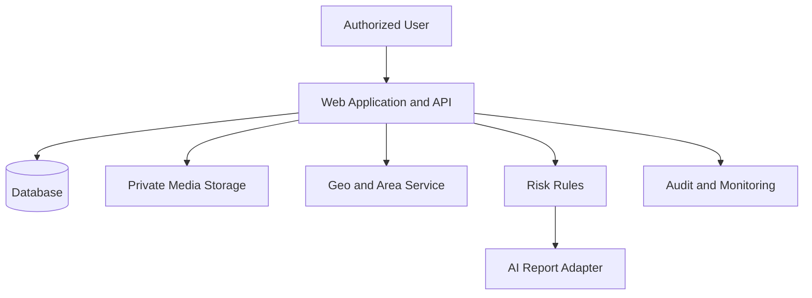

# GeoCredit AI — Security & Privacy Checklist

**Version:** MVP v1.0  
**Status:** Security Review Baseline  
**Target:** Hackathon / 3-Day Demo MVP  
**Last Updated:** 03 September 2026

## 1. Purpose

This checklist defines the minimum security and privacy controls for the GeoCredit AI MVP. It covers customer identity, financial and behavioral data, GPS locations, field images, nearby-area intelligence, AI processing, role-based workflows, offline storage, APIs, deployment, monitoring and incident handling.

> This checklist supports an MVP review; it does not replace BRAC security standards, legal/privacy review, threat modeling, penetration testing, model governance or production approval.

## 2. How to Use This Checklist

For every item, record:

- `PASS` — implemented and evidence verified.
- `FAIL` — not implemented or evidence contradicts the control.
- `N/A` — not applicable, with approved reason.
- `DEFERRED` — accepted MVP gap with owner, risk, mitigation and deadline.

P0 items must pass before a live demo using anything beyond synthetic data. Critical privacy, authorization or decision-control failures are release blockers.

## 3. Review Record

| Field | Value |
|---|---|
| Application/build version | |
| Environment | |
| Review date | |
| Security reviewer | |
| Privacy reviewer | |
| Engineering owner | |
| Product owner | |
| Data classification | |
| Seed/data version | |
| Open exceptions | |
| Final decision | Approve / Conditional / Reject |

## 4. Data Classification

| Data | Classification | Examples | Default Handling |
|---|---|---|---|
| Authentication secrets | Restricted | Tokens, cookies, API keys | Never log; encrypted secret store |
| Identity data | Restricted/Confidential | ID number, date of birth, family details | Minimize, encrypt/tokenize, mask |
| Financial data | Confidential | Income, expenses, liabilities, loan/savings | Need-to-know access, encryption |
| Behavioral/risk data | Confidential | Repayment history, risk score/factors | Scoped access, audit |
| Precise location | Sensitive/Confidential | GPS coordinates, capture time | Purpose-limited, scoped, protected |
| Field media | Sensitive/Confidential | Home/business images | Private storage, short-lived access |
| Area aggregates | Internal/Confidential | 500m cohort metrics | Minimum cohort, no neighbor PII |
| Audit/security logs | Confidential | Actor/action/result/IP where allowed | Restricted, append-only/immutable controls |
| Synthetic demo data | Internal | Seed names/IDs/images | Clearly marked synthetic |

Final classifications must be confirmed by authorized security/privacy owners before production use.

## 5. Security and Privacy Invariants

- [ ] **P0** Only RM can record `APPROVED` or `REJECTED`.
- [ ] **P0** AI cannot execute or authorize any workflow decision.
- [ ] **P0** Every protected request verifies authentication and server-side authorization.
- [ ] **P0** Role, department, organizational scope and assignment are enforced on the server.
- [ ] **P0** Nearby borrower identities are not exposed through area intelligence.
- [ ] **P0** Missing/insufficient data is not represented as Low Risk.
- [ ] **P0** Submitted application versions and risk snapshots are immutable.
- [ ] **P0** Secrets, full identity data and raw financial payloads are absent from logs.
- [ ] **P0** Demo data is synthetic; no production customer data is used without formal approval.
- [ ] **P0** All traffic outside local development uses HTTPS.

## 6. Data Flow Review

- [ ] All data flows and third parties are documented.
- [ ] Data leaving the controlled environment is identified and approved.
- [ ] Trust boundaries are documented.
- [ ] Sensitive inputs/outputs at each boundary are minimized.
- [ ] AI, storage, authentication and monitoring providers have named owners.
- [ ] No undocumented direct browser access to database or privileged services exists.

## 7. Privacy by Design

- [ ] The purpose for collecting each profile, financial, GPS and media field is documented.
- [ ] Only data required for the approved loan assessment purpose is collected.
- [ ] Optional fields are clearly distinguished from mandatory fields.
- [ ] Data is not repurposed for unrelated analytics, training or marketing without approval.
- [ ] User-facing notice/consent requirements are reviewed by Legal/Privacy.
- [ ] Withdrawal/correction/deletion requirements and exceptions are documented.
- [ ] Retention periods are defined per data type and environment.
- [ ] Data-subject/customer access and correction process is defined before production.
- [ ] Privacy-impact assessment is planned/completed for production.
- [ ] High-risk processing (credit assistance, precise location, profiling) has explicit governance.

## 8. Synthetic and Test Data

- [ ] **P0** Local, CI and demo environments use synthetic data by default.
- [ ] Seed records are clearly marked `GEOCREDIT_MVP_V1` or equivalent.
- [ ] Names, phone numbers, IDs, addresses, images and coordinates do not identify real people.
- [ ] Demo ID numbers are dummy/masked and cannot be mistaken for valid national IDs.
- [ ] Production database dumps are not copied into local/demo environments.
- [ ] If masked data is ever approved, re-identification risk is reviewed.
- [ ] Seed loading fails when `APP_ENV=production`.
- [ ] Seed reset deletes only the exact marked dataset.
- [ ] Test screenshots/recordings contain no real or secret data.

## 9. Authentication

- [ ] Authentication is handled by an approved provider or isolated demo adapter.
- [ ] Plaintext passwords are never stored in the GeoCredit database.
- [ ] Password/MFA/session policy follows organizational requirements.
- [ ] Tokens validate issuer, audience, signature, expiry and required claims.
- [ ] Session cookies are `Secure`, `HttpOnly` and use appropriate `SameSite` settings.
- [ ] Session identifiers rotate after login/privilege change where applicable.
- [ ] Logout invalidates/revokes the relevant session.
- [ ] Disabled users lose access promptly.
- [ ] Failed login/auth events are rate-limited and monitored.
- [ ] Demo role switching is visibly labeled and impossible in UAT/production.
- [ ] Authentication errors do not reveal whether a customer/application exists.

## 10. Authorization and RBAC

- [ ] **P0** Authorization is deny-by-default and enforced in backend services/repositories.
- [ ] CDO access is restricted to Dabi and assigned organizational scope.
- [ ] CO access is restricted to Progoti and assigned organizational scope.
- [ ] BM reviews only in-scope Dabi applications.
- [ ] AM reviews only assigned Dabi/Progoti applications within area scope.
- [ ] RM decides only in-scope assigned applications.
- [ ] ADMIN does not automatically inherit RM final-decision permission.
- [ ] Client-supplied role, user, department, branch and allowed actions are ignored for authorization.
- [ ] Object references are re-authorized on every request (IDOR protection).
- [ ] UI-hidden actions are also denied when called directly through API.
- [ ] Cross-branch/area/region test cases exist and pass.
- [ ] Authorization policy is centralized and tested as a role/action matrix.
- [ ] High-risk denials are safely audited.

## 11. Workflow and Decision Integrity

- [ ] **P0** Dabi route is `CDO → BM → AM → RM`.
- [ ] **P0** Progoti route is `CO → AM → RM`; no BM stage is inserted.
- [ ] Client sends a workflow action, not an arbitrary status.
- [ ] Server derives the destination status using an explicit transition table.
- [ ] Transition validates role, scope, assignment, state and record version.
- [ ] Transition, owner assignment and audit history are atomic.
- [ ] Return, additional verification and rejection require reasons/remarks.
- [ ] Duplicate idempotent transition requests do not create duplicates.
- [ ] Concurrent reviewer actions cannot both succeed against the same version.
- [ ] Terminal applications are read-only for ordinary business data.
- [ ] Final decision includes RM identity, time, application version and remarks.
- [ ] AI/risk services have no database/API permission to approve or reject.

## 12. Customer Identity and Financial Data

- [ ] Full identity numbers are encrypted/tokenized at rest.
- [ ] UI and normal APIs show only masked identity values.
- [ ] Sensitive fields are excluded from list/search responses unless required.
- [ ] Search resists enumeration and applies authorization before returning matches.
- [ ] Financial information is encrypted in transit and access controlled at rest.
- [ ] Data exports are disabled for MVP or require explicit authorized controls.
- [ ] Copy/download/print exposure is reviewed for each role.
- [ ] Support/ADMIN access is limited, justified and audited.
- [ ] Database administrators and app identities follow least privilege.
- [ ] Backups containing confidential data are encrypted and access controlled.

## 13. GPS and Location Privacy

- [ ] **P0** Precise coordinates are collected only for the approved verification/area purpose.
- [ ] GPS capture records accuracy, capture time and source/device metadata.
- [ ] Coordinates/accuracy/time are server validated.
- [ ] Client-provided distance and verification status are never trusted.
- [ ] Exact location is shown only to authorized roles with a business need.
- [ ] Location is absent/redacted from normal logs, analytics and error reports.
- [ ] GPS is not continuously tracked; capture is event-based.
- [ ] Offline coordinates are protected on the device.
- [ ] Retention/deletion rules for precise location are defined.
- [ ] Map/analytics providers do not receive unnecessary customer identifiers.
- [ ] Third-party map telemetry/privacy settings are reviewed.

## 14. 500m Area Intelligence Privacy

- [ ] **P0** The authoritative query uses `ST_DWithin` on geography with radius 500m.
- [ ] Exact 500m is included and more than 500m is excluded.
- [ ] Only valid and policy-eligible borrower locations are included.
- [ ] The current applicant is excluded from peer metrics where the definition requires it.
- [ ] Response exposes aggregate metrics—not neighbor names, member numbers, addresses, IDs or exact coordinates.
- [ ] Minimum cohort threshold is configured and versioned.
- [ ] Below-threshold result is `INSUFFICIENT_DATA`.
- [ ] Small-cell values are suppressed/generalized where re-identification is possible.
- [ ] Drill-down endpoints cannot bypass aggregation rules.
- [ ] Query snapshot stores only data needed for reproducibility/audit.
- [ ] Area results are accessible only to authorized application reviewers.
- [ ] Area data is not reused for unrelated surveillance or profiling.

## 15. Field Images and Media

- [ ] Object storage is private; public-read access is disabled.
- [ ] Storage keys are server-generated and non-guessable.
- [ ] Signed URLs are short-lived and issued only after authorization.
- [ ] Declared MIME, file signature, extension and safe image decoding are validated.
- [ ] File size and pixel/dimension limits are enforced.
- [ ] Unsupported, corrupt, executable and polyglot files are rejected.
- [ ] Malware scanning is enabled where required by deployment policy.
- [ ] Original filenames and metadata do not expose unnecessary personal/device data.
- [ ] EXIF/geolocation retention is reviewed and stripped unless required.
- [ ] Upload status must be complete before evidence can satisfy a submission guard.
- [ ] Replacement/deletion preserves required application/audit history.
- [ ] Media is not included in logs, analytics events or AI prompts by default.

## 16. API Security

- [ ] All API input is validated using allowlisted schemas.
- [ ] SQL/database queries are parameterized.
- [ ] Output is encoded; supported rich text is sanitized.
- [ ] CSRF protection is applied to cookie-authenticated mutations.
- [ ] CORS allows only exact trusted origins.
- [ ] Content types and request/body size limits are enforced.
- [ ] Pagination has maximum page size and stable ordering.
- [ ] Rate limits protect login, search, upload and AI endpoints.
- [ ] Error responses use stable codes and safe messages.
- [ ] No stack trace, SQL, internal hostname or secret appears in response.
- [ ] Idempotency keys protect retryable create/submit/transition operations.
- [ ] The same idempotency key with a different payload is rejected.
- [ ] Security headers are configured (CSP, frame restrictions, MIME sniffing control, referrer policy).
- [ ] API documentation/debug endpoints are disabled or protected outside approved environments.

## 17. Web and Client Security

- [ ] No secret is included in browser bundles or public environment variables.
- [ ] Authentication tokens are stored using approved secure mechanisms.
- [ ] Untrusted content is never rendered with unsafe HTML APIs.
- [ ] Navigation/action controls reflect server-provided permissions but do not replace them.
- [ ] Sensitive pages avoid caching where required.
- [ ] Browser history/URL parameters do not include PII or tokens.
- [ ] External links use safe target/rel behavior.
- [ ] Content Security Policy permits only necessary sources.
- [ ] Source maps and debug information are handled according to environment policy.
- [ ] Clipboard/download/print behavior is reviewed for sensitive screens.

## 18. Offline and Device Data

- [ ] Offline capture is limited to the minimum necessary draft data.
- [ ] Local sensitive data uses platform encryption/protected storage.
- [ ] Local records are partitioned by authenticated user.
- [ ] A second user cannot access the previous user’s unsynced drafts.
- [ ] Logout and device handover behavior is defined.
- [ ] Local media/coordinates are deleted after confirmed sync according to policy.
- [ ] Screenshots/backups/cloud sync exposure is considered.
- [ ] Rooted/jailbroken or unsupported device policy is defined before production.
- [ ] Version conflicts never silently overwrite server data.
- [ ] Lost-response retries use the same idempotency key.
- [ ] Remote session revocation/device-loss response is planned.

## 19. Database Security and Integrity

- [ ] Database is not publicly reachable.
- [ ] Network access is restricted to application/migration operations.
- [ ] Application and migration identities are separate where practical.
- [ ] Database users have least privilege.
- [ ] Connections require TLS outside local development.
- [ ] Sensitive fields use approved encryption/tokenization.
- [ ] Foreign keys, check constraints and uniqueness rules protect integrity.
- [ ] Optimistic locking protects mutable application data.
- [ ] Submitted snapshots are append-only/immutable.
- [ ] Workflow/decision/audit writes use transactions.
- [ ] PostGIS spatial index and geography types are correctly configured.
- [ ] Database logs/slow-query logs do not capture sensitive bind values.
- [ ] Backup encryption, access, retention and restoration are verified.
- [ ] Destructive migrations require explicit approval and recovery plan.

## 20. Risk Engine Security and Fairness

- [ ] Authoritative score is calculated by deterministic, versioned rules.
- [ ] Customer and area risk are stored/displayed separately.
- [ ] Feature, rule, threshold and engine versions are preserved.
- [ ] Triggered factors link to valid evidence/reason codes.
- [ ] Missing data is explicit and does not default to favorable.
- [ ] Rule configuration changes require controlled access and audit.
- [ ] Users cannot edit scores directly through the client/API.
- [ ] Submitted risk snapshots cannot be silently recalculated or overwritten.
- [ ] Bias/fairness review is planned before production.
- [ ] Protected/sensitive attributes are excluded unless lawful, necessary and approved.
- [ ] Proxy risks from geography/area data are recognized and governed.
- [ ] Human reviewers receive guidance on appropriate use and limitations.

## 21. AI/LLM Security and Privacy

- [ ] AI receives minimized, redacted and structured inputs.
- [ ] Neighbor identities and raw area-member data are never sent to AI.
- [ ] Raw images/documents are excluded unless explicitly approved.
- [ ] Provider/model and data-processing terms are reviewed before real data use.
- [ ] Provider training/retention controls are configured according to policy.
- [ ] API keys are server-side and stored in an approved secret manager.
- [ ] Prompt injection is treated as untrusted input; application text cannot grant tools/permissions.
- [ ] AI has no database credentials or unrestricted tools.
- [ ] AI cannot call approval/rejection/workflow mutations.
- [ ] Output must pass strict schema, enum, length and factor-reference validation.
- [ ] Unsupported facts and score contradictions are rejected.
- [ ] Rendered AI text is encoded/sanitized.
- [ ] Retry count/timeouts are bounded; safe deterministic fallback exists.
- [ ] Prompts/responses are not logged with sensitive content.
- [ ] Model, prompt and output-schema versions are stored.
- [ ] Report displays `AI Recommendation — Human Review Required`.
- [ ] AI/report evaluation includes hallucination, omission and unsafe recommendation tests.

## 22. Secrets and Key Management

- [ ] No secret is committed to source code, documentation, seed data or images.
- [ ] `.env` files are ignored; `.env.example` contains placeholders only.
- [ ] Deployed secrets come from an approved secret manager/environment injection.
- [ ] Separate secrets exist for local/test/demo/UAT/production.
- [ ] Access is least privilege and audited.
- [ ] Rotation process and owner are documented.
- [ ] Short-lived credentials are preferred where supported.
- [ ] Secret scanning runs in CI and pre-commit/repository controls.
- [ ] Suspected exposure triggers revocation/rotation, not only file deletion.
- [ ] Application startup never prints secret values or full connection URLs.

## 23. Logging, Monitoring and Audit

- [ ] Logs include timestamp, service/build, request ID, route, result code and duration.
- [ ] Logs exclude secrets, tokens, cookies, full IDs and raw payloads.
- [ ] Financial data, images and precise GPS are redacted or excluded.
- [ ] AI prompts/responses are not captured unredacted.
- [ ] Error monitoring scrubbers are configured and tested.
- [ ] Audit events exist for create/edit/submit/review/decision/geo/risk/report/configuration changes.
- [ ] Audit includes actor/service, action, target reference, result, timestamp and application version.
- [ ] Normal users cannot update/delete audit history.
- [ ] Audit write failure for material actions follows fail-closed policy.
- [ ] Alerts cover authorization anomalies, 5xx spikes, audit failures and dependency outages.
- [ ] Access to logs/audit tools is restricted and reviewed.
- [ ] Log and audit retention follows approved policy.

## 24. Infrastructure and Deployment

- [ ] HTTPS/TLS is mandatory outside local development.
- [ ] Database, storage and internal services are on restricted networks.
- [ ] Containers/processes run as non-root where applicable.
- [ ] Images are minimal, pinned and scanned for vulnerabilities.
- [ ] Production dependencies use supported versions.
- [ ] Security patches and dependency update process are defined.
- [ ] CI/CD uses protected credentials and least privilege.
- [ ] Artifacts are immutable and traceable to a commit/release.
- [ ] Migrations run through controlled identity/process.
- [ ] Health endpoints reveal no secrets or internal details.
- [ ] Debug mode, demo auth and role switcher are disabled outside demo/local.
- [ ] Environment-specific buckets/databases/credentials prevent cross-environment access.
- [ ] Backup, restore, rollback and disaster-recovery procedures are tested.
- [ ] Cloud/platform activity logs are enabled and access restricted.

## 25. Dependency and Supply-Chain Security

- [ ] Lockfiles are committed and CI uses clean deterministic install.
- [ ] Dependencies are reviewed for necessity and maintained status.
- [ ] Vulnerability scanning runs in CI.
- [ ] Critical/high vulnerabilities are fixed or formally risk accepted.
- [ ] Package lifecycle scripts and new transitive dependencies are reviewed.
- [ ] Private registry/proxy controls are used where required.
- [ ] Container base images are pinned and scanned.
- [ ] Build provenance/artifact digest is recorded.
- [ ] Third-party SDK permissions and telemetry are minimized.
- [ ] No unreviewed code snippet or AI-generated dependency is added merely to save time.

## 26. Common Threat Checklist

| Threat | Required Control | Status/Evidence |
|---|---|---|
| Account/session theft | Secure session, expiry, revocation, MFA policy | |
| IDOR/cross-branch access | Server scope-aware authorization | |
| Privilege escalation | Central role/action policy; RM-only decision | |
| SQL injection | Parameterized queries and input schemas | |
| XSS | Safe rendering, encoding, CSP | |
| CSRF | Token/origin/same-site protections | |
| Malicious upload | Type/signature/size/decode/scan controls | |
| GPS spoofing/inaccuracy | Accuracy/time/source validation and audit | |
| Neighbor re-identification | Aggregation, cohort threshold, suppression | |
| AI prompt injection | Structured inputs, no tools, strict output validation | |
| AI hallucination | Evidence/factor verification and fallback | |
| Replay/duplicate transition | Idempotency and optimistic locking | |
| Data leakage in logs | Redaction and scrubber tests | |
| Offline device exposure | Protected storage and user partitioning | |
| Supply-chain compromise | Lockfile, scan, pinned artifacts | |

## 27. Security Test Cases

| ID | Priority | Test | Expected Result |
|---|---|---|---|
| SEC-001 | P0 | Change application/customer ID to another branch | Denied; protected data absent |
| SEC-002 | P0 | CDO/CO/BM/AM tries approve/reject API | Denied; state unchanged; audited |
| SEC-003 | P0 | ADMIN tries RM decision without RM assignment | Denied |
| SEC-004 | P0 | Modify client role/department/allowedActions | Server ignores and reauthorizes |
| SEC-005 | P0 | SQL injection in search/form fields | Safe parameterized behavior |
| SEC-006 | P0 | Stored/reflected script in remarks/AI text | Never executes |
| SEC-007 | P0 | Guess media object/storage URL | Private object inaccessible |
| SEC-008 | P0 | Upload executable/polyglot as image | Rejected |
| SEC-009 | P1 | Oversized/decompression-bomb image | Rejected safely |
| SEC-010 | P0 | Inspect area response | No neighbor PII/exact coordinates |
| SEC-011 | P0 | Cohort below minimum | `INSUFFICIENT_DATA`; small cells protected |
| SEC-012 | P0 | Prompt injection text in application remarks | No tools/decision; safe structured report |
| SEC-013 | P0 | Malformed/unsupported AI fact | Output rejected or fallback used |
| SEC-014 | P0 | Same transition replayed | One action/decision only |
| SEC-015 | P0 | Two concurrent RM decisions | Only one succeeds |
| SEC-016 | P0 | Inspect logs after sensitive journeys | No prohibited secrets/PII/payloads |
| SEC-017 | P1 | Session expiry with offline draft | Reauth required; draft protected/retained |
| SEC-018 | P0 | Different user opens local draft | Access blocked |
| SEC-019 | P0 | Attempt audit modification/deletion | Denied through normal app paths |
| SEC-020 | P0 | Production-mode seed/demo switch | Start/seed blocked |

## 28. Privacy Test Cases

| ID | Priority | Test | Expected Result |
|---|---|---|---|
| PRI-001 | P0 | Customer list/search response | Sensitive IDs masked/minimized |
| PRI-002 | P0 | Unauthorized exact member search | No existence/data disclosure |
| PRI-003 | P0 | 500m area API/UI | Aggregates only; no member identity |
| PRI-004 | P1 | Map provider network inspection | No unnecessary customer identifiers |
| PRI-005 | P1 | Image metadata inspection | Unneeded EXIF removed/not exposed |
| PRI-006 | P0 | AI request payload inspection | Redacted/minimized; no neighbor PII |
| PRI-007 | P0 | Error/log/monitoring payload | No full IDs, images, secrets, raw finance |
| PRI-008 | P1 | Demo reset/retention | Exact synthetic dataset only |
| PRI-009 | P1 | Logout/user change | Local sensitive records inaccessible |
| PRI-010 | P1 | Report/export/screenshot path | Role/policy controls and masking applied |

## 29. Pre-Demo P0 Checklist

- [ ] Demo dataset verified synthetic.
- [ ] Demo banner/label is visible.
- [ ] No production credentials are configured.
- [ ] HTTPS is enabled for remote demo access.
- [ ] All roles and scopes have been tested.
- [ ] Non-RM decision attempt is denied.
- [ ] Cross-scope ID access is denied.
- [ ] 500m result contains no neighbor PII.
- [ ] Insufficient cohort is not shown as Low Risk.
- [ ] Media is private and upload types are validated.
- [ ] AI output is schema validated and advisory-only.
- [ ] Deterministic AI fallback works.
- [ ] Logs/errors contain no secrets or prohibited PII.
- [ ] Debug endpoints and raw API keys are hidden.
- [ ] Frozen build, rollback and backup demo recording are ready.

## 30. Production Readiness Gaps

Before production or a live-data pilot, complete at minimum:

- Formal threat model and security architecture review.
- Privacy impact assessment and lawful-purpose/notice/consent review.
- Data classification, retention, deletion and subject-rights procedures.
- Identity/SSO/MFA and device security integration.
- Independent penetration test and remediation.
- Secure code/dependency/container assessment.
- AI/provider data-processing and retention approval.
- Credit/model governance, fairness/bias, calibration and explainability review.
- Production logging/SIEM, alerting and incident-response integration.
- Backup/restore, disaster recovery and business continuity tests.
- Vendor/cloud/storage/map provider security reviews.
- Controlled user training and pilot approval.

## 31. Exception Register

| ID | Checklist Item | Risk | Compensating Control | Owner | Due Date | Approver | Status |
|---|---|---|---|---|---|---|---|
| | | | | | | | |

Rules:

- P0 authorization, privacy leakage and RM-only decision controls should not be waived for the demo.
- Every exception needs a specific owner and expiry date.
- “Hackathon” or “MVP” alone is not an acceptable risk justification.
- Expired exceptions automatically return to open/failed status.

## 32. Incident Response Quick Guide

If sensitive data, a secret or unauthorized access is suspected:

1. Stop or isolate the affected feature/environment.
2. Preserve relevant logs/evidence without spreading sensitive content.
3. Notify the designated security/privacy and system owners.
4. Revoke/rotate exposed credentials immediately.
5. Determine affected data, users, timeframe and access path.
6. Apply containment and verified remediation.
7. Follow required notification/legal processes.
8. Restore only after security validation and document lessons/actions.

Do not delete evidence, silently patch the issue or share exposed values in chat/email/tickets.

## 33. Sign-Off

| Role | Name | Result | Date | Conditions/Notes |
|---|---|---|---|---|
| Product Owner | | Pass / Conditional / Fail | | |
| Engineering Lead | | Pass / Conditional / Fail | | |
| Security Reviewer | | Pass / Conditional / Fail | | |
| Privacy/Legal Reviewer | | Pass / Conditional / Fail | | |
| Credit/Model Risk Reviewer | | Pass / Conditional / Fail | | |
| QA Lead | | Pass / Conditional / Fail | | |

## 34. MVP Security Acceptance Criteria

The MVP is acceptable for a synthetic-data demonstration only when:

- all P0 checklist items and security tests pass;
- no real customer data or production secret is present;
- authentication and server-side role/scope controls work;
- only RM can record final decisions;
- GPS, area aggregates, media and AI inputs are privacy protected;
- AI is advisory, schema validated and isolated from workflow mutations;
- logs/errors reveal no prohibited sensitive data;
- material actions are atomic and audited; and
- all remaining gaps are recorded with owners and approved mitigations.

