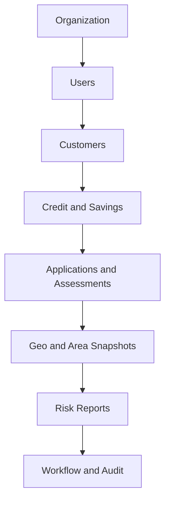

# GeoCredit AI — Seed / Mock Data Specification

**Version:** MVP v1.0  
**Status:** Development & Demo Baseline  
**Target:** Hackathon / 3-Day MVP  
**Last Updated:** 03 September 2026

## 1. Purpose

This document defines deterministic seed and mock data for local development, automated tests, UI demos and UAT of GeoCredit AI. The dataset covers Dabi and Progoti applications, role-based workflows, repayment and savings history, financial assessments, GPS verification, 500-meter area intelligence and explainable AI risk outputs.

The seed dataset must be synthetic. It must not contain real BRAC member names, phone numbers, national IDs, addresses, images or production credentials.

## 2. Goals

- Make every major screen and workflow demonstrable immediately after setup.
- Provide repeatable low, moderate, high and very-high risk scenarios.
- Test both sufficient and insufficient 500m-area cohorts.
- Cover success, validation, correction, additional-verification and final-decision paths.
- Keep IDs and timestamps deterministic so API snapshots and automated tests remain stable.
- Allow the complete dataset to be reset and reloaded safely in non-production environments.

## 3. Data Packages

| Package | Purpose | Minimum Records |
|---|---|---:|
| `core_org` | Organizational hierarchy and assignments | 9 units |
| `core_users` | All MVP roles and access scopes | 8 users |
| `customers` | Dabi and Progoti member profiles | 16 customers |
| `credit_history` | Loans, installments and overdue cases | 20 loans, 160 transactions |
| `savings_history` | Stable, volatile and weak savings patterns | 120 transactions |
| `applications` | Screens and workflow queues | 14 applications |
| `assessments` | Income, expense, social and checklists | 14 complete sets |
| `geo_cluster` | Valid/invalid GPS and 500m boundary cases | 16 locations |
| `risk_outputs` | Customer/area scores and explanations | 28 assessments |
| `workflow_audit` | Transition history and audit examples | 35+ events |
| `media_stubs` | Safe placeholder evidence metadata | 18 objects |

## 4. Environment Rules

| Environment | Seed Allowed | Data Type | Reset Allowed |
|---|---|---|---|
| Local | Yes | Full synthetic dataset | Yes |
| CI/Test | Yes | Deterministic minimal/full dataset | Yes |
| Demo | Yes | Curated synthetic dataset | Controlled |
| UAT | Yes | Synthetic or formally approved masked data | Controlled |
| Production | No | Never auto-seed | No |

Seed execution must fail when `APP_ENV=production`. The loader must require an explicit flag such as `ALLOW_SYNTHETIC_SEED=true` outside local/CI environments.

## 5. Deterministic Conventions

### 5.1 IDs

Use fixed UUIDs grouped by entity. Example namespace:

| Entity | UUID Pattern Example |
|---|---|
| Organization | `10000000-0000-0000-0000-000000000001` |
| User | `20000000-0000-0000-0000-000000000001` |
| Customer | `30000000-0000-0000-0000-000000000001` |
| Loan | `40000000-0000-0000-0000-000000000001` |
| Application | `50000000-0000-0000-0000-000000000001` |
| Geo verification | `60000000-0000-0000-0000-000000000001` |
| Risk assessment | `70000000-0000-0000-0000-000000000001` |

### 5.2 Dates and Money

- Reference time: `2026-09-01T06:00:00Z`.
- Historic transactions are generated relative to the fixed reference date, not the current system clock.
- Currency is BDT; money uses two decimal places.
- All stored timestamps use UTC.
- Display timezone may use `Asia/Dhaka`.

### 5.3 Synthetic Markers

Every seeded root record must include one of:

- `source_system = 'GEOCREDIT_SEED_V1'`
- `metadata.seed_dataset = 'MVP_V1'`
- a deterministic ID within the reserved seed namespace.

## 6. Organizational Hierarchy

Create the following fictional hierarchy:

| Code | Type | Name | Parent |
|---|---|---|---|
| `DIV-DEMO-01` | DIVISION | Demo Division | — |
| `REG-DEMO-01` | REGION | Demo Region North | `DIV-DEMO-01` |
| `AREA-DEMO-01` | AREA | Demo Area Central | `REG-DEMO-01` |
| `BR-DEMO-01` | BRANCH | Demo Branch A | `AREA-DEMO-01` |
| `BR-DEMO-02` | BRANCH | Demo Branch B | `AREA-DEMO-01` |
| `VO-DABI-01` | VO | Dabi VO Sunrise | `BR-DEMO-01` |
| `VO-DABI-02` | VO | Dabi VO Riverside | `BR-DEMO-02` |
| `VO-PRO-01` | VO | Progoti VO Market | `BR-DEMO-01` |
| `VO-PRO-02` | VO | Progoti VO Workshop | `BR-DEMO-02` |

## 7. Seed Users

| Employee ID | Display Name | Role | Department | Scope | Demo Purpose |
|---|---|---|---|---|---|
| `SEED-CDO-01` | Demo CDO One | CDO | DABI | `VO-DABI-01` | Create/submit Dabi |
| `SEED-CDO-02` | Demo CDO Two | CDO | DABI | `VO-DABI-02` | Scope-denial test |
| `SEED-CO-01` | Demo CO One | CO | PROGOTI | `VO-PRO-01` | Create/submit Progoti |
| `SEED-BM-01` | Demo BM One | BM | DABI | `BR-DEMO-01` | Dabi review |
| `SEED-BM-02` | Demo BM Two | BM | DABI | `BR-DEMO-02` | Scope-denial test |
| `SEED-AM-01` | Demo AM One | AM | — | `AREA-DEMO-01` | Dabi/Progoti review |
| `SEED-RM-01` | Demo RM One | RM | — | `REG-DEMO-01` | Final decision |
| `SEED-ADMIN-01` | Demo Administrator | ADMIN | — | `DIV-DEMO-01` | Configuration/support |

Authentication passwords must not be stored in application seed SQL. Local login identities should be created through the configured identity-provider emulator or development authentication adapter.

## 8. Customer Personas

Use obviously fictional names and masked identifiers.

| Key | Project | Persona | History | Expected Customer Risk |
|---|---|---|---|---|
| `CUS-DABI-001` | DABI | Repeat borrower, stable income | Two clean closed loans | LOW |
| `CUS-DABI-002` | DABI | Thin-file new borrower | No loan history | MODERATE |
| `CUS-DABI-003` | DABI | Irregular repayments | Repeated delays, small overdue | HIGH |
| `CUS-DABI-004` | DABI | Financial stress | Negative surplus, overdue | VERY_HIGH |
| `CUS-DABI-005` | DABI | Stable borrower at 499m boundary | Clean history | LOW |
| `CUS-DABI-006` | DABI | Stable borrower at 501m boundary | Clean history | LOW |
| `CUS-DABI-007` | DABI | Missing geo evidence | Average history | MODERATE |
| `CUS-DABI-008` | DABI | Outside officer scope | Clean history | LOW |
| `CUS-PRO-001` | PROGOTI | Established microenterprise | Strong cash flow | LOW |
| `CUS-PRO-002` | PROGOTI | Seasonal shop | Volatile income | MODERATE |
| `CUS-PRO-003` | PROGOTI | Leveraged enterprise | External debt | HIGH |
| `CUS-PRO-004` | PROGOTI | Distressed business | Severe overdue | VERY_HIGH |
| `CUS-PRO-005` | PROGOTI | New enterprise | Insufficient history | MODERATE |
| `CUS-PRO-006` | PROGOTI | Duplicate-coordinate test | Average history | MODERATE |
| `CUS-PRO-007` | PROGOTI | Invalid GPS accuracy | Clean history | LOW |
| `CUS-PRO-008` | PROGOTI | Privacy/API masking case | Average history | MODERATE |

Suggested display names: `Demo Member 001` through `Demo Member 016`. ID numbers must use encrypted dummy values and masked suffixes such as `0001`; never use valid-looking national identity numbers.

## 9. Credit History Patterns

### 9.1 Pattern Definitions

| Pattern | Scheduled | Delayed | Current Overdue | Trend | Expected Factors |
|---|---:|---:|---:|---|---|
| `CLEAN_REPEAT` | 24 | 0 | 0 | Stable/Improving | `NO_REPAYMENT_DELAYS`, `NO_CURRENT_OVERDUE` |
| `LIGHT_DELAY` | 20 | 2 | 0 | Stable | `REPAYMENT_DELAYS_LOW` |
| `IRREGULAR` | 20 | 7 | 4,000 | Deteriorating | `REPAYMENT_DELAYS_HIGH`, `CURRENT_OVERDUE_MODERATE` |
| `SEVERE` | 16 | 10 | 18,000 | Deteriorating | `REPAYMENT_DELAYS_CRITICAL`, `CURRENT_OVERDUE_HIGH` |
| `NEW_BORROWER` | 0 | 0 | 0 | Unavailable | `NEW_BORROWER_NO_HISTORY` |

### 9.2 Transaction Generation

- Generate scheduled weekly installments for Dabi and monthly installments for the selected Progoti demo products.
- A delayed installment uses collection date 3–14 days after the target date.
- A missed collection has `collection_amount = 0` and positive due/overdue.
- Closed clean loans end with zero due and `loan_status = 'CLOSED'`.
- Severe cases must include historical default/write-off only if the schema and approved demo policy support it.
- Sum of generated transaction amounts must reconcile to the loan-level figures.

## 10. Savings Patterns

| Pattern | Monthly Behavior | Expected Interpretation |
|---|---|---|
| `SAVINGS_STABLE` | Regular deposits, rare withdrawal, rising balance | Positive |
| `SAVINGS_FLAT` | Small irregular deposits, mostly flat balance | Neutral |
| `SAVINGS_VOLATILE` | Large deposits and withdrawals | Risk/Informational |
| `SAVINGS_DECLINING` | Repeated withdrawals, falling balance | Risk |
| `SAVINGS_NONE` | No history | Missing-data indicator |

Balances must reconcile in chronological order:

```text
new_balance = previous_balance + savings_own + collection_security - withdrawal_amount
```

## 11. Application Scenario Matrix

| Application No. | Project | Status | Owner | Customer | Customer Risk | Area Result | Primary Test |
|---|---|---|---|---|---|---|---|
| `DABI-SEED-001` | DABI | DRAFT | CDO-01 | DABI-001 | LOW | LOW | Editable complete draft |
| `DABI-SEED-002` | DABI | SUBMITTED_BY_CDO | BM-01 | DABI-002 | MODERATE | INSUFFICIENT_DATA | BM queue |
| `DABI-SEED-003` | DABI | BM_REVIEW | BM-01 | DABI-003 | HIGH | HIGH | Return/request verification |
| `DABI-SEED-004` | DABI | BM_RECOMMENDED | AM-01 | DABI-001 | LOW | MODERATE | AM start review |
| `DABI-SEED-005` | DABI | AM_REVIEW | AM-01 | DABI-004 | VERY_HIGH | HIGH | AM assessment |
| `DABI-SEED-006` | DABI | AM_RECOMMENDED | RM-01 | DABI-005 | LOW | LOW | RM queue |
| `DABI-SEED-007` | DABI | APPROVED | — | DABI-001 | LOW | LOW | Read-only terminal state |
| `PRO-SEED-001` | PROGOTI | DRAFT | CO-01 | PRO-001 | LOW | LOW | Complete Progoti draft |
| `PRO-SEED-002` | PROGOTI | SUBMITTED_BY_CO | AM-01 | PRO-002 | MODERATE | MODERATE | AM queue |
| `PRO-SEED-003` | PROGOTI | AM_REVIEW | AM-01 | PRO-003 | HIGH | HIGH | Difference warnings |
| `PRO-SEED-004` | PROGOTI | AM_RECOMMENDED | RM-01 | PRO-001 | LOW | LOW | RM review |
| `PRO-SEED-005` | PROGOTI | RM_REVIEW | RM-01 | PRO-004 | VERY_HIGH | VERY_HIGH | Reject scenario |
| `PRO-SEED-006` | PROGOTI | RETURNED_FOR_CORRECTION | CO-01 | PRO-005 | MODERATE | INSUFFICIENT_DATA | Correction loop |
| `PRO-SEED-007` | PROGOTI | ADDITIONAL_VERIFICATION_REQUIRED | CO-01 | PRO-007 | LOW | PENDING | Invalid GPS retake |

Reuse of a customer across applications is permitted only when the application dates and product rules make the scenario logically consistent.

## 12. Financial Assessment Fixtures

| Fixture | Income | Expense | External Debt Payment | Cash | Proposed Installment | Expected Signal |
|---|---:|---:|---:|---:|---:|---|
| `FIN-STRONG` | 45,000 | 22,000 | 0 | 30,000 | 5,000 | Strong affordability |
| `FIN-ACCEPTABLE` | 35,000 | 23,000 | 2,000 | 12,000 | Acceptable/moderate |
| `FIN-STRETCHED` | 30,000 | 24,000 | 3,000 | 4,000 | High burden |
| `FIN-NEGATIVE` | 24,000 | 27,000 | 4,000 | 0 | 6,000 | No available surplus |

Expected calculations must be stored in fixture assertions, not manually overridden in production columns.

## 13. Checklist and Document Fixtures

Create at least these answer sets:

- `CHK-POSITIVE`: all required answers favorable; mandatory documents present.
- `CHK-MIXED`: one warning-level concern; documents present.
- `CHK-RISKY`: multiple adverse answers and weak repayment intent.
- `CHK-MISSING-BLOCKING`: one mandatory answer/document absent.
- `CHK-CDO-BM-DIFFERENCE`: CDO positive, BM adverse on the same assessed topic.
- `CHK-CO-AM-DIFFERENCE`: CO positive, AM adverse on business stability.

Document states must cover `PRESENT`, `MISSING` and `NOT_APPLICABLE` without storing real document bytes.

## 14. GPS Cluster and 500m Geometry

### 14.1 Synthetic Center

Use the fictional demo center near Dhaka solely for geometry tests:

```text
latitude  = 23.780573
longitude = 90.407206
SRID      = 4326
```

### 14.2 Required Points

| Point | Approx. Distance | Geo Status | Included in 500m Search |
|---|---:|---|---|
| `GEO-CENTER` | 0m | VALID | Yes |
| `GEO-NEAR-100` | 100m | VALID | Yes |
| `GEO-NEAR-250` | 250m | VALID | Yes |
| `GEO-EDGE-499` | 499m | VALID | Yes |
| `GEO-EDGE-500` | 500m | VALID | Yes, boundary inclusive |
| `GEO-OUT-501` | 501m | VALID | No |
| `GEO-OUT-750` | 750m | VALID | No |
| `GEO-POOR-ACCURACY` | 120m | INVALID | No |
| `GEO-PENDING` | 200m | UPLOAD_PENDING | No |
| `GEO-MISSING` | — | — | No |

Exact coordinates should be generated using PostGIS so assertions use geodesic distance:

```sql
ST_Project(
  ST_SetSRID(ST_MakePoint(90.407206, 23.780573), 4326)::geography,
  :distance_meters,
  radians(:bearing_degrees)
)
```

The authoritative inclusion assertion is:

```sql
ST_DWithin(candidate.location, origin.location, 500.0)
```

Do not use latitude/longitude rounding or a rectangular bounding box as the final eligibility test.

## 15. Area Intelligence Scenarios

| Scenario | Eligible Borrowers | Overdue Rate | Risk Mix | Expected Area Output |
|---|---:|---:|---|---|
| `AREA-LOW` | 8 | 0–5% | Mostly LOW | LOW |
| `AREA-MODERATE` | 7 | 10–20% | LOW/MODERATE mix | MODERATE |
| `AREA-HIGH` | 9 | 30–45% | Several HIGH | HIGH |
| `AREA-VERY-HIGH` | 6 | >50% | HIGH/VERY_HIGH majority | VERY_HIGH |
| `AREA-INSUFFICIENT` | 2 | Any | Too few records | INSUFFICIENT_DATA |
| `AREA-EMPTY` | 0 | — | None | INSUFFICIENT_DATA |

The minimum cohort size must come from versioned configuration. For the demo, use `minimum_eligible_borrowers = 5` unless business owners approve a different value.

Area-query borrower snapshots must include only eligible, server-validated locations and must exclude the current applicant when the metric definition requires peer-only analysis.

## 16. Risk Output Fixtures

For each selected application seed:

- Store separate `CUSTOMER` and `AREA` risk assessments.
- Store engine, rule, threshold and feature-schema versions.
- Include at least two positive/risk factors where evidence exists.
- Use approved factor codes from the AI Risk Scoring Rules.
- Include data-quality flags for missing history or insufficient cohort.
- Display `AI Recommendation — Human Review Required`.
- Never seed an AI-generated workflow approval or rejection.

Example fixture:

```json
{
  "applicationNo": "DABI-SEED-003",
  "assessmentType": "CUSTOMER",
  "score": 67.25,
  "riskLevel": "HIGH",
  "engineVersion": "rules-mvp-1.0",
  "factors": [
    {"code": "REPAYMENT_DELAYS_HIGH", "direction": "RISK"},
    {"code": "REPAYMENT_DETERIORATING", "direction": "RISK"},
    {"code": "SAVINGS_PRESENT", "direction": "POSITIVE"}
  ],
  "humanReviewRequired": true
}
```

Scores in fixtures must be recalculated when rule configuration changes. The seed must not silently preserve values that contradict the active rule version.

## 17. Media Stubs

Use local, non-sensitive placeholders:

| Type | Example Key | Required Metadata |
|---|---|---|
| House image | `seed/house/001.jpg` | MIME, size, checksum, capture time |
| Business image | `seed/business/001.jpg` | MIME, size, checksum, capture time |
| Evidence thumbnail | `seed/thumb/001.jpg` | Parent object reference |

Do not embed base64 images in SQL. Seed metadata may reference bundled placeholder assets. At least one record must test unsupported MIME type, oversized file and missing upload.

## 18. Workflow and Audit History

Each non-draft application must have a valid transition chain from `DRAFT`. Seed records must include actor, previous status, next status, action, timestamp, remarks where required and application version.

Mandatory history examples:

- Dabi: submit → BM review → recommend → AM review → recommend → RM review → approve.
- Progoti: submit → AM review → return → corrected draft → resubmit.
- Additional verification request with required reason and assignee.
- Rejection by RM with remarks.
- A denied transition should exist only in test fixtures or audit events, not as current workflow state.

## 19. Offline Sync Fixtures

Create client-side fixtures for:

| Scenario | Expected Result |
|---|---|
| Draft created offline then synced | One server application created |
| Same request retried with idempotency key | No duplicate |
| Local version older than server | `RESOURCE_VERSION_CONFLICT` |
| Image pending while form syncs | Application remains incomplete |
| GPS captured offline | `LOCAL_ONLY` then server verification |
| Invalid/expired session on sync | Authentication error; local data retained |

Offline fixtures should use stable client-generated UUIDs and explicit idempotency keys.

## 20. Negative and Boundary Fixtures

Include separate fixtures for:

- Missing mandatory fields.
- Negative income or expense value.
- Proposed installment with zero/negative surplus.
- GPS latitude/longitude outside legal ranges.
- Poor GPS accuracy and stale capture time.
- Distance exactly 500m and just over 500m.
- Duplicate idempotency key with a different payload.
- Unauthorized organizational scope.
- Invalid workflow transition.
- Concurrent version conflict.
- Missing risk report for current application version.
- Area query pending and area cohort insufficient.
- Terminal application mutation attempt.
- Malformed AI output and unsupported factor code.

Negative fixtures must be isolated from the default happy-path dataset or clearly marked `expected_invalid = true`.

## 21. Suggested Fixture Layout

```text
seed/
  manifest.json
  01_organizational_units.json
  02_users.json
  03_customers.json
  04_credit_history.json
  05_savings_history.json
  06_applications.json
  07_assessments.json
  08_geo_verifications.json
  09_area_queries.json
  10_risk_outputs.json
  11_workflow_audit.json
  media/
  invalid/
  assertions/
```

## 22. Seed Manifest

```json
{
  "dataset": "GEOCREDIT_MVP_V1",
  "version": "1.0.0",
  "referenceTime": "2026-09-01T06:00:00Z",
  "synthetic": true,
  "currency": "BDT",
  "locationSrid": 4326,
  "areaRadiusMeters": 500,
  "minimumAreaCohort": 5,
  "riskRulesVersion": "rules-mvp-1.0"
}
```

## 23. Load Order and Idempotency



- Load parents before children.
- Use deterministic primary keys and `ON CONFLICT` handling appropriate to local/test environments.
- Running the same seed version twice must not create duplicates.
- If data from another seed version exists, the loader must stop or require an explicit reset.
- Reset must delete only records marked with the exact seed dataset identifier.
- Execute each package in a transaction; report the failing package and record key.

## 24. Validation Assertions

The loader must run post-load checks:

| Check | Expected |
|---|---|
| User role coverage | CDO, CO, BM, AM, RM, ADMIN present |
| Department coverage | DABI and PROGOTI present |
| Application state coverage | All required demo states present |
| Risk coverage | LOW, MODERATE, HIGH, VERY_HIGH present |
| Geo boundary | 499m/500m included; 501m excluded |
| Area insufficiency | Cohort below minimum returns insufficient data |
| Financial reconciliation | Stored totals match line items |
| Loan reconciliation | Transactions match loan balances |
| Savings reconciliation | Every running balance is correct |
| Workflow integrity | Every status has a valid history chain |
| Version integrity | Risk/report references current frozen version |
| Privacy | No real ID, phone, email, image or address detected |

## 25. Automated Test Mapping

| Test Suite | Primary Fixtures |
|---|---|
| Authentication/RBAC | Seed users and cross-scope users |
| Customer API | All customer personas |
| Application validation | Draft and invalid fixtures |
| Workflow | Scenario matrix and audit chains |
| Financial calculations | Four financial fixtures |
| GPS service | Center, accuracy and boundary points |
| 500m search | 499m, 500m, 501m and invalid status |
| Risk engine | Four risk bands and missing-data cases |
| AI report renderer | Risk outputs and malformed-output fixture |
| Offline sync | Idempotency and conflict fixtures |

## 26. Sample Seed Command Contract

```bash
npm run seed -- --dataset GEOCREDIT_MVP_V1
npm run seed:verify -- --dataset GEOCREDIT_MVP_V1
npm run seed:reset -- --dataset GEOCREDIT_MVP_V1
```

Command names are illustrative. The implementation may use the selected backend framework, but must preserve dataset selection, verification and scoped reset behavior.

## 27. Ownership and Change Control

| Area | Owner/Reviewer |
|---|---|
| Workflow scenarios | Product + Operations |
| Risk scores/factors | Credit Risk + Model Risk |
| Financial fixtures | Business + Finance SME |
| GPS/area cases | Engineering + Data |
| Privacy review | Security/Privacy |
| Test assertions | QA + Engineering |

Any change to risk thresholds, minimum cohort size, workflow states or schema requires a new seed dataset version or an explicitly reviewed fixture migration.

## 28. Acceptance Criteria

- A clean local database can load the complete dataset without manual edits.
- Re-running the same seed is idempotent.
- Both Dabi and Progoti happy paths are demonstrable.
- Every MVP role has a usable synthetic account and correct scope.
- Customer and area results cover all four risk levels plus insufficient data.
- The 500m boundary test includes 500m and excludes points beyond it.
- All financial, loan and savings values reconcile.
- Workflow histories match the current application states.
- No seeded record contains real personal or production information.
- Verification scripts complete successfully before the dataset is used for demo or CI.

## 29. MVP Delivery Priority

For a three-day build, implement in this order:

1. Organization, users and two happy-path applications.
2. Four customer-risk personas and financial fixtures.
3. GPS center, 499m/500m/501m boundary points and area cohorts.
4. Workflow queues, risk reports and terminal examples.
5. Invalid, offline and concurrency fixtures required by automated tests.

