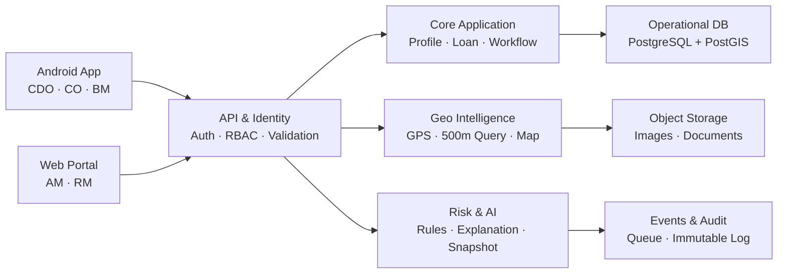
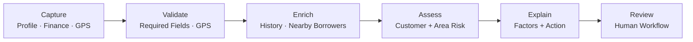

# GeoCredit AI

**SOLUTION ARCHITECTURE**

AI-Powered Area Risk Intelligence, Customer Credit Assessment & Geo-Verification

| **Architecture intent** Deliver an auditable, offline-aware MVP that combines verified customer location, 500-meter portfolio context, financial and behavioral data, and explainable risk guidance—while keeping the final lending decision with authorized officers. |
|------------------------------------------------------------------------------------------------------------------------------------------------------------------------------------------------------------------------------------------------------------------------|

| **Document** | **Value**                                                         |
|--------------|-------------------------------------------------------------------|
| Version      | MVP v1.0                                                          |
| Status       | Draft for architecture review                                     |
| Prepared     | 03 September 2026                                                 |
| Source       | Geo Credit AI PRD (MVP v1.0)                                      |
| Audience     | Product, Engineering, Data/AI, Security, Operations and UAT teams |

# Decision summary

- Mobile-first field capture with an Android offline outbox; online connectivity is required for central borrower search and risk generation.

- A modular application backend owns transactional workflow; geospatial, risk and reporting modules expose versioned internal contracts.

- PostgreSQL with PostGIS is the operational system of record; images are stored in encrypted object storage, not in database rows.

- The MVP risk engine uses configurable rules and statistics, with deterministic factor codes and a controlled language-generation layer for readable explanations.

- Every submitted application preserves an immutable input and risk snapshot for traceability and later audit.

**AI RECOMMENDATION — HUMAN REVIEW REQUIRED**

# 1. Purpose and scope

This document translates the GeoCredit AI PRD into an implementable MVP architecture. It defines system boundaries, runtime components, core data ownership, primary processing flows, security controls, deployment topology, operational targets and the decisions needed before build completion.

## 1.1 In scope

- Android workflows for Dabi CDO/BM and Progoti CO, including offline geo/photo capture.

- Web review workflows for AM and RM.

- Customer, loan, repayment, savings, assessment and checklist views.

- Mandatory GPS validation, image evidence, 500-meter nearby-borrower search and map presentation.

- Customer risk, area risk, explainable factors, suggested action and immutable risk snapshot.

- Dabi workflow: CDO → BM → AM → RM; Progoti workflow: CO → AM → RM.

- RBAC, audit trail, privacy filtering, monitoring and MVP integration boundaries.

## 1.2 Out of scope for MVP

Fully automated credit decisions, national risk heatmaps, complex fraud networks, continuous real-time risk refresh, advanced predictive ML and broad enterprise integration are excluded. The architecture provides extension points but does not require these capabilities for MVP acceptance.

## 1.3 Architecture principles

| **Principle**               | **Application**                                                                         |
|-----------------------------|-----------------------------------------------------------------------------------------|
| Human authority             | AI output is advisory; RM or other authorized authority records the final decision.     |
| Explainability first        | Every score maps to observable inputs, rule/model version and reason codes.             |
| Snapshot over recomputation | Submitted applications retain the exact inputs and result used during review.           |
| Offline safely              | Field evidence is encrypted locally, queued, deduplicated and synchronized when online. |
| Least exposure              | Nearby borrower views reveal only approved summary fields.                              |
| Replaceable intelligence    | Risk and explanation contracts are versioned so rules can later be replaced by ML.      |

# 2. Requirements driving the architecture

| **Driver**                        | **Architectural response**                                                                                   |
|-----------------------------------|--------------------------------------------------------------------------------------------------------------|
| Rural connectivity                | Local mobile database, encrypted media cache, outbox queue and resumable uploads.                            |
| Mandatory location evidence       | In-app capture binds image, coordinates, accuracy, timestamp, officer and device to one verification record. |
| 500m intelligence                 | PostGIS geography index and ST_DWithin query using server-side canonical coordinates.                        |
| Two workflows                     | Configurable state machine with department-specific transitions, guards and role checks.                     |
| Explainable AI                    | Feature pipeline → transparent scoring → reason codes → templated/LLM narrative with guardrails.             |
| Historical consistency            | Application input snapshot, risk snapshot, versioned rules/model, and append-only workflow/audit events.     |
| Sensitive financial/location data | Encryption, scoped RBAC/ABAC, field minimization, short-lived URLs and comprehensive access logs.            |
| Limited integration for demo      | Anti-corruption adapters support controlled datasets now and enterprise APIs later.                          |

## 2.1 Key assumptions to validate

- Employee identity, hierarchy and branch/area assignments are available from an existing identity source or a controlled MVP directory.

- Historical loan and savings data can be provided through read-only APIs, scheduled extracts or a seeded dataset.

- The captured GPS value comes from the device location service at capture time; EXIF is supporting evidence, not the sole trusted source.

- The 500-meter rule uses straight-line geodesic distance from the verified coordinate.

- Exact affordability/tolerance formulas, score thresholds, checklist mandatory fields and retention periods remain configurable business parameters.

# 3. System context and boundaries

Figure 1. Logical system architecture.

## 3.1 External dependencies

| **Dependency**              | **Purpose**                                                               | **MVP boundary**                                                               |
|-----------------------------|---------------------------------------------------------------------------|--------------------------------------------------------------------------------|
| Identity/employee directory | Authenticate staff and resolve role, department, branch, area and region. | OIDC/SAML where available; otherwise controlled directory with migration path. |
| Core microfinance data      | Customer, loan, collection and savings history.                           | Read-only API or scheduled ingestion; source remains authoritative.            |
| Map provider                | Base map tiles and geocoding if approved.                                 | Location/risk logic does not depend on map rendering.                          |
| Object storage              | Encrypted image and document evidence.                                    | Private bucket/container; application-mediated access.                         |
| Notification channel        | Optional workflow alerts.                                                 | In-app notification first; SMS/email can be added later.                       |

# 4. Recommended architecture style

| **Recommendation** Use a modular monolith for transactional APIs plus independent background workers for media processing, area aggregation, risk generation and report rendering. This is the lowest-complexity path that still preserves clean service boundaries. |
|----------------------------------------------------------------------------------------------------------------------------------------------------------------------------------------------------------------------------------------------------------------------|

The application backend is deployed as one codebase/runtime for the MVP, with modules that own schemas and interfaces. Computational or retryable work runs through a queue. Risk/AI can be scaled or extracted independently when volume, governance or model lifecycle requires it.

| **Option**                 | **Strength**                                               | **Trade-off**                                                        | **Decision**     |
|----------------------------|------------------------------------------------------------|----------------------------------------------------------------------|------------------|
| Modular monolith + workers | Fast delivery, simple transactions, clean extraction path. | Requires discipline around module boundaries.                        | Selected for MVP |
| Microservices              | Independent scaling and ownership.                         | Operational overhead, distributed failure modes, slower MVP.         | Defer            |
| Single monolith            | Simplest initial deployment.                               | Tight coupling of risk, media and workflow; limited retry isolation. | Not selected     |

## 4.1 Module boundaries

| **Module**         | **Owns**                                       | **Primary interfaces**              |
|--------------------|------------------------------------------------|-------------------------------------|
| Identity & Access  | users, roles, scopes, assignments, sessions    | login/token, authorization policy   |
| Customer 360       | profile, organizational links, read models     | profile CRUD/read, history summary  |
| Loan Application   | Dabi/Progoti applications, finance assessments | draft/update/validate/submit        |
| Workflow           | state, transitions, tasks, remarks             | transition, inbox, decision history |
| Geo Verification   | capture metadata, verification state           | upload initiate/complete, verify    |
| Area Intelligence  | radius query, aggregates, masked nearby view   | search 500m, area metrics, map feed |
| Risk & Explanation | features, score, factors, suggested action     | assess, retrieve report, snapshot   |
| Audit & Reporting  | events, audit evidence, operational reporting  | append/query/export                 |

# 5. Component responsibilities

## 5.1 Android application

- Role-aware UI for CDO, CO and BM, with department-specific forms and state guards.

- Encrypted local database for assigned profiles, active drafts, reference values and synchronization metadata.

- In-app camera flow records device GPS, accuracy, capture time, image hash and device context in one atomic local record.

- Outbox pattern queues profile/application mutations and media uploads with idempotency keys.

- Network-aware sync retries safely; submission remains blocked until server confirms mandatory evidence and risk report availability.

## 5.2 Web portal

- AM/RM work queues filtered by organizational scope, role and department.

- Read-only customer/history/risk views plus authorized checklists, recommendation and decision actions.

- Map and nearby-borrower summaries retrieved from privacy-filtered APIs.

- Decision screens show the frozen risk snapshot, its generation time, inputs completeness, factors and “Human Review Required” notice.

## 5.3 API and application services

A versioned REST/JSON API is sufficient for MVP. An API gateway or ingress terminates TLS, applies request limits and propagates correlation IDs. The backend enforces authorization and workflow guards server-side; client-side visibility is never treated as access control.

## 5.4 Background processing

| **Worker**            | **Trigger**                                        | **Output / retry behavior**                                                                                       |
|-----------------------|----------------------------------------------------|-------------------------------------------------------------------------------------------------------------------|
| Media processor       | Upload finalized                                   | Malware/type check, metadata extraction, hash verification, thumbnail; retry and dead-letter on repeated failure. |
| Area aggregator       | Valid geo verification / risk request              | Nearby set and aggregate metrics with query timestamp.                                                            |
| Risk worker           | Application validated or reviewer requests refresh | Versioned feature set, scores, factors and immutable report snapshot.                                             |
| Audit/event projector | Business event committed                           | Queryable audit trail and notification/read models; idempotent consumer.                                          |

# 6. Core processing flows

Figure 2. Risk-report processing path.

## 6.1 Geo capture and synchronization

1.  Officer opens the in-app camera; the app confirms permission, GPS enabled status and acceptable coordinate availability.

2.  At shutter time, the app creates a local verification record containing image hash, latitude/longitude, accuracy, captured_at, officer, customer, application and device identifiers.

3.  The encrypted image and record enter the local outbox. When online, the app obtains an upload session and transfers the media using resumable upload.

4.  Backend verifies checksum/type, stores the object privately, compares client metadata with server and extracted metadata, and records validation signals.

5.  Only a server-confirmed VALID verification satisfies the Progoti CO and Dabi CDO submission guard. BM recapture/verification behavior is retained as a configurable exception rule.

## 6.2 Application submission and risk snapshot

1.  API validates required fields, workflow role, checklist readiness, geo status and financial calculations.

2.  Within one transaction it creates the submission version and outbox event; repeated requests with the same idempotency key return the same result.

3.  Risk worker assembles a point-in-time feature set from customer history, submitted assessments and area metrics.

4.  Rules/statistics produce customer and area scores, levels and reason codes. Explanation layer produces narrative only from approved facts and reason codes.

5.  A signed/hashed immutable snapshot stores inputs reference, feature values, scores, thresholds, rule/model version, factors, suggested action and generated timestamp.

6.  Workflow advances only when report generation succeeds; reviewers always access the frozen submission snapshot.

## 6.3 Workflow states and guards

| **Workflow** | **Primary path**                                                                                                   | **Mandatory guards**                                                                                               |
|--------------|--------------------------------------------------------------------------------------------------------------------|--------------------------------------------------------------------------------------------------------------------|
| Dabi         | Draft → Submitted by CDO → BM Review → BM Recommended → AM Review → AM Recommended → RM Review → Approved/Rejected | CDO geo valid; BM checklist before recommendation; AM checklist before recommendation; RM role for final decision. |
| Progoti      | Draft → Submitted by CO → AM Review → AM Recommended → RM Review → Approved/Rejected                               | CO geo valid; required checklists/documents visible; AM recommendation; RM role for final decision.                |
| Both         | Any review → Additional Verification Required / Returned → corrected prior step                                    | Reason required; assignment and state history retained; no destructive overwrite.                                  |

# 7. Data architecture

## 7.1 Storage choices

| **Store**            | **Technology**                          | **Data and rationale**                                                                 |
|----------------------|-----------------------------------------|----------------------------------------------------------------------------------------|
| Operational database | PostgreSQL 16 + PostGIS                 | Strong transactions for applications/workflow; spatial index and geodesic 500m search. |
| Object storage       | S3-compatible/private blob store        | Images and documents; encryption, lifecycle control and scalable upload.               |
| Queue                | Managed queue or Redis/RabbitMQ for MVP | Retries and isolation for media, area and risk tasks; dead-letter support.             |
| Mobile local store   | Encrypted SQLite/Room                   | Offline draft, evidence metadata, outbox and minimal assigned data.                    |
| Cache                | Optional Redis                          | Short-lived reference data, sessions/rate limits; never source of record.              |
| Analytics            | Deferred warehouse/lake                 | Operational reporting can begin with read replica/materialized views.                  |

## 7.2 Core entity model

| **Aggregate** | **Key entities**                                                              | **Important design notes**                                                      |
|---------------|-------------------------------------------------------------------------------|---------------------------------------------------------------------------------|
| Party         | customer, spouse, nominee, organizational_assignment                          | Use stable customer ID; sensitive identifiers encrypted/tokenized as required.  |
| Behavior      | loan, loan_transaction, savings_transaction                                   | External source ID + source system; incremental sync and reconciliation fields. |
| Application   | loan_application, income_assessment, expense_assessment, liability_assessment | Version drafts; preserve assessment_source to compare CDO and BM values.        |
| Evidence      | customer_location, geo_verification, media_object                             | Retain historical locations; store coordinate as PostGIS geography(Point,4326). |
| Review        | checklist, checklist_response, document_status                                | Template/version controls mandatory questions and department variants.          |
| Intelligence  | area_query, area_metric, feature_set, risk_assessment, ai_report              | Version every feature/rule/report; snapshot nearby cohort IDs or cohort hash.   |
| Workflow      | workflow_instance, workflow_action, task_assignment                           | Append transitions; current state is a projection with optimistic locking.      |
| Governance    | audit_event, access_event, configuration_version                              | Append-only evidence, correlation ID and before/after references.               |

## 7.3 Geospatial query

Store verified coordinates as geography(Point, 4326) and create a GiST index. The authoritative radius query uses ST_DWithin(candidate.location, applicant.location, 500), excluding the applicant and applying department/portfolio eligibility rules. Return distance and only privacy-approved fields. Persist query timestamp, radius, eligibility-rule version and cohort reference so results can be explained later.

| **Accuracy rule** GPS presence is mandatory; an accuracy threshold and stale-location threshold should be configurable. Poor-but-present accuracy should produce a review warning unless business explicitly chooses to block it. |
|-----------------------------------------------------------------------------------------------------------------------------------------------------------------------------------------------------------------------------------|

# 8. Risk and AI architecture

## 8.1 Hybrid MVP pipeline

| **Stage**        | **Responsibility**                                                                      | **Control**                                                               |
|------------------|-----------------------------------------------------------------------------------------|---------------------------------------------------------------------------|
| Feature assembly | Calculate affordability, repayment, savings, assessment-difference and area metrics.    | Feature schema/version; missingness indicators; deterministic transforms. |
| Customer scoring | Weighted rules/statistics across financial, loan, savings, social and checklist inputs. | Config version, threshold version and reason codes.                       |
| Area scoring     | Aggregate nearby exposure, overdue, risk distribution and trends.                       | Minimum cohort/privacy threshold; distance and eligibility versions.      |
| Fusion           | Keep customer and area levels separate; derive overall review priority/action.          | No opaque averaging that hides conflicting perspectives.                  |
| Explanation      | Render positive/risk factors, findings and suggested action.                            | Template-first; optional LLM sees structured approved facts only.         |
| Snapshot         | Persist complete point-in-time assessment.                                              | Immutable record, checksum, timestamps and lineage.                       |

## 8.2 Explainability contract

Each factor contains factor_code, display_label, direction, severity, observed_value, comparison/threshold, source_timestamp, source_entity and human-readable evidence. The report generator may rephrase these facts but cannot invent causes, change risk levels or issue an approval/rejection.

| **Example factor code**    | **Evidence**                                                           | **Rendered message**                                                     |
|----------------------------|------------------------------------------------------------------------|--------------------------------------------------------------------------|
| AFFORDABILITY_HIGH         | Proposed installment / available surplus exceeds configured threshold. | Proposed installment is high relative to available monthly surplus.      |
| REPAYMENT_DETERIORATING    | Recent delay rate exceeds prior baseline.                              | Recent repayment performance has deteriorated.                           |
| AREA_OVERDUE_CONCENTRATION | Nearby overdue ratio exceeds area threshold.                           | The surrounding area shows elevated overdue concentration.               |
| ASSESSMENT_VARIANCE        | CDO vs BM reported income variance exceeds threshold.                  | Field assessments contain a material income difference requiring review. |

## 8.3 AI safety

- UI and exported report display “AI Recommendation — Human Review Required.”

- No model endpoint has permission to transition workflow or set final decision fields.

- Narrative is grounded in structured factor payloads and checked for unsupported numbers/decision language.

- Rules/model promotion requires validation, approval, versioning and rollback.

- Monitor missing data, score distribution, override outcomes and group-level performance for unfair or unstable behavior.

# 9. API and integration design

| **Resource/API**   | **Representative operations**                 | **Notes**                                                                          |
|--------------------|-----------------------------------------------|------------------------------------------------------------------------------------|
| /auth              | login, refresh, logout, session/device revoke | Prefer enterprise federation; strong rate limit and device binding where feasible. |
| /customers         | search, profile, loan/savings summaries       | Scope by organizational assignment; mask sensitive fields.                         |
| /applications      | create/update/validate/submit/get             | ETag/version and idempotency key for offline synchronization.                      |
| /geo-verifications | initiate upload, complete, status, recapture  | Short-lived upload URLs; server verification result is authoritative.              |
| /areas             | nearby, map, metrics                          | Privacy-filtered response; server caps radius to approved value.                   |
| /risk-assessments  | request/status/report/snapshot                | Asynchronous status; application snapshot retrieval.                               |
| /workflow          | inbox, transition, history                    | Allowed-actions returned by server; reason required for return/reject.             |
| /audit             | authorized search/export                      | Restricted operations/security role.                                               |

## 9.1 Integration reliability

- Use correlation IDs across API, queue, audit and worker logs.

- Use transactional outbox for events created with application/workflow updates.

- Consumers are idempotent; uniqueness includes event ID and assessment request ID.

- External history ingestion maintains watermarks, reconciliation totals and source timestamps.

- No synchronous dependency on external loan/savings systems during final submission if the required snapshot has already been refreshed within an approved freshness window.

# 10. Security, privacy and audit

## 10.1 Identity and authorization

Use short-lived access tokens and rotated refresh tokens. Authorization combines role (CDO/CO/BM/AM/RM), department, organizational scope, record assignment and workflow state. Every sensitive API applies server-side policy checks and denies by default.

| **Control area** | **MVP control**                                                                                                                |
|------------------|--------------------------------------------------------------------------------------------------------------------------------|
| Transport        | TLS 1.2+ externally and authenticated encryption for internal service traffic where supported.                                 |
| At rest          | Managed encryption keys for database/object storage; Android keystore-backed encryption for local secrets and database.        |
| Secrets          | Secret manager; no secrets in application configuration, mobile package or logs.                                               |
| Media            | Private objects, checksum, MIME/signature validation, malware scanning where available, short-lived application-issued access. |
| PII              | Field-level masking/encryption for NID and contact data; never include unnecessary PII in nearby responses or AI prompts.      |
| Sessions         | Idle/absolute expiry, token revocation, lockout/rate limiting and device/session inventory.                                    |
| Database         | Separate service roles, least privilege, encrypted backups and restricted production access.                                   |
| Logging          | Structured logs with redaction; coordinates, NID, tokens and image URLs excluded from general logs.                            |

## 10.2 Audit model

Audit events record actor, role, organizational scope, action, entity/reference, timestamp, prior/new state reference, reason, IP/device where appropriate and correlation ID. Critical events include profile change, geo capture/verification, media access, application submission, risk generation/view, checklist update, recommendation, return, approval and rejection. Audit records are append-only for application roles and covered by retention/backup policy.

## 10.3 Privacy rules for nearby borrowers

- Return opaque customer reference, approximate map marker if required, distance band, loan status, risk level and summarized repayment/savings indicators only.

- Do not expose name, NID, exact address, phone, detailed transactions or exact coordinates unless separately authorized for a legitimate workflow purpose.

- Apply minimum cohort thresholds to area aggregates to reduce inference risk; exact threshold requires privacy/business approval.

- Log access to nearby details and restrict exports/screenshots through policy and user training where technical prevention is impractical.

# 11. Deployment architecture

| **Layer**     | **MVP deployment**                                                | **Scaling path**                                                   |
|---------------|-------------------------------------------------------------------|--------------------------------------------------------------------|
| Edge          | WAF/API gateway/ingress, TLS, rate limiting                       | Multi-zone load balancing and stronger bot/device controls.        |
| Application   | Containerized API instances behind load balancer                  | Horizontal scale; later extract high-change modules.               |
| Workers       | Separate worker deployments for media, geo/risk and notifications | Scale by queue depth; dedicated risk runtime/GPU only if required. |
| Data          | Managed PostgreSQL/PostGIS, object storage, queue, optional Redis | Multi-AZ, read replica, partition high-volume history/audit.       |
| Observability | Central logs, metrics, traces and alerting                        | SIEM integration, SLO dashboards and automated incident workflows. |
| Environments  | Dev, test/UAT, production with isolated data and secrets          | Infrastructure-as-code and controlled promotion pipeline.          |

## 11.1 Availability and recovery targets (proposed)

| **Target**          | **MVP proposal**                     | **Notes**                                                                            |
|---------------------|--------------------------------------|--------------------------------------------------------------------------------------|
| API availability    | 99.5% monthly                        | Excludes planned maintenance; confirm business expectation.                          |
| Online read latency | p95 ≤ 2 seconds                      | Profile/application summary excluding risk generation.                               |
| 500m search         | p95 ≤ 3 seconds                      | For indexed query and approved cohort size.                                          |
| Risk report         | 90% ≤ 30 seconds; timeout 60 seconds | Asynchronous progress and retry; exact target depends on explanation implementation. |
| RPO                 | ≤ 15 minutes                         | Managed DB point-in-time recovery; object versioning as approved.                    |
| RTO                 | ≤ 4 hours                            | Documented restore and redeploy runbook.                                             |
| Offline outbox      | Retain unsynced records ≥ 7 days     | Confirm operational field duration and device storage limits.                        |

## 11.2 Observability

- Technical: request rate/error/latency, database saturation, queue depth/age, upload failures, worker retries and dead-letter count.

- Business: application funnel by state, GPS validity, offline sync success, report-generation success and turnaround time.

- Risk: score distribution, missing feature rate, factor frequency, human override/decision outcomes and version comparison.

- Security: authentication failures, unusual exports/media access, cross-scope authorization denials and privileged configuration changes.

# 12. Offline synchronization design

| **Concern**      | **Design**                                                                                                                                                |
|------------------|-----------------------------------------------------------------------------------------------------------------------------------------------------------|
| Local identity   | Server-issued stable UUIDs; client-generated UUIDs for new drafts and evidence records.                                                                   |
| Mutation queue   | Ordered outbox with operation type, payload version, dependency, idempotency key, attempts and last error.                                                |
| Media dependency | Application submission depends on completed media upload and server VALID geo state.                                                                      |
| Conflict policy  | Profiles use server version/ETag and field-aware resolution; workflow transitions never merge and must refresh state.                                     |
| Deletion         | No destructive offline deletion for submitted records; drafts use explicit tombstones if enabled.                                                         |
| Reference data   | Versioned cached checklists/products with expiry; stale mandatory schema blocks final submission, not capture.                                            |
| Security         | Encrypted local DB/files, no sensitive data in notifications/logs, remote session revocation and data purge on logout/device reassignment where feasible. |

| **User experience** Offline capture should show “Saved on device” and later “Synced/Verified” as distinct states. A local capture must never be presented as centrally submitted. |
|-----------------------------------------------------------------------------------------------------------------------------------------------------------------------------------|

# 13. Architecture decisions

| **ID** | **Decision**                             | **Rationale / consequence**                                                |
|--------|------------------------------------------|----------------------------------------------------------------------------|
| ADR-01 | Modular monolith plus workers            | Accelerates MVP while preserving clear extraction seams.                   |
| ADR-02 | PostgreSQL + PostGIS                     | One transactional/geospatial platform; indexed geodesic query.             |
| ADR-03 | Private object storage for media         | Avoid database bloat and enable secure resumable transfer/lifecycle.       |
| ADR-04 | Transactional outbox and idempotency     | Prevents lost/duplicate processing under weak connectivity and retries.    |
| ADR-05 | Transparent rules first                  | Meets explainability and limited-data constraints; ML remains replaceable. |
| ADR-06 | Separate customer and area risk          | Preserves PRD intent and avoids hiding contradictory evidence.             |
| ADR-07 | Immutable submission/risk snapshot       | Supports traceability, audit, model versioning and dispute review.         |
| ADR-08 | Server-side workflow state machine       | Consistent department flows and authorization across Android/web.          |
| ADR-09 | Minimal nearby-borrower projection       | Reduces unnecessary personal-data exposure.                                |
| ADR-10 | Device GPS at capture + metadata signals | Avoids reliance on editable EXIF while retaining evidence checks.          |

# 14. Delivery plan and quality gates

| **Increment**      | **Deliverable**                                                                   | **Exit gate**                                                              |
|--------------------|-----------------------------------------------------------------------------------|----------------------------------------------------------------------------|
| 1\. Foundation     | Identity/RBAC, customer read model, application draft, audit skeleton             | Role and organization isolation tests pass.                                |
| 2\. Field evidence | Android capture, encrypted outbox, resumable media, geo verification              | Offline-to-online capture passes; invalid/missing GPS blocks submission.   |
| 3\. Intelligence   | PostGIS nearby search, area metrics, customer feature pipeline, rules and factors | Known fixtures reproduce expected cohort, scores and reasons.              |
| 4\. Workflow       | Dabi and Progoti state machines, inboxes, checklists, returns and RM decision     | End-to-end acceptance scenarios pass with audit history.                   |
| 5\. Hardening      | Privacy filters, performance, backups, monitoring, security/UAT fixes             | Security review, restore test, load test and operational runbook approved. |

## 14.1 Test strategy

- Unit tests for calculations, thresholds, state guards, data masking and reason-code mapping.

- Contract tests for mobile/web APIs, history adapters and risk payloads.

- Geospatial fixtures at inside/on/outside 500m, duplicate coordinates and accuracy edge cases.

- Offline tests covering app termination, reordered retries, partial uploads, token expiry and duplicate submission.

- Golden tests for risk reports: same snapshot + same version produces identical structured output.

- Authorization matrix tests across role, department, hierarchy, branch/area and application state.

- UAT traces for complete Dabi and Progoti stories, including return/additional verification paths.

# 15. Risks and mitigations

| **Risk**                     | **Impact**                               | **Mitigation**                                                                                                           |
|------------------------------|------------------------------------------|--------------------------------------------------------------------------------------------------------------------------|
| Poor GPS/device manipulation | False area result or invalid evidence    | Accuracy signal, capture-time binding, device integrity signals where available, anomaly rules and supervisor recapture. |
| Incomplete/stale history     | Misleading score                         | Freshness indicators, missing-data factors, ingestion reconciliation and block/degrade policy.                           |
| Sparse 500m cohort           | Unstable or privacy-sensitive area score | Minimum cohort threshold; show insufficient-data outcome and broaden only if business approves.                          |
| Rule bias or threshold drift | Unfair decisions                         | Governed configuration, back-testing, subgroup monitoring, human review and version rollback.                            |
| LLM hallucination            | Unsupported finding                      | Template-first report, structured grounding, numeric validator, no decision authority, fallback to deterministic text.   |
| Offline conflict/data loss   | Duplicate or missing submission          | Encrypted outbox, idempotency, dependency order, resumable upload and visible sync state.                                |
| Scope leakage                | Unauthorized customer/location access    | Server-side ABAC, minimal projections, access audit and automated authorization tests.                                   |
| MVP over-engineering         | Delayed delivery                         | Keep transactional backend modular but deploy together; defer extraction until measurable need.                          |

# 16. Open decisions for architecture review

1.  Authoritative identity provider and mapping of employee → role → branch/area/region/division/project.

2.  Source and freshness SLA for customer, loan, collection and savings data.

3.  Exact affordability formula, tolerance configuration, risk weights, level thresholds and approval owner for changes.

4.  GPS accuracy/staleness thresholds and whether Dabi BM exception in PRD should be retained given the mandatory CDO rule.

5.  Nearby borrower eligibility definition, minimum aggregation cohort and map-location precision.

6.  Media/document retention period, legal/privacy basis, customer notice/consent and deletion/archive rules.

7.  Whether explanation is deterministic templates only or an approved private LLM endpoint with no data retention.

8.  Expected daily application volume, concurrent users, image size, coverage/connectivity pattern and operational SLOs.

9.  Hosting region, cloud/platform standards, disaster recovery requirements and security/compliance review process.

# Appendix A. Requirements traceability

| **PRD capability**            | **Architecture component**                        | **Verification**                                           |
|-------------------------------|---------------------------------------------------|------------------------------------------------------------|
| Authentication/RBAC           | Identity & Access, gateway, ABAC policy           | Authorization matrix and scope-isolation tests.            |
| Customer/loan/savings         | Customer 360 + history adapters                   | Data reconciliation and UI/API contract tests.             |
| Loan applications/assessments | Loan Application module                           | Field validation and calculation fixtures.                 |
| GPS + image                   | Android capture, Geo Verification, object storage | Missing GPS, checksum, offline sync and recapture tests.   |
| 500m search/map               | PostGIS Area Intelligence                         | Boundary distance and privacy projection tests.            |
| Individual/area risk          | Feature and scoring pipeline                      | Golden feature/score fixtures and missing-data tests.      |
| Explainable AI/action         | Reason codes + explanation layer                  | Unsupported-claim validator and human-review label checks. |
| Dabi/Progoti workflow         | Workflow state machine                            | End-to-end PRD acceptance scenarios.                       |
| Risk snapshot                 | Immutable assessment/report records               | Historical retrieval unchanged after source updates.       |
| Audit/security/privacy        | Audit, access logging and data controls           | Event completeness, redaction, backup and access tests.    |

# Appendix B. Suggested MVP technology profile

Technology choices should align with the organization’s supported stack. A pragmatic reference profile is:

| **Layer**     | **Reference choice**                                                                                          |
|---------------|---------------------------------------------------------------------------------------------------------------|
| Android       | Kotlin, Jetpack Compose, Room, WorkManager, CameraX, fused location provider                                  |
| Web           | React/TypeScript with a component library and role-aware routing                                              |
| Backend       | Java/Spring Boot, .NET, or Node/NestJS modular application—select the strongest internal capability           |
| Data          | PostgreSQL 16 with PostGIS; managed object storage; managed queue; optional Redis                             |
| Risk          | Python worker or backend-native rules engine; versioned configuration and deterministic feature library       |
| Observability | OpenTelemetry, centralized logs/metrics/traces and alert manager                                              |
| Delivery      | Containers, infrastructure-as-code, automated tests, SAST/dependency/image scanning and environment promotion |
