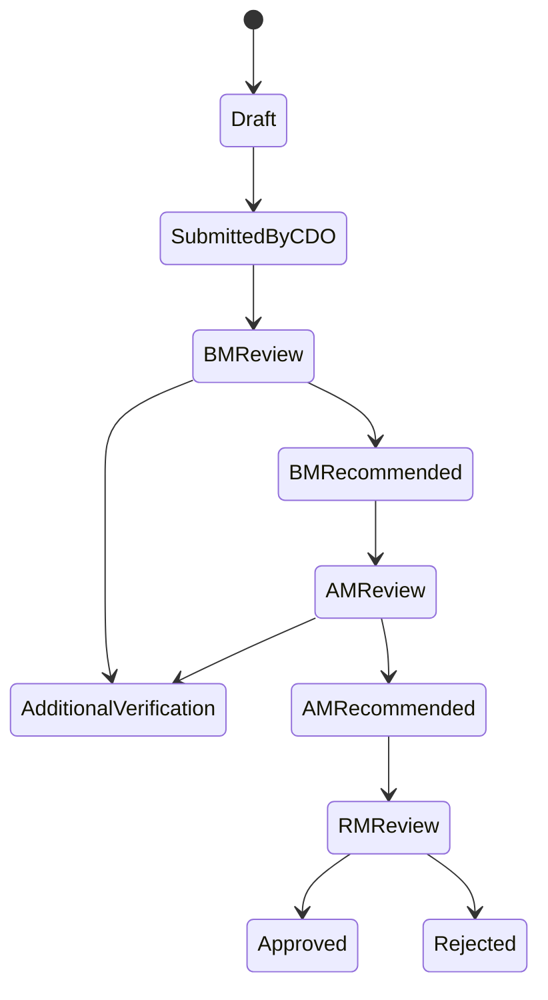
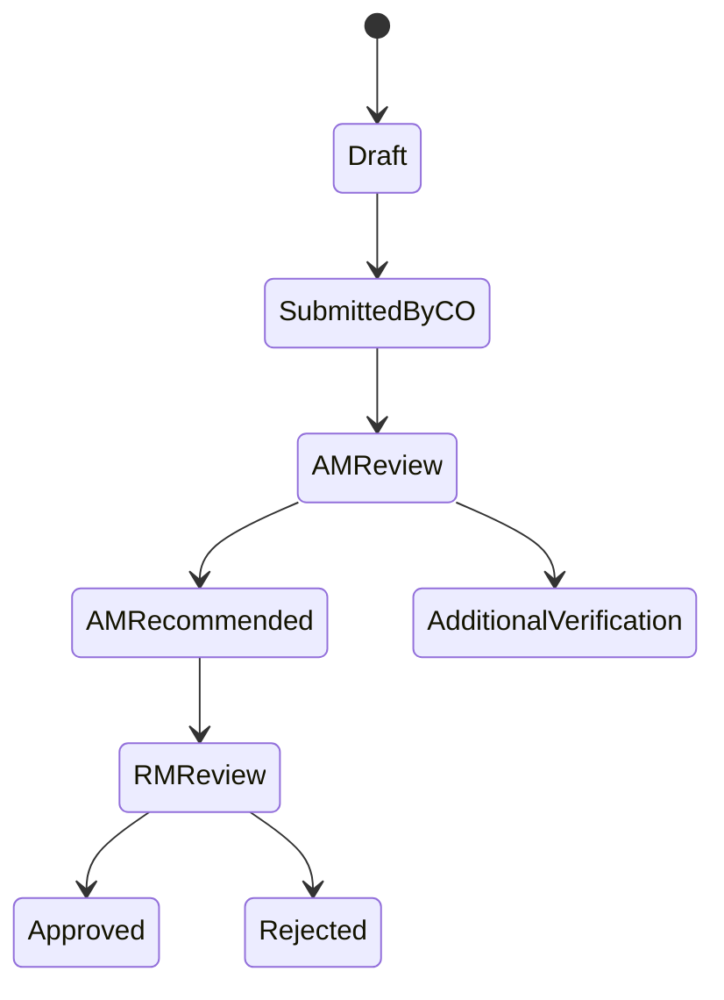

# GeoCredit AI — Technical Requirements Document

**Version:** MVP v1.0  
**Status:** Draft for Development  
**Source:** Geo Credit AI PRD and GeoCredit AI Solution Architecture MVP v1.0  
**Target:** Hackathon / 3-Day Demo MVP  
**Last Updated:** 03 September 2026

---

## 1. Purpose

This Technical Requirements Document defines the implementation requirements for the GeoCredit AI MVP. It is written to support rapid AI-assisted development while preserving the core business rules, data contracts, validation logic, security boundaries, and acceptance criteria.

GeoCredit AI combines customer financial and behavioral data with verified GPS location and nearby borrower information to produce:

- Individual Customer Risk Assessment
- 500-meter Area Risk Assessment
- Positive and Risk Indicators
- Explainable Key Findings
- Suggested Action for Human Review

The system is a decision-support tool. It must never automatically approve or reject a loan.

> **Mandatory label:** AI Recommendation — Human Review Required

---

## 2. MVP Scope

### 2.1 Included

- Demo authentication and role-based access
- Customer profile and historical behavior
- Loan application and financial assessment
- House/business image capture or upload
- GPS coordinate capture and validation
- 500-meter nearby borrower search
- Customer and area risk calculation
- Explainable AI report
- Dabi workflow support
- Progoti workflow support where time permits
- Reviewer recommendation and final decision
- Risk snapshot and basic audit history
- Seeded/demo dataset

### 2.2 Excluded

- Autonomous loan approval or rejection
- Production enterprise authentication
- Full core banking/microfinance integration
- Advanced predictive machine learning
- Fraud network analysis
- National risk heatmap
- Full production-grade offline conflict resolution
- SMS, email, or external notification integration
- Production disaster recovery implementation

---

## 3. Recommended MVP Technology Stack

| Layer | Recommended Technology | Requirement |
|---|---|---|
| Frontend | React + TypeScript + Vite | Responsive PWA optimized for mobile and desktop |
| UI | Tailwind CSS + shadcn/ui | Reusable accessible components |
| Backend | Supabase or Node.js/NestJS | Authentication, business APIs, workflow, audit |
| Database | PostgreSQL + PostGIS | Transactional and 500-meter geospatial queries |
| Storage | Supabase Storage or S3-compatible storage | Private image/document storage |
| Risk Engine | TypeScript or Python rules module | Deterministic, versioned, explainable scoring |
| AI Explanation | Deterministic templates; optional private LLM | Must use only approved structured factors |
| Maps | Leaflet + OpenStreetMap | Applicant point, radius and nearby markers |
| Deployment | Vercel + Supabase or container platform | Fast MVP deployment |

### 3.1 Architecture Constraint

The MVP should use a modular monolith. Customer, application, geo, risk, workflow, and audit logic must remain separated by modules even if deployed together.

---

## 4. User Roles

| Role | Department | Primary Platform | Main Capabilities |
|---|---|---|---|
| CDO | Dabi | Mobile/PWA | Customer, application, assessment, geo capture, AI report, submit |
| BM | Dabi | Mobile/PWA | Review, BM checklist, geo verification if required, recommend/return |
| CO | Progoti | Mobile/PWA | Customer, application, checklists, geo capture, AI report, submit |
| AM | Both | Web | Review, checklist, recommend/return |
| RM | Both | Web | Final review, approve/reject |

### 4.1 Authorization Rules

- Every protected request must verify authenticated user, role, department, organizational scope, and application state.
- UI visibility must not be treated as authorization.
- Only RM can record the final `APPROVED` or `REJECTED` decision.
- Nearby borrower data must use a privacy-minimized response.
- Users must not access applications outside their assigned organizational scope.

---

## 5. Functional Requirements

### 5.1 Authentication and Session

| ID | Requirement | Priority |
|---|---|---|
| TR-AUTH-01 | User can sign in with employee ID/PIN or demo credentials. | Must |
| TR-AUTH-02 | Session stores user ID, role, department, branch, area and region. | Must |
| TR-AUTH-03 | Protected routes redirect unauthenticated users to login. | Must |
| TR-AUTH-04 | Backend rejects unauthorized role/state actions. | Must |
| TR-AUTH-05 | User can log out and invalidate the active session. | Should |

### 5.2 Customer Profile

| ID | Requirement | Priority |
|---|---|---|
| TR-CUS-01 | CDO/CO can search and open a customer by customer/member reference. | Must |
| TR-CUS-02 | Authorized field users can create or edit a profile. | Must |
| TR-CUS-03 | Profile contains personal, organizational, identity, occupation, address, spouse and nominee information. | Must |
| TR-CUS-04 | Existing profile data auto-populates a new loan application. | Must |
| TR-CUS-05 | BM/AM/RM have read-only access to the relevant customer profile. | Must |

### 5.3 Loan and Savings Behavior

| ID | Requirement | Priority |
|---|---|---|
| TR-HIS-01 | System displays previous loan summary and expandable transaction history. | Must |
| TR-HIS-02 | Loan summary includes counts, disbursed amount, overdue, delay and repayment trend. | Must |
| TR-HIS-03 | System displays savings balance and transaction history. | Must |
| TR-HIS-04 | Savings summary includes deposit frequency, withdrawals, consistency and trend. | Must |
| TR-HIS-05 | MVP may load history from seeded JSON/CSV or database fixtures. | Must |

### 5.4 Loan Application

| ID | Requirement | Priority |
|---|---|---|
| TR-APP-01 | CDO/CO can create a draft application from a customer profile. | Must |
| TR-APP-02 | Application stores proposed amount, user, type, duration, sector, scheme and product. | Must |
| TR-APP-03 | Dabi supports income, expense and liability assessment. | Must |
| TR-APP-04 | Progoti supports income, expense and tolerance calculation. | Must |
| TR-APP-05 | Calculated totals update immediately when inputs change. | Must |
| TR-APP-06 | Server recalculates all financial totals before submission. | Must |
| TR-APP-07 | Draft can be saved before all mandatory fields are complete. | Must |
| TR-APP-08 | Submission is blocked when required fields or evidence are incomplete. | Must |

### 5.5 Checklists

| ID | Requirement | Priority |
|---|---|---|
| TR-CHK-01 | Dabi BM can complete the BM checklist and remarks. | Must |
| TR-CHK-02 | Dabi AM can complete the AM checklist. | Must |
| TR-CHK-03 | Progoti CO can complete initial, document and loan assessment checklists. | Must for Progoti demo |
| TR-CHK-04 | Missing required checklist responses are visibly highlighted. | Must |
| TR-CHK-05 | Checklist template and version are stored with responses. | Should |

### 5.6 Geo-Verification

| ID | Requirement | Priority |
|---|---|---|
| TR-GEO-01 | User can open the in-app camera or approved capture interface. | Must |
| TR-GEO-02 | Capture record contains customer ID, application ID, image, latitude, longitude, accuracy, timestamp, officer ID and device identifier where available. | Must |
| TR-GEO-03 | Submission is blocked if latitude or longitude is missing. | Must |
| TR-GEO-04 | Coordinates are displayed to the capturing user. | Must |
| TR-GEO-05 | Image is stored privately and referenced by storage key, not a public URL. | Must |
| TR-GEO-06 | Image checksum/hash is retained to detect transfer corruption. | Should |
| TR-GEO-07 | Dabi BM geo input is optional when CDO evidence is valid and mandatory when the configured exception rule applies. | Must |
| TR-GEO-08 | Progoti CO cannot submit without server-confirmed valid geo evidence. | Must |

### 5.7 Offline Capture

| ID | Requirement | Priority |
|---|---|---|
| TR-OFF-01 | Field user can save draft profile/application data locally. | Should |
| TR-OFF-02 | Field user can save GPS and image evidence locally when offline. | Must if native/PWA capability permits |
| TR-OFF-03 | UI distinguishes `Saved on device`, `Uploading`, `Synced`, `Verified`, and `Failed`. | Must |
| TR-OFF-04 | Client assigns a UUID/idempotency key to every queued mutation. | Must |
| TR-OFF-05 | Retry must not create duplicate application, evidence or workflow actions. | Must |
| TR-OFF-06 | AI report and nearby borrower search require online connectivity. | Must |

### 5.8 500-Meter Area Intelligence

| ID | Requirement | Priority |
|---|---|---|
| TR-AREA-01 | Backend searches eligible borrowers within 500 meters of the verified point. | Must |
| TR-AREA-02 | Applicant is excluded from the nearby borrower result. | Must |
| TR-AREA-03 | Search uses geodesic distance through PostGIS `ST_DWithin`. | Must |
| TR-AREA-04 | Query returns borrower count, distance, loan status, masked reference, risk level and approved summaries. | Must |
| TR-AREA-05 | Area metrics include borrower count, active loans, overdue concentration, repayment performance, savings indicators and risk distribution where data exists. | Must |
| TR-AREA-06 | Map shows applicant, 500-meter boundary and privacy-safe nearby markers. | Should |
| TR-AREA-07 | Area query stores radius, timestamp and rules/version used. | Should |

### 5.9 Risk Assessment

| ID | Requirement | Priority |
|---|---|---|
| TR-RISK-01 | System calculates customer risk independently from area risk. | Must |
| TR-RISK-02 | Risk level is one of `LOW`, `MODERATE`, `HIGH`, `VERY_HIGH`. | Must |
| TR-RISK-03 | MVP uses configurable weighted rules and statistical indicators. | Must |
| TR-RISK-04 | Every score-affecting rule emits a reason/factor code. | Must |
| TR-RISK-05 | Missing input data is recorded and must not silently become a positive value. | Must |
| TR-RISK-06 | Risk output includes positive factors, risk factors, key findings and suggested action. | Must |
| TR-RISK-07 | Exact score, threshold configuration and rule version are persisted. | Must |
| TR-RISK-08 | Risk engine must not update workflow decision fields. | Must |

### 5.10 AI Explanation

| ID | Requirement | Priority |
|---|---|---|
| TR-AI-01 | Explanation uses only calculated features and approved factor payloads. | Must |
| TR-AI-02 | Explanation must not invent data, causes, amounts or customer details. | Must |
| TR-AI-03 | Explanation must not state that the loan is approved or rejected. | Must |
| TR-AI-04 | Deterministic templates are the fallback when AI generation is unavailable. | Must |
| TR-AI-05 | Report displays the human-review notice. | Must |
| TR-AI-06 | Prompt/template version is stored with the report. | Should |

### 5.11 Workflow

#### Dabi



#### Progoti



| ID | Requirement | Priority |
|---|---|---|
| TR-WF-01 | Backend controls allowed state transitions. | Must |
| TR-WF-02 | Every transition records actor, role, timestamp, prior state, new state and remarks. | Must |
| TR-WF-03 | Return, reject and additional-verification actions require remarks. | Must |
| TR-WF-04 | BM/AM recommendation does not equal final approval. | Must |
| TR-WF-05 | Only RM can move an application to Approved or Rejected. | Must |
| TR-WF-06 | Reviewer sees the same frozen risk snapshot created for the submitted application. | Must |

### 5.12 Risk Snapshot and Audit

| ID | Requirement | Priority |
|---|---|---|
| TR-AUD-01 | Submission creates an immutable application input version. | Must |
| TR-AUD-02 | Risk assessment stores feature set, score, level, factors, version and generated timestamp. | Must |
| TR-AUD-03 | Later customer/history changes must not alter the historical submitted report. | Must |
| TR-AUD-04 | Audit captures profile update, geo capture, upload, validation, submission, risk generation, review, recommendation and decision. | Must |
| TR-AUD-05 | Application users cannot edit or delete audit events. | Must |

---

## 6. Business Calculations

### 6.1 Common Calculations

```text
total_monthly_income = sum(all applicable income fields)
total_monthly_expense = sum(all applicable expense fields)
available_surplus = total_monthly_income - total_monthly_expense
installment_burden_ratio = proposed_monthly_installment / max(available_surplus, 1)
```

### 6.2 Assessment Difference

```text
income_difference_percent =
  abs(cdo_income - bm_income) / max(cdo_income, bm_income, 1) * 100
```

The alert threshold must be configurable. Suggested demo threshold: `20%`.

### 6.3 Risk Level Mapping

Demo defaults; final values require business approval.

| Score | Level |
|---|---|
| 0–24 | LOW |
| 25–49 | MODERATE |
| 50–74 | HIGH |
| 75–100 | VERY_HIGH |

### 6.4 Suggested Action Mapping

| Risk Level | Suggested Action |
|---|---|
| LOW | Proceed with normal review. |
| MODERATE | Proceed with additional attention to identified factors. |
| HIGH | Additional verification/review recommended. |
| VERY_HIGH | Enhanced review recommended before proceeding. |

---

## 7. Data Requirements

### 7.1 Core Tables

| Table | Important Fields |
|---|---|
| `users` | id, employee_id, role, department, branch_id, area_id, region_id, active |
| `customers` | id, member_no, profile fields, organization fields, created_at, updated_at |
| `loans` | id, customer_id, source_id, amount, disbursed_at, status, installment_count |
| `loan_transactions` | id, loan_id, collection_date, target, collection, due, overdue, method |
| `savings_transactions` | id, customer_id, transaction_date, deposit, withdrawal, balance, method |
| `loan_applications` | id, customer_id, department, application_no, proposed fields, status, version |
| `income_assessments` | id, application_id, assessor_id, assessor_role, income fields, total |
| `expense_assessments` | id, application_id, assessor_id, assessor_role, expense fields, total |
| `liability_assessments` | id, application_id, debt, cash_in_hand, proposed_installment, tolerance |
| `checklist_responses` | id, application_id, template_version, question_code, response, actor_id |
| `document_statuses` | id, application_id, document_code, present, remarks |
| `geo_verifications` | id, customer_id, application_id, point, accuracy_m, captured_at, officer_id, status |
| `media_objects` | id, storage_key, checksum, mime_type, size_bytes, verification_id |
| `area_queries` | id, application_id, center_point, radius_m, query_time, rules_version |
| `area_metrics` | area_query_id, metric_code, numeric_value, data_timestamp |
| `risk_assessments` | id, application_id, type, score, level, engine_version, generated_at |
| `risk_factors` | id, assessment_id, factor_code, direction, severity, observed_value, evidence |
| `ai_reports` | id, application_id, snapshot_version, findings, suggested_action, template_version |
| `workflow_actions` | id, application_id, actor_id, from_state, to_state, remarks, created_at |
| `audit_events` | id, actor_id, action, entity_type, entity_id, correlation_id, created_at |

### 7.2 Geospatial Definition

```sql
location geography(Point, 4326) NOT NULL
```

```sql
CREATE INDEX idx_geo_verifications_location
ON geo_verifications
USING GIST (location);
```

Reference query:

```sql
SELECT
  customer_id,
  ST_Distance(location, :applicant_location) AS distance_m
FROM current_customer_locations
WHERE customer_id <> :applicant_customer_id
  AND ST_DWithin(location, :applicant_location, 500)
ORDER BY distance_m;
```

---

## 8. API Requirements

### 8.1 General Standards

- Base path: `/api/v1`
- Format: JSON over HTTPS
- Authentication: Bearer token/session
- Dates: ISO 8601 UTC
- Identifiers: UUID
- Mutating offline requests: `Idempotency-Key` header required
- Updates: optimistic concurrency through `version` or `If-Match`
- Every response includes or propagates a correlation/request ID
- Validation errors return field-level error codes

### 8.2 Required Endpoints

| Method | Endpoint | Purpose |
|---|---|---|
| POST | `/auth/login` | Authenticate user |
| POST | `/auth/logout` | End session |
| GET | `/me` | Current identity and permissions |
| GET | `/customers` | Search accessible customers |
| GET | `/customers/{id}` | Customer profile |
| POST | `/customers` | Create customer |
| PATCH | `/customers/{id}` | Update customer |
| GET | `/customers/{id}/loan-summary` | Loan behavior |
| GET | `/customers/{id}/savings-summary` | Savings behavior |
| POST | `/applications` | Create draft |
| GET | `/applications/{id}` | Complete application view |
| PATCH | `/applications/{id}` | Update draft/allowed fields |
| POST | `/applications/{id}/validate` | Return readiness and validation errors |
| POST | `/applications/{id}/submit` | Submit to workflow |
| POST | `/geo-verifications` | Create verification metadata/upload session |
| POST | `/geo-verifications/{id}/complete` | Finalize uploaded evidence |
| GET | `/geo-verifications/{id}` | Verification status |
| GET | `/applications/{id}/nearby-borrowers` | Privacy-filtered 500m results |
| GET | `/applications/{id}/area-metrics` | Area intelligence |
| POST | `/applications/{id}/risk-assessments` | Request risk calculation |
| GET | `/applications/{id}/risk-report` | Frozen risk report |
| GET | `/workflow/inbox` | Role-scoped review queue |
| POST | `/applications/{id}/transitions` | Recommend, return, approve or reject |
| GET | `/applications/{id}/history` | Workflow and audit timeline |

### 8.3 Standard Error Response

```json
{
  "error": {
    "code": "GEO_LOCATION_REQUIRED",
    "message": "Valid latitude and longitude are required before submission.",
    "fieldErrors": [
      { "field": "geoVerificationId", "code": "REQUIRED" }
    ],
    "correlationId": "req_01J..."
  }
}
```

---

## 9. Risk Engine Contract

### 9.1 Input

```json
{
  "applicationId": "uuid",
  "snapshotVersion": 1,
  "customer": {},
  "financial": {},
  "loanBehavior": {},
  "savingsBehavior": {},
  "socialAssessment": {},
  "checklists": {},
  "areaMetrics": {},
  "dataTimestamps": {}
}
```

### 9.2 Output

```json
{
  "engineVersion": "rules-1.0.0",
  "customerRisk": { "score": 42, "level": "MODERATE" },
  "areaRisk": { "score": 68, "level": "HIGH" },
  "positiveFactors": [],
  "riskFactors": [],
  "keyFindings": [],
  "suggestedActionCode": "ADDITIONAL_REVIEW",
  "humanReviewRequired": true,
  "generatedAt": "2026-09-03T10:42:00Z"
}
```

### 9.3 Factor Schema

Every factor must include:

- `factorCode`
- `label`
- `direction`: `POSITIVE` or `RISK`
- `severity`
- `observedValue`
- `threshold` or comparison
- `sourceEntity`
- `sourceTimestamp`
- `evidenceText`

---

## 10. Validation Rules

| Code | Rule | Result |
|---|---|---|
| `AUTH_SCOPE_DENIED` | User outside role/organization scope | HTTP 403 |
| `APPLICATION_NOT_EDITABLE` | Application is not in an editable state | HTTP 409 |
| `REQUIRED_FIELD_MISSING` | Mandatory form value absent | Submission blocked |
| `GEO_LOCATION_REQUIRED` | Latitude or longitude missing | Submission blocked |
| `GEO_NOT_VERIFIED` | Evidence has not passed server verification | Submission blocked |
| `IMAGE_REQUIRED` | House/business image missing | Submission blocked |
| `CHECKLIST_INCOMPLETE` | Required checklist unanswered | Relevant transition blocked |
| `DOCUMENT_CHECKLIST_INCOMPLETE` | Required Progoti document state missing | Warning/block per configuration |
| `RISK_REPORT_PENDING` | Risk report not generated | Reviewer submission blocked |
| `INVALID_WORKFLOW_TRANSITION` | Action not allowed from current state | HTTP 409 |
| `REMARKS_REQUIRED` | Return/reject/additional verification without remarks | Action blocked |

---

## 11. Security and Privacy Requirements

- Use HTTPS for all network traffic.
- Store images/documents in private storage.
- Use short-lived signed media access or application-proxied access.
- Encrypt sensitive data at rest using platform-managed encryption.
- Store local credentials and encryption keys using the device security store.
- Do not log tokens, PINs, NID values, exact coordinates, full addresses, or signed media URLs.
- Mask NID and sensitive identifiers in UI unless the user is explicitly authorized.
- Nearby borrower API must not return name, NID, phone, exact address, exact coordinate, or complete transaction history.
- AI prompts must not contain unnecessary direct identifiers.
- Record access to customer location, nearby borrower details, risk reports, and media.
- Rate-limit login, search, media and report endpoints.
- Secrets must be stored in environment/secret management, never in source code.

---

## 12. Non-Functional Requirements

| ID | Requirement | MVP Target |
|---|---|---|
| NFR-01 | Online API availability | 99.5% monthly target |
| NFR-02 | Profile/application read latency | p95 ≤ 2 seconds |
| NFR-03 | Indexed 500m search latency | p95 ≤ 3 seconds |
| NFR-04 | Risk report generation | 90% ≤ 30 seconds; timeout at 60 seconds |
| NFR-05 | Responsive UI | 360px mobile to desktop widths |
| NFR-06 | Accessibility | Keyboard navigation, labels, contrast and visible validation |
| NFR-07 | Idempotency | Repeated request produces one logical record/action |
| NFR-08 | Auditability | All major actions traceable by actor and timestamp |
| NFR-09 | Browser support | Latest Chrome/Edge; Android Chrome for PWA demo |
| NFR-10 | Data recovery | Daily backup for demo; production target RPO/RTO requires approval |

---

## 13. Seed Data Requirements

Demo data must include:

- At least 20 customers across two or more locations
- At least 12 borrowers within 500 meters of the demo applicant
- Low, moderate, high and very-high borrower examples
- Closed and active loans
- Normal, delayed and overdue repayment histories
- Consistent and inconsistent savings histories
- Dabi applicant with CDO and BM income variance
- Applicant with good customer history but high-risk area
- Applicant with weak customer history but low-risk area
- Demo users for CDO, CO, BM, AM and RM
- At least one complete Dabi workflow history

Seed data must not contain real customer personal information.

---

## 14. Testing Requirements

### 14.1 Required Automated Tests

- Financial total and affordability calculation tests
- Risk threshold boundary tests
- Reason-code mapping tests
- Missing-data behavior tests
- PostGIS inside/on/outside 500-meter tests
- Role and organizational-scope authorization tests
- Workflow transition tests
- Idempotent submission tests
- Nearby borrower privacy response tests
- Risk snapshot immutability tests

### 14.2 Required Demo/UAT Scenarios

1. CDO signs in and opens the demo customer.
2. CDO reviews loan and savings behavior.
3. CDO creates a loan application and enters financial data.
4. CDO captures/uploads an image with valid coordinates.
5. System finds nearby borrowers within 500 meters.
6. System calculates individual and area risk.
7. System displays explainable findings and suggested action.
8. CDO submits to BM.
9. BM reviews and completes the BM checklist.
10. AM reviews and recommends to RM.
11. RM approves or rejects and enters remarks.
12. System displays complete workflow and audit history.

Negative scenarios:

- Submission without GPS must fail.
- Submission without image must fail.
- Unauthorized role transition must fail.
- Reject/return without remarks must fail.
- Duplicate submission request must not create a duplicate action.
- Nearby borrower response must not expose restricted PII.

---

## 15. 3-Day Implementation Priority

### Day 1 — Foundation

- Project setup and shared types
- Demo authentication and roles
- Database schema and seed data
- Customer profile/history screens
- Application form and calculations
- Basic audit events

### Day 2 — Geo and Risk

- Image capture/upload
- GPS validation
- PostGIS 500-meter search
- Map and nearby borrower list
- Rule-based customer/area scoring
- Explainable report generation

### Day 3 — Workflow and Demo

- BM/AM/RM review screens
- Workflow transitions and guards
- Risk snapshot
- Error/empty/loading states
- Automated smoke tests and UAT
- Deployment and demo rehearsal

### 15.1 Build Priority

1. One complete Dabi happy path
2. GPS blocking rule
3. 500-meter seeded area intelligence
4. Deterministic explainable risk report
5. Reviewer workflow and RM decision
6. Progoti variations
7. Offline enhancements and polish

---

## 16. Definition of Done

The hackathon MVP is complete when:

- A demo user can sign in using each required role.
- A field user can open a customer and create a loan application.
- Financial totals are calculated correctly.
- Missing GPS/image blocks submission.
- Valid coordinates return eligible borrowers within 500 meters.
- Customer and area risks are calculated separately.
- Every risk output contains understandable evidence-based factors.
- AI output clearly requires human review.
- Dabi workflow completes from CDO to RM.
- RM can approve or reject with remarks.
- Historical risk snapshot remains unchanged.
- Major actions appear in the audit timeline.
- Restricted nearby-borrower PII is not exposed.
- The deployed demo runs end-to-end using seeded, non-production data.

---

## 17. Open Decisions

- Final implementation stack and hosting platform
- Production identity provider
- Authoritative customer/loan/savings data source
- Exact affordability and tolerance formula
- Risk weights and approval owner
- GPS accuracy and staleness thresholds
- Nearby borrower eligibility and minimum cohort size
- Image/document retention policy
- Deterministic-only explanation or approved private LLM
- Production performance, availability, RPO and RTO targets

