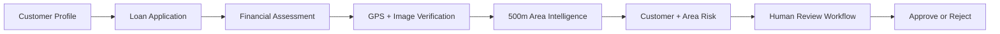
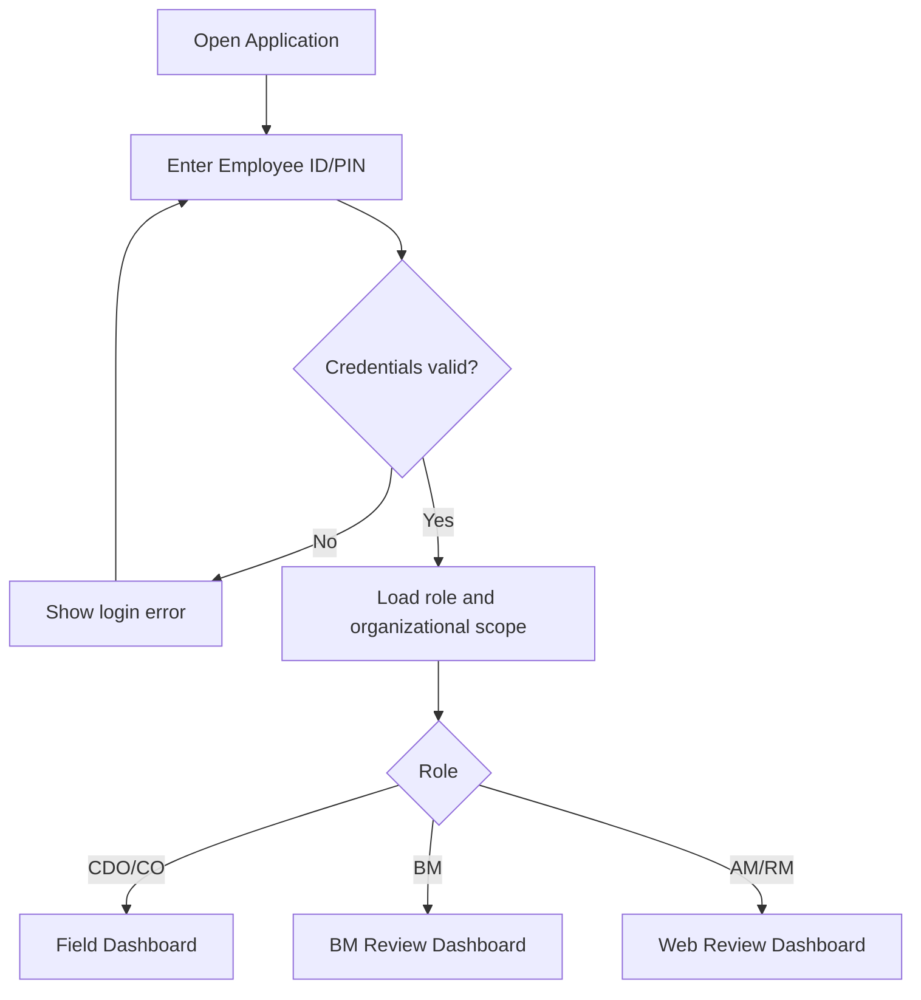
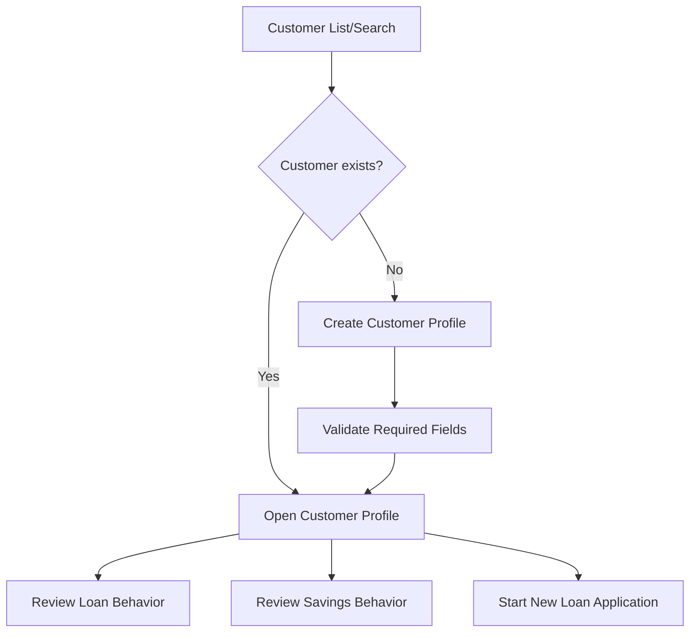
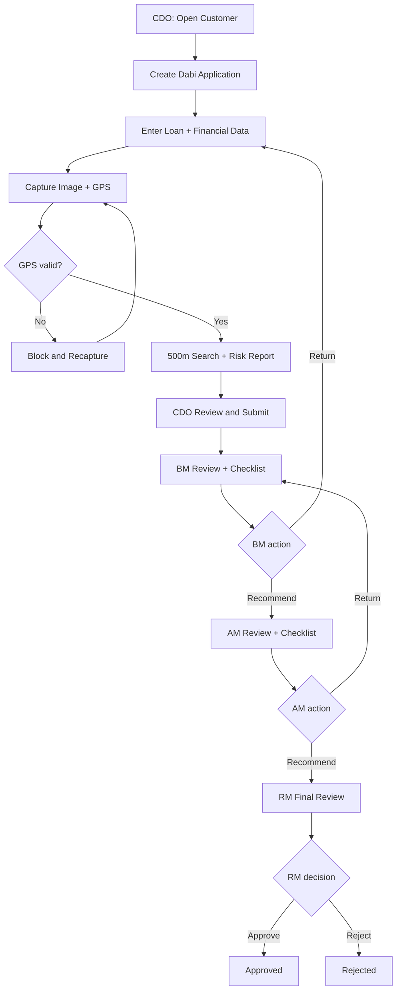
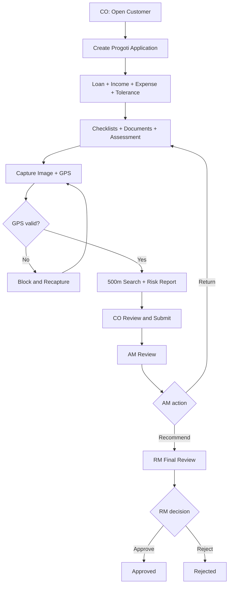
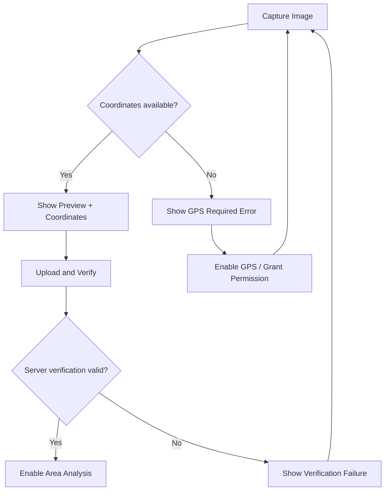
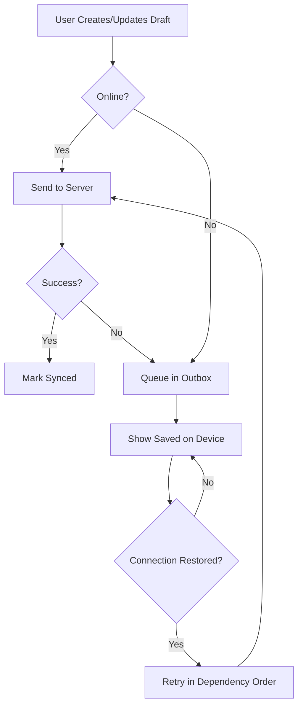
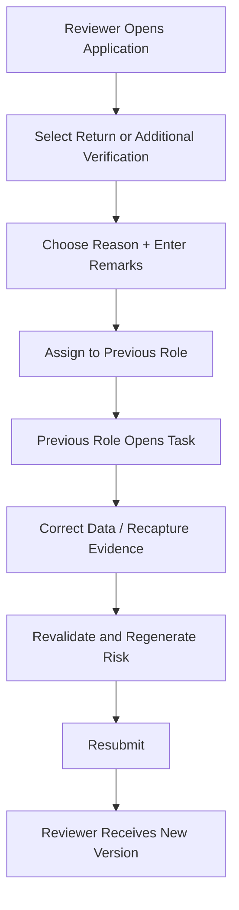

# GeoCredit AI — User Flow Document

**Version:** MVP v1.0  
**Status:** Draft for Development  
**Source:** Geo Credit AI PRD, Solution Architecture and Technical Requirements  
**Target:** Hackathon / 3-Day Demo MVP  
**Last Updated:** 03 September 2026

---

## 1. Purpose

This document defines the end-to-end user flows for GeoCredit AI. It describes what each user sees, the actions they can take, system validations, status changes, error paths, and the handoff between roles.

The primary MVP journey is:

> GeoCredit AI provides a suggested action only. The authorized human user makes the final decision.

---

## 2. Actors

| Actor | Department | Platform | Main Responsibility |
|---|---|---|---|
| CDO | Dabi | Mobile/PWA | Customer data, application, financial assessment, geo capture and submission |
| BM | Dabi | Mobile/PWA | Review, BM assessment/checklist and recommendation |
| CO | Progoti | Mobile/PWA | Customer data, application, checklists, geo capture and submission |
| AM | Dabi and Progoti | Web | Review, checklist/assessment and recommendation |
| RM | Dabi and Progoti | Web | Final review and approve/reject decision |
| System | Both | Backend | Validation, 500m search, risk analysis, workflow and audit |

---

## 3. Navigation Model

### 3.1 Mobile/PWA Navigation

- Login
- Dashboard
- Customers
- Applications
- Review Queue, for BM
- Notifications/Tasks
- Profile and Logout

### 3.2 Web Portal Navigation

- Login
- Review Dashboard
- Application Queue
- Application Details
- Customer and Behavior
- Location and Area Intelligence
- AI Risk Report
- Checklist/Recommendation
- Decision History
- Profile and Logout

### 3.3 Application Detail Tabs

1. Overview
2. Customer Profile
3. Loan Application
4. Income, Expense and Liability/Tolerance
5. Loan Behavior
6. Savings Behavior
7. Checklists and Documents
8. Geo Verification
9. Nearby Borrowers and Map
10. AI Risk Report
11. Workflow History

---

## 4. Authentication Flow

### 4.1 Happy Path

1. User opens GeoCredit AI.
2. User enters employee ID/PIN or demo credentials.
3. System validates the credentials.
4. System loads role, department, branch, area and region.
5. System routes the user to the role-specific dashboard.
6. System records a successful login audit event.

### 4.2 Error States

| Condition | User Message | Action |
|---|---|---|
| Empty credential | Employee ID/PIN is required. | Keep user on login screen |
| Invalid credential | Invalid employee ID or PIN. | Allow retry |
| Inactive account | Your account is inactive. Contact support. | Block login |
| Network unavailable | You are offline. Sign-in requires a previous valid session. | Retry or use cached session if allowed |
| Unauthorized platform | This role cannot use this application. | Block access |

---

## 5. Shared Customer Flow

### 5.1 Search Existing Customer

1. CDO/CO selects **Customers**.
2. User searches by member number, customer reference or name.
3. System displays customers within the user's authorized scope.
4. User selects a customer.
5. System opens the customer overview.

### 5.2 Create Customer

1. User selects **Add Customer**.
2. User enters organizational and personal information.
3. User enters identification, occupation, address, spouse and nominee information.
4. User selects **Save Draft** or **Save Customer**.
5. System validates required fields.
6. System checks for a possible duplicate member/customer reference.
7. System saves the profile and records an audit event.

### 5.3 Profile Actions by Role

| Action | CDO | CO | BM | AM | RM |
|---|---:|---:|---:|---:|---:|
| Search customer | Yes | Yes | Assigned only | Assigned only | Assigned only |
| Create profile | Yes | Yes | No | No | No |
| Edit profile | Yes | Yes | No | No | No |
| View loan behavior | Yes | Yes | Yes | Yes | Yes |
| View savings behavior | Yes | Yes | Yes | Yes | Yes |
| Start application | Dabi | Progoti | No | No | No |

---

## 6. Dabi End-to-End User Flow

### 6.1 CDO — Create Dabi Application

**Entry condition:** CDO is authenticated and has access to the customer.

1. CDO opens the customer profile.
2. CDO reviews the profile, loan behavior and savings behavior.
3. CDO selects **New Loan Application**.
4. CDO chooses **Dabi**.
5. System creates a draft and auto-populates customer information.
6. CDO enters:
   - Proposed amount
   - Loan user
   - Loan type
   - Duration
   - Investment sector
   - Scheme
   - Loan product
7. CDO saves the draft.

**Result:** Application status is `DRAFT`.

### 6.2 CDO — Financial Assessment

1. CDO opens **Income**.
2. CDO enters regular income, alternative income, remittance, rent and other applicable income.
3. System calculates total monthly income.
4. CDO opens **Expense**.
5. CDO enters rent/utilities, food, education, medical and other expenses.
6. System calculates total monthly expense.
7. CDO opens **Liabilities**.
8. CDO enters other debt, cash in hand, proposed installment and tolerance.
9. System calculates available surplus and installment burden.
10. CDO enters residence information and field remarks.

### 6.3 CDO — Geo Capture

1. CDO selects **Verify Location**.
2. System requests camera and location permissions if required.
3. System confirms GPS is enabled.
4. CDO opens the in-app camera.
5. CDO captures the customer's house/business image.
6. System binds image, latitude, longitude, accuracy, timestamp, officer and customer/application reference.
7. System shows image preview and coordinates.
8. CDO selects **Use This Photo** or **Retake**.
9. When online, system uploads and verifies the record.

**Success result:** Geo status is `VERIFIED`.  
**Failure result:** CDO cannot proceed to submission.

### 6.4 CDO — Area and AI Report

1. After geo verification, system starts the 500-meter search.
2. Loading state displays **Analyzing surrounding area**.
3. System returns borrower count and risk distribution.
4. CDO can open the map and privacy-safe nearby borrower list.
5. System calculates customer risk and area risk separately.
6. System displays:
   - Customer risk level
   - Area risk level
   - Positive indicators
   - Risk indicators
   - Key findings
   - Suggested action
   - Data timestamp
   - Human-review notice
7. CDO acknowledges the report and selects **Submit to BM**.
8. System validates application completeness.
9. System creates the submission and risk snapshot.

**Result:** Status becomes `SUBMITTED_BY_CDO` and the application enters BM's queue.

### 6.5 BM — Review and Recommend

1. BM opens **Review Queue**.
2. BM selects the submitted application.
3. BM reviews customer, application, history, CDO assessment, image, GPS, map, area report and AI report.
4. BM completes the BM checklist.
5. BM enters their income/expense assessment where required.
6. System compares CDO and BM assessments.
7. If the difference exceeds the configured threshold, system displays an assessment-difference warning.
8. BM selects an action:
   - **Recommend to AM**
   - **Request Additional Verification**
   - **Return for Correction**
9. BM enters mandatory remarks for return/additional verification.
10. System records the action and audit event.

**Recommend result:** Status becomes `BM_RECOMMENDED`.  
**Return result:** Application returns to the appropriate correction step.

### 6.6 AM — Review and Recommend

1. AM opens the Dabi review queue.
2. AM selects the BM-recommended application.
3. AM reviews the full application and prior assessments.
4. AM completes the AM checklist.
5. AM reviews customer risk, area risk, factors and suggested action.
6. AM chooses:
   - **Recommend to RM**
   - **Request Additional Verification**
   - **Return Application**
7. System requires remarks for return/additional verification.
8. System records the action.

**Recommend result:** Status becomes `AM_RECOMMENDED`.

### 6.7 RM — Final Decision

1. RM opens the final review queue.
2. RM selects the AM-recommended application.
3. RM reviews the full application, frozen risk snapshot and decision history.
4. RM selects **Approve** or **Reject**.
5. RM enters decision remarks.
6. System displays a confirmation dialog.
7. RM confirms the decision.
8. System records RM ID, decision, date/time and remarks.

**Result:** Status becomes `APPROVED` or `REJECTED`.

---

## 7. Progoti End-to-End User Flow

### 7.1 CO — Create Progoti Application

1. CO opens or creates the customer profile.
2. CO reviews loan and savings behavior.
3. CO selects **New Loan Application → Progoti**.
4. System auto-populates customer information.
5. CO enters loan amount, purpose, user, type, duration, investment sector, scheme and product.
6. CO enters all applicable income sources.
7. CO enters household, health/education, daily, business and loan-related expenses.
8. System calculates total income, total expense, available surplus and tolerance.

### 7.2 CO — Checklists and Assessment

1. CO completes the initial Progoti checklist.
2. CO completes the document checklist.
3. Missing documents are clearly highlighted.
4. CO completes project/business information.
5. CO completes accommodation, guarantor, land, loan-use and repayment assessment.
6. CO adds remarks about financial capacity and sustainability.

### 7.3 CO — Geo, Risk and Submission

1. CO captures the house/business image through the approved camera flow.
2. System validates latitude and longitude.
3. If location is missing, submission remains blocked.
4. After verification, system runs the 500-meter search.
5. System produces customer and area risk reports.
6. CO reviews the report.
7. CO selects **Submit to AM**.
8. System validates required fields, checklist, image and geo status.
9. System freezes the submitted application and risk snapshot.

**Result:** Status becomes `SUBMITTED_BY_CO`.

### 7.4 AM and RM

1. AM reviews the complete Progoti application.
2. AM selects **Recommend to RM**, **Request Additional Verification**, or **Return**.
3. RM receives AM-recommended applications.
4. RM reviews the frozen application and risk report.
5. RM selects **Approve** or **Reject** and enters remarks.
6. System records the final decision and audit history.

---

## 8. GPS Validation Failure Flow

### 8.1 Messages

| Condition | Message | Primary Action |
|---|---|---|
| GPS disabled | Turn on GPS to capture the customer location. | Open Settings |
| Permission denied | Location permission is required for verification. | Grant Permission |
| Coordinates unavailable | Location could not be detected. Move to an open area and try again. | Retry |
| Poor accuracy | GPS accuracy is low. Wait for a stronger signal or continue with a warning if allowed. | Retry |
| Image missing | Capture a house/business image before continuing. | Open Camera |
| Upload failed | The image is saved on this device but has not been uploaded. | Retry Upload |
| Verification failed | Location evidence could not be verified. Capture a new photo. | Recapture |

---

## 9. Offline Capture and Synchronization Flow

### 9.1 Sync States

| State | Meaning | User Action |
|---|---|---|
| Saved on device | Data exists only on the current device | Wait for connection |
| Queued | Record is waiting to upload | No action normally required |
| Uploading | Synchronization is in progress | Keep app open if requested |
| Synced | Server accepted the record | Continue |
| Verified | Server validated geo/media evidence | Area analysis is enabled |
| Failed | Sync or validation failed | Retry or correct data |
| Conflict | Server record changed since local edit | Review latest data |

### 9.2 Offline Rules

- Draft saving and geo/photo capture may work offline.
- Nearby borrower search and AI risk report do not work fully offline.
- Local submission must not be shown as centrally submitted.
- Image upload must complete before geo verification.
- Geo verification must complete before risk analysis.
- Risk analysis must complete before final field submission.
- Repeated sync requests must use the same idempotency key.

---

## 10. Return and Additional Verification Flow

### 10.1 Rules

- Reviewer must enter remarks.
- System must identify which fields/evidence require correction.
- Previous submitted version and risk snapshot remain available in history.
- Corrected submission creates a new application version and risk snapshot.
- The system must not overwrite or delete the original reviewer action.
- Reviewer sees what changed between versions where possible.

---

## 11. Risk Report User Flow

### 11.1 Report Layout Order

1. Human-review notice
2. Customer risk level and score
3. Area risk level and score
4. Suggested action
5. Key findings
6. Positive indicators
7. Risk/warning indicators
8. Data availability and freshness
9. Nearby borrower summary
10. Report generation time and version

### 11.2 Report Actions

| Role | Allowed Actions |
|---|---|
| CDO/CO | View, acknowledge, submit application |
| BM | View, add checklist/assessment, recommend or return |
| AM | View, add checklist/comment, recommend or return |
| RM | View, approve or reject independently |

### 11.3 Report States

| State | UI Behavior |
|---|---|
| Not ready | Explain missing prerequisites |
| Generating | Show progress and allow safe refresh |
| Ready | Show complete frozen report |
| Failed | Show retry action and correlation/reference ID |
| Insufficient data | Show available findings and explicitly label unavailable analysis |
| Superseded | Show historical snapshot with link to current application version |

---

## 12. Nearby Borrower and Map Flow

1. User opens **Area Intelligence**.
2. System displays the verified applicant marker.
3. System draws the 500-meter boundary.
4. System displays privacy-safe nearby borrower markers.
5. User selects a marker or list item.
6. System displays only:
   - Masked customer reference
   - Distance or distance band
   - Loan status
   - Risk level
   - Repayment summary
   - Savings summary
7. User returns to the area summary or risk report.

The interface must not expose nearby borrowers' names, NID, phone, exact address, exact coordinates or full transaction history.

---

## 13. Dashboard Flows

### 13.1 CDO/CO Dashboard

- Assigned/recent customers
- Draft applications
- Applications requiring correction
- Pending uploads/synchronization
- Submitted applications
- Quick action: New Customer
- Quick action: Search Customer

### 13.2 BM Dashboard

- New submissions
- In review
- Additional verification requested
- Recommended applications
- Overdue review tasks

### 13.3 AM Dashboard

- Dabi and Progoti filters
- New recommendations
- In review
- Returned applications
- Recommended to RM

### 13.4 RM Dashboard

- Awaiting final decision
- High/very-high risk filter
- Department and area filter
- Approved applications
- Rejected applications
- Decision history

---

## 14. Status and Available Actions

| Current Status | Primary Owner | Available Actions |
|---|---|---|
| `DRAFT` | CDO/CO | Edit, capture evidence, generate risk, submit |
| `SUBMITTED_BY_CDO` | BM | Start review |
| `BM_REVIEW` | BM | Save checklist, recommend, return, request verification |
| `BM_RECOMMENDED` | AM | Start review |
| `SUBMITTED_BY_CO` | AM | Start review |
| `AM_REVIEW` | AM | Save checklist/comment, recommend, return, request verification |
| `AM_RECOMMENDED` | RM | Start final review |
| `RM_REVIEW` | RM | Approve, reject |
| `ADDITIONAL_VERIFICATION_REQUIRED` | Assigned previous role | Correct, recapture, regenerate risk, resubmit |
| `APPROVED` | None | View history only |
| `REJECTED` | None | View history only |

---

## 15. Confirmation Dialogs

| Action | Confirmation Message |
|---|---|
| Submit to BM | Submit this application to BM? You cannot edit the submitted version. |
| Submit to AM | Submit this application to AM? A risk snapshot will be preserved. |
| Recommend | Recommend this application to the next reviewer? |
| Return | Return this application for correction? Your remarks will be shared with the assigned officer. |
| Additional verification | Request additional verification for this application? |
| Approve | Approve this loan application? This decision will be recorded with your identity and timestamp. |
| Reject | Reject this loan application? Remarks are required and the decision will be recorded. |
| Retake photo | Replace the current location evidence with a new capture? |

---

## 16. Empty, Loading and Error States

| Screen | Empty/Loading/Error Requirement |
|---|---|
| Customer search | Show “No customers found” and authorized create action |
| Loan history | Show “No previous loan history available” without treating it as positive behavior |
| Savings history | Show “No savings history available” |
| Nearby borrowers | Distinguish no borrowers found from query failure |
| Risk report | Show missing prerequisites or generation status |
| Review queue | Show clear empty state with active filters |
| Map | List view remains available if map tiles fail |
| Media upload | Preserve local evidence and allow retry |
| Workflow action | Prevent duplicate action while request is processing |

---

## 17. Notification and Task Events

| Event | Recipient | Message Intent |
|---|---|---|
| Application submitted | BM or AM | New application requires review |
| Application recommended | AM or RM | Application is ready for next review |
| Application returned | CDO/CO/BM | Correction is required |
| Additional verification requested | Assigned user | New verification task is available |
| Final decision recorded | Relevant prior users | Application approved/rejected |
| Sync failed | Capturing user | Locally saved record requires attention |
| Risk generation failed | Current owner | Retry or contact support with reference ID |

For the hackathon MVP, notifications may be represented by in-app task badges instead of external messages.

---

## 18. Primary Demo Flow

The preferred three-day MVP demo uses one Dabi customer.

1. Log in as CDO.
2. Search and open the seeded customer.
3. Review previous loan and savings behavior.
4. Create a Dabi loan application.
5. Enter loan, income, expense and liability data.
6. Capture/upload house/business image with GPS.
7. Display verified coordinates.
8. Find seeded borrowers within 500 meters.
9. Display map, borrower count and area-risk distribution.
10. Generate the customer and area risk report.
11. Submit to BM.
12. Switch to BM and complete checklist/recommendation.
13. Switch to AM and recommend to RM.
14. Switch to RM and record the final decision.
15. Display the complete workflow/audit timeline.

---

## 19. User Flow Acceptance Criteria

- Each role lands on the correct dashboard after login.
- Users see only records and actions authorized for their role and scope.
- Existing customer information auto-populates the application.
- Financial totals update and are revalidated by the backend.
- Missing GPS or image blocks field submission.
- Offline capture is never shown as centrally submitted before synchronization.
- Valid geo evidence enables 500-meter search and risk generation.
- Customer and area risks remain visually separate.
- Every risk report displays evidence-based factors and the human-review notice.
- Dabi application can move CDO → BM → AM → RM.
- Progoti application can move CO → AM → RM.
- Return/additional-verification requires remarks and preserves history.
- Only RM can approve or reject.
- Final action stores user, role, decision, timestamp and remarks.
- Submitted risk snapshots remain accessible at all later stages.
- Nearby borrower views do not expose restricted personal information.

