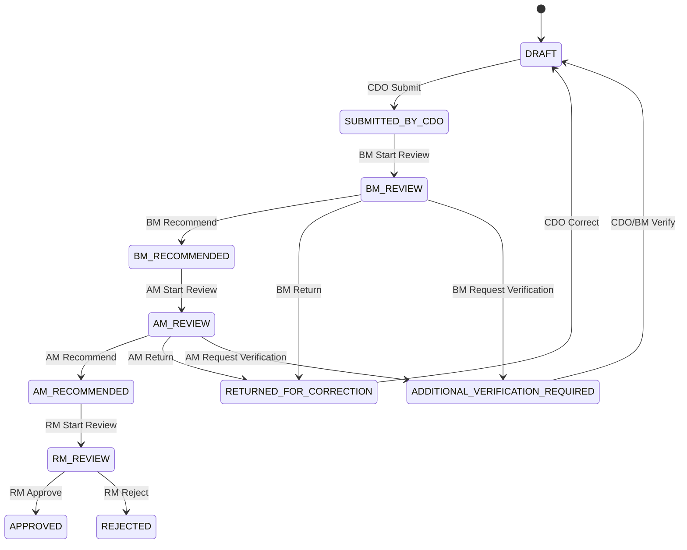
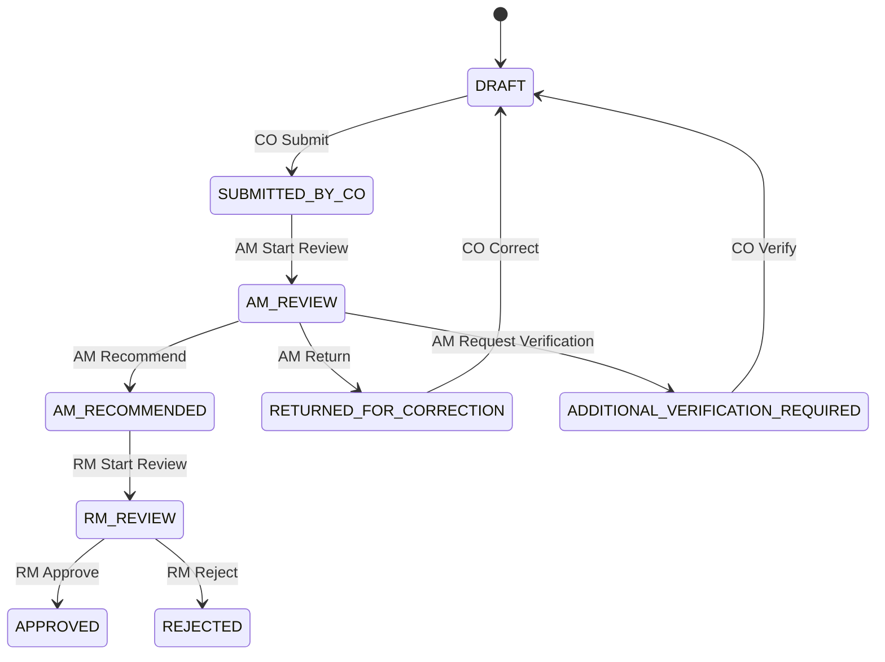
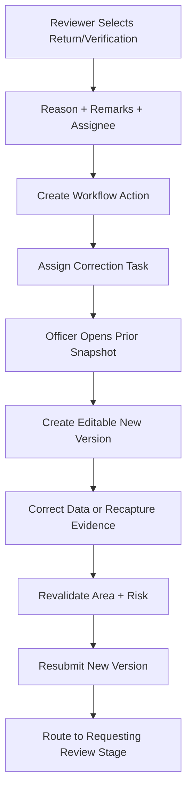
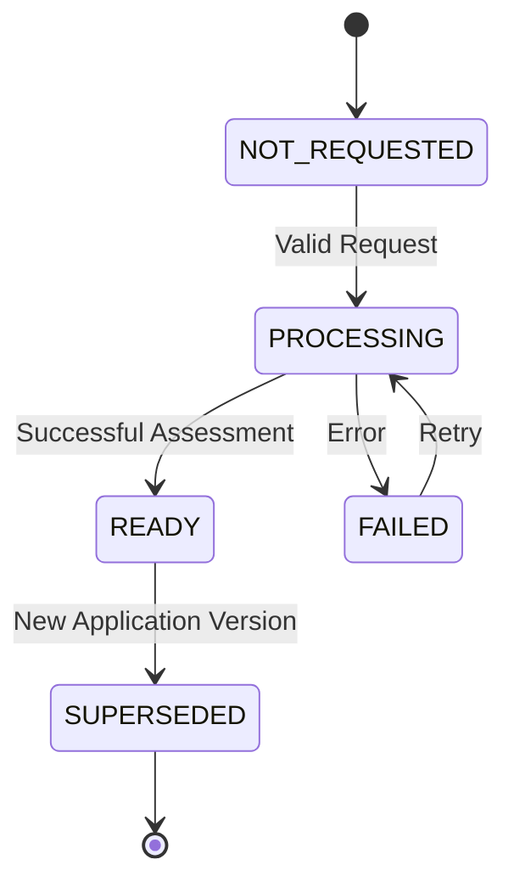
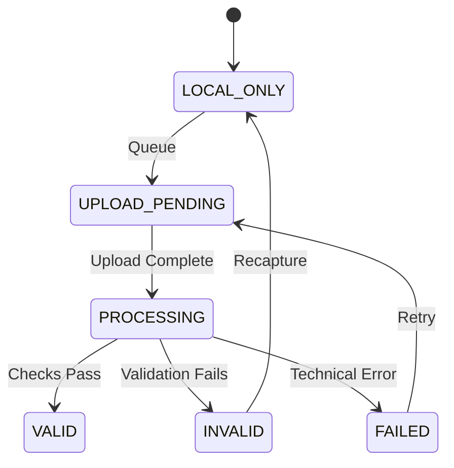

# GeoCredit AI — Workflow & Status Transition Document

**Version:** MVP v1.0  
**Status:** Draft for Development and UAT  
**Target:** Hackathon / 3-Day Demo MVP  
**Last Updated:** 03 September 2026

## 1. Purpose

This document defines the lifecycle, state transitions, role ownership, validation guards, correction loops and audit requirements for GeoCredit AI loan applications.

Supported approval routes:

- **Dabi:** CDO → BM → AM → RM
- **Progoti:** CO → AM → RM

The AI report is decision support only. It cannot transition an application to Approved or Rejected.

## 2. Workflow Principles

1. The backend is the authoritative workflow state machine.
2. Every transition verifies role, department, organizational scope, assignment and current state.
3. Every transition is atomic and append-only in workflow history.
4. Mutations use optimistic concurrency and idempotency.
5. Submitted application versions and their risk reports are immutable.
6. Corrections create a new application version and new risk snapshot.
7. Return, additional verification and rejection require remarks.
8. Only RM may record the final Approve or Reject decision.
9. AI components have no workflow-decision permission.
10. UI `allowedActions` are advisory; the server revalidates every action.

## 3. Status Definitions

| Status | Meaning | Owner |
|---|---|---|
| `DRAFT` | Application is being prepared and may be edited | CDO or CO |
| `SUBMITTED_BY_CDO` | Dabi application submitted and waiting for BM | BM queue |
| `BM_REVIEW` | BM has started review | Assigned BM |
| `BM_RECOMMENDED` | BM completed review and recommended to AM | AM queue |
| `SUBMITTED_BY_CO` | Progoti application submitted and waiting for AM | AM queue |
| `AM_REVIEW` | AM has started review | Assigned AM |
| `AM_RECOMMENDED` | AM completed review and recommended to RM | RM queue |
| `RM_REVIEW` | RM has started final review | Assigned RM |
| `ADDITIONAL_VERIFICATION_REQUIRED` | A reviewer requested new field verification/evidence | Assigned prior role |
| `RETURNED_FOR_CORRECTION` | Application returned for data/checklist correction | Assigned prior role |
| `APPROVED` | RM recorded final approval | Terminal |
| `REJECTED` | RM recorded final rejection | Terminal |

## 4. Dabi State Machine



## 5. Progoti State Machine



## 6. Dabi Transition Matrix

| From | Action | Role | To | Required Guards |
|---|---|---|---|---|
| `DRAFT` | `SUBMIT` | CDO | `SUBMITTED_BY_CDO` | Dabi, complete form, valid GPS/image, area/risk ready |
| `SUBMITTED_BY_CDO` | `START_REVIEW` | BM | `BM_REVIEW` | Assigned branch and reviewer scope |
| `BM_REVIEW` | `RECOMMEND` | BM | `BM_RECOMMENDED` | BM checklist/assessment complete |
| `BM_REVIEW` | `RETURN` | BM | `RETURNED_FOR_CORRECTION` | Reason and remarks required |
| `BM_REVIEW` | `REQUEST_ADDITIONAL_VERIFICATION` | BM | `ADDITIONAL_VERIFICATION_REQUIRED` | Reason, remarks and assignee required |
| `BM_RECOMMENDED` | `START_REVIEW` | AM | `AM_REVIEW` | Assigned area and reviewer scope |
| `AM_REVIEW` | `RECOMMEND` | AM | `AM_RECOMMENDED` | AM checklist/comment complete |
| `AM_REVIEW` | `RETURN` | AM | `RETURNED_FOR_CORRECTION` | Reason and remarks required |
| `AM_REVIEW` | `REQUEST_ADDITIONAL_VERIFICATION` | AM | `ADDITIONAL_VERIFICATION_REQUIRED` | Reason, remarks and assignee required |
| `AM_RECOMMENDED` | `START_REVIEW` | RM | `RM_REVIEW` | Assigned region and reviewer scope |
| `RM_REVIEW` | `APPROVE` | RM | `APPROVED` | Decision confirmation; remarks per policy |
| `RM_REVIEW` | `REJECT` | RM | `REJECTED` | Decision confirmation and remarks required |

## 7. Progoti Transition Matrix

| From | Action | Role | To | Required Guards |
|---|---|---|---|---|
| `DRAFT` | `SUBMIT` | CO | `SUBMITTED_BY_CO` | Progoti, financials/checklists complete, valid GPS/image, area/risk ready |
| `SUBMITTED_BY_CO` | `START_REVIEW` | AM | `AM_REVIEW` | Assigned area and reviewer scope |
| `AM_REVIEW` | `RECOMMEND` | AM | `AM_RECOMMENDED` | Required AM comment/assessment complete |
| `AM_REVIEW` | `RETURN` | AM | `RETURNED_FOR_CORRECTION` | Reason and remarks required |
| `AM_REVIEW` | `REQUEST_ADDITIONAL_VERIFICATION` | AM | `ADDITIONAL_VERIFICATION_REQUIRED` | Reason, remarks and assignee required |
| `AM_RECOMMENDED` | `START_REVIEW` | RM | `RM_REVIEW` | Assigned region and reviewer scope |
| `RM_REVIEW` | `APPROVE` | RM | `APPROVED` | Decision confirmation; remarks per policy |
| `RM_REVIEW` | `REJECT` | RM | `REJECTED` | Decision confirmation and remarks required |

## 8. Submission Guards

### 8.1 Common Guards

| Guard | Condition | Blocking Error |
|---|---|---|
| Authentication | Valid active session | `AUTHENTICATION_REQUIRED` |
| Role | CDO for Dabi; CO for Progoti | `ROLE_PERMISSION_DENIED` |
| Scope | Customer/application inside assignment | `ORGANIZATIONAL_SCOPE_DENIED` |
| Current state | Application is `DRAFT` or eligible correction draft | `INVALID_WORKFLOW_TRANSITION` |
| Version | Client version matches server | `RESOURCE_VERSION_CONFLICT` |
| Required fields | Product and application-specific fields complete | `REQUIRED_FIELD_MISSING` |
| Financial validation | Values valid and recalculated by server | `FINANCIAL_DATA_INVALID` |
| Image evidence | Required house/business image exists | `IMAGE_REQUIRED` |
| Location | Latitude and longitude exist | `GEO_LOCATION_REQUIRED` |
| Verification | Server geo status is `VALID` | `GEO_NOT_VERIFIED` |
| Area analysis | 500m query complete or explicit insufficient-data outcome | `AREA_QUERY_PENDING` |
| Risk report | Report generated for current version | `RISK_REPORT_PENDING` |

### 8.2 Dabi CDO Submission

- Application department is Dabi.
- CDO owns or is assigned the draft.
- Dabi loan and financial fields are complete.
- CDO information is complete.
- Geo evidence contains valid server-confirmed location.
- Current-version area and risk reports are ready.
- CDO has acknowledged the AI report.

### 8.3 Dabi BM Recommendation

- Current state is `BM_REVIEW`.
- BM is assigned and within branch scope.
- BM checklist is complete.
- BM assessment/remarks are stored.
- Any configured mandatory BM geo verification is valid.
- CDO vs BM assessment-difference warning has been displayed when applicable.

### 8.4 Dabi AM Recommendation

- Current state is `AM_REVIEW`.
- AM is assigned and within area scope.
- AM checklist/comment is complete.
- BM recommendation exists in workflow history.
- Current frozen risk snapshot is accessible.

### 8.5 Progoti CO Submission

- Application department is Progoti.
- CO owns or is assigned the draft.
- Loan, income, expense and tolerance fields are complete.
- Required initial checklist and loan assessment are complete.
- Document checklist statuses are recorded.
- Missing mandatory documents follow configured block/warning rules.
- Geo evidence is server-confirmed valid.
- Current-version area and risk reports are ready.
- CO has acknowledged the AI report.

### 8.6 Final Decision

- Current state is `RM_REVIEW`.
- Actor role is RM and application is within assigned region.
- AM recommendation exists.
- Application version and risk snapshot are accessible.
- Reject always includes remarks.
- Approve remarks may be required by configuration.
- Confirmation is explicit and cannot be triggered by the AI service.

## 9. Correction and Additional Verification



### 9.1 Return Rules

- Reviewer selects a reason category.
- Reviewer provides remarks.
- System identifies the target role and correction sections.
- Historical submitted version remains read-only.
- A new editable version is created or activated.
- Only permitted fields are editable.
- New or changed geo/financial inputs require area/risk regeneration.
- Resubmission creates a new frozen application and report snapshot.

### 9.2 Suggested Reason Codes

| Code | Meaning |
|---|---|
| `CUSTOMER_DATA_CORRECTION` | Customer/profile data needs correction |
| `FINANCIAL_REASSESSMENT` | Income/expense/liability requires review |
| `GPS_RECAPTURE_REQUIRED` | Location evidence must be recaptured |
| `IMAGE_RECAPTURE_REQUIRED` | Image is missing/unclear/invalid |
| `CHECKLIST_INCOMPLETE` | Required checklist needs completion |
| `DOCUMENT_MISSING` | Required Progoti document status/evidence missing |
| `GUARANTOR_VERIFICATION` | Guarantor/family verification required |
| `LOAN_AMOUNT_REVIEW` | Proposed amount requires reassessment |
| `AREA_RISK_REVIEW` | Area-risk condition requires additional review |
| `OTHER` | Other documented reason |

### 9.3 Return Target

| Requesting Stage | Typical Target |
|---|---|
| BM review | CDO |
| Dabi AM review | BM or CDO, depending on correction type |
| Progoti AM review | CO |
| RM review, if enabled | AM, BM/CDO or CO through explicit routing |

For MVP simplicity, RM return may be excluded; RM performs Approve or Reject only.

## 10. Application Versioning

| Event | Version Behavior |
|---|---|
| Create draft | Version 1 mutable draft |
| Save draft | Same version; increment optimistic-lock value |
| First submission | Freeze application version 1 |
| Reviewer checklist/assessment | Stored against submitted application version |
| Return/correction | Create editable application version 2 |
| Resubmission | Freeze version 2 and create new risk snapshot |
| Final decision | References the exact final reviewed version |

Each frozen version must contain or reference:

- Customer/profile snapshot
- Loan application values
- Financial assessments
- Checklists/documents applicable at submission
- Geo-verification ID and evidence reference
- Area query/cohort
- Feature set
- Customer and area risk assessments
- AI report and versions
- Submission actor and time

## 11. Risk Report Lifecycle



Rules:

- `READY` risk report must match the submitted application version.
- A source-data change does not alter an existing frozen report.
- A corrected version requires a new feature set and report.
- A failed report prevents field submission unless an approved business exception exists.
- All reports display `humanReviewRequired = true`.

## 12. Geo-Verification Lifecycle



Only `VALID` satisfies the mandatory submission guard.

## 13. Assignment Rules

| Transition | Assignment Result |
|---|---|
| CDO submits Dabi | Assign to BM queue for the application branch |
| BM recommends | Assign to AM queue for the parent area |
| CO submits Progoti | Assign to AM queue for the application area |
| AM recommends | Assign to RM queue for the parent region |
| Reviewer returns | Assign to specified prior role/user and correction task |
| RM starts review | Lock/assign review to RM according to queue policy |
| Final decision | Clear active task; retain final actor |

The server resolves hierarchy from authoritative organizational assignments. The client must not select an arbitrary reviewer ID unless explicitly allowed.

## 14. Allowed Actions Response

Application reads should return state-aware actions:

```json
{
  "status": "BM_REVIEW",
  "version": 3,
  "allowedActions": [
    {
      "action": "RECOMMEND",
      "enabled": false,
      "blockingReasons": ["BM_CHECKLIST_INCOMPLETE"]
    },
    {
      "action": "RETURN",
      "enabled": true,
      "remarksRequired": true
    },
    {
      "action": "REQUEST_ADDITIONAL_VERIFICATION",
      "enabled": true,
      "remarksRequired": true
    }
  ]
}
```

This response improves UI guidance but does not replace server validation during action submission.

## 15. Transition API Contract

`POST /api/v1/applications/{applicationId}/transitions`

Headers:

```http
Authorization: Bearer <token>
Idempotency-Key: <uuid>
If-Match: "<application-version>"
```

Request:

```json
{
  "action": "RECOMMEND",
  "expectedCurrentStatus": "BM_REVIEW",
  "applicationVersion": 1,
  "reasonCode": null,
  "remarks": "Checklist and assessment completed."
}
```

Response:

```json
{
  "data": {
    "workflowActionId": "uuid",
    "applicationId": "uuid",
    "previousStatus": "BM_REVIEW",
    "currentStatus": "BM_RECOMMENDED",
    "nextOwnerRole": "AM",
    "performedBy": {
      "userId": "uuid",
      "role": "BM"
    },
    "performedAt": "2026-09-03T11:15:00Z",
    "version": 4
  }
}
```

## 16. Transaction Boundary

A successful transition must atomically:

1. Lock or compare the current application version/state.
2. Recheck authorization and all guards.
3. Insert the append-only workflow action.
4. Update application current state/owner/version.
5. Create the next task/assignment if applicable.
6. Insert a transactional outbox event.
7. Insert or schedule the audit projection.
8. Commit once.

If any step fails, no partial transition may remain.

## 17. Concurrency and Idempotency

### 17.1 Optimistic Concurrency

- Client supplies current `version`/`If-Match`.
- Server updates only when the version and state match.
- Mismatch returns `409 RESOURCE_VERSION_CONFLICT`.
- Client refreshes the application before retrying.

### 17.2 Idempotency

- Every transition uses an idempotency key.
- Same actor + key + request returns the original response.
- Same key with a different request returns `409 IDEMPOTENCY_CONFLICT`.
- Double-clicking Approve/Reject must create only one action.

## 18. Notifications and Tasks

| Event | Recipient | Task/Notification |
|---|---|---|
| Dabi submitted | BM queue | New Dabi application to review |
| BM recommended | AM queue | BM-recommended Dabi application |
| Progoti submitted | AM queue | New Progoti application to review |
| AM recommended | RM queue | Application awaiting final review |
| Returned | Assigned prior role | Correction required with reviewer remarks |
| Verification requested | Assigned field/reviewer role | Additional verification task |
| Approved/rejected | Relevant previous owners | Final decision recorded |
| Risk generation failed | Current owner/support | Retry required |

For the hackathon, notifications may be in-app task badges generated from workflow events.

## 19. Workflow Audit Event

Every transition records:

- Workflow action ID
- Application ID and version
- Actor user ID and role
- Organizational scope
- From status
- Action
- To status
- Reason code
- Remarks
- Previous/current owner
- Timestamp
- Idempotency key
- Correlation ID
- Device/IP metadata where appropriate

Application roles cannot update or delete workflow/audit history.

## 20. Terminal-State Rules

### Approved

- Read-only for normal business roles.
- Decision identifies RM, date/time and remarks.
- Final application and risk snapshot remain accessible.
- No automated reopening in MVP.

### Rejected

- Read-only for normal business roles.
- Rejection remarks are mandatory.
- Final application and risk snapshot remain accessible.
- A future reapplication must create a new application, not modify the rejected record.

## 21. Error Codes

| Code | HTTP | Meaning |
|---|---:|---|
| `AUTHENTICATION_REQUIRED` | 401 | Valid session required |
| `ROLE_PERMISSION_DENIED` | 403 | Role cannot perform action |
| `ORGANIZATIONAL_SCOPE_DENIED` | 403 | Application outside user scope |
| `RECORD_NOT_ASSIGNED` | 403 | Reviewer assignment missing |
| `INVALID_WORKFLOW_TRANSITION` | 409 | Action not permitted in current state |
| `RESOURCE_VERSION_CONFLICT` | 409 | Application changed since client read |
| `IDEMPOTENCY_CONFLICT` | 409 | Key reused for different action |
| `REQUIRED_FIELD_MISSING` | 422 | Application data incomplete |
| `CHECKLIST_INCOMPLETE` | 422 | Role checklist incomplete |
| `REMARKS_REQUIRED` | 422 | Remarks required for action |
| `GEO_NOT_VERIFIED` | 422 | Required location/image invalid or pending |
| `AREA_QUERY_PENDING` | 422 | 500m analysis not complete |
| `RISK_REPORT_PENDING` | 422 | Current-version risk report unavailable |
| `FINAL_DECISION_RM_ONLY` | 403 | Only RM can approve/reject |

## 22. MVP Implementation Priority

1. Dabi happy path: Draft → CDO → BM → AM → RM → Approved/Rejected
2. GPS/image/risk submission guards
3. Reviewer checklist guards
4. Return/correction loop
5. Immutable application/risk snapshots
6. Progoti CO → AM → RM path
7. Additional verification assignment refinements
8. Notifications and advanced queue filters

## 23. Acceptance Criteria

- Dabi application follows only valid CDO → BM → AM → RM transitions.
- Progoti application follows only valid CO → AM → RM transitions.
- Role and organizational scope are rechecked on every transition.
- CDO cannot submit Progoti and CO cannot submit Dabi.
- Missing required fields, GPS/image, area result or risk report blocks field submission.
- BM recommendation is blocked until BM requirements are complete.
- AM recommendation is blocked until AM requirements are complete.
- Only RM can approve or reject.
- Reject, return and additional verification require remarks.
- Each successful transition stores actor, role, state change and timestamp.
- Transition and application update are atomic.
- Duplicate transition requests create one logical action.
- Stale versions return a conflict instead of overwriting current state.
- Submitted versions and risk reports remain immutable.
- Correction creates a new application/risk snapshot version.
- Final decision references the exact version reviewed by RM.
- AI/risk services cannot perform lending decisions.

